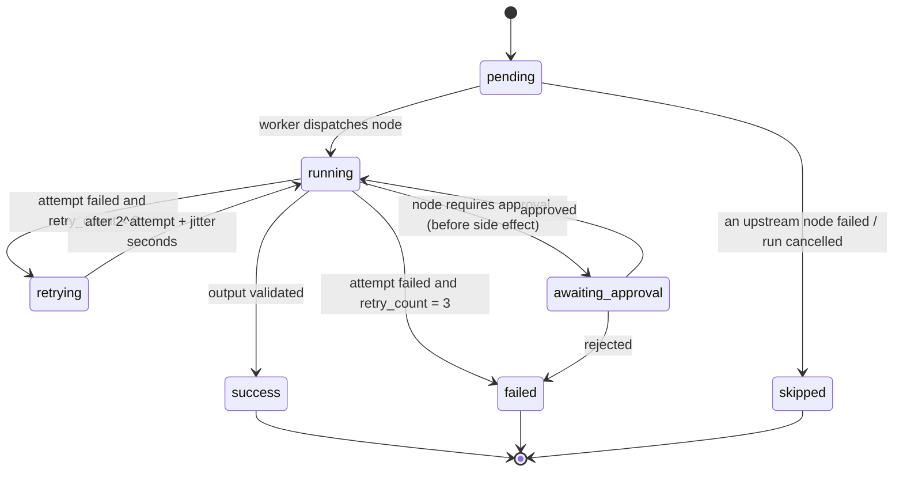
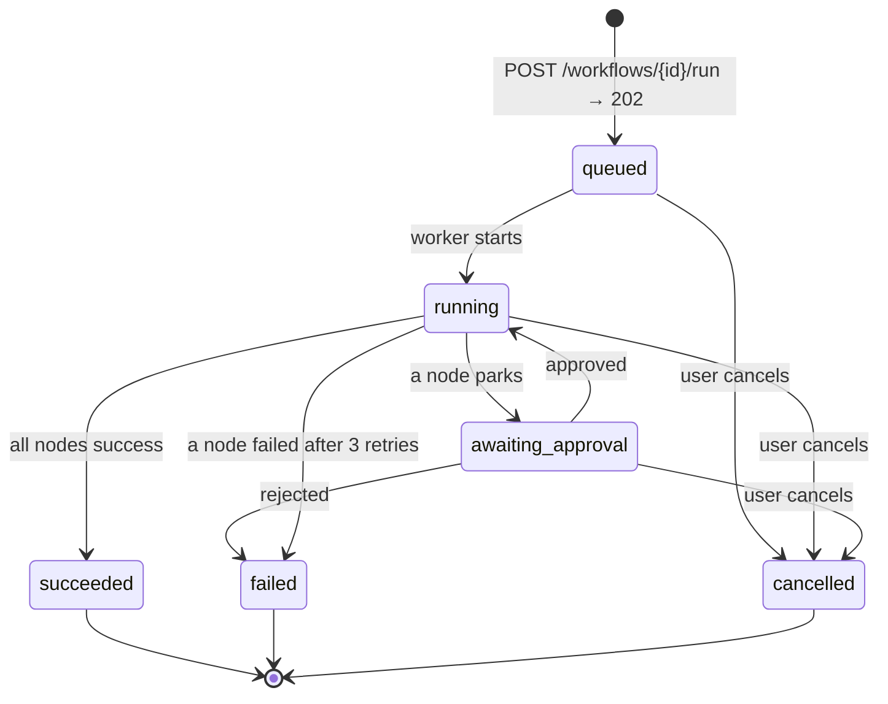
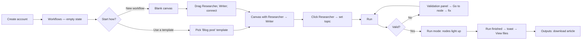
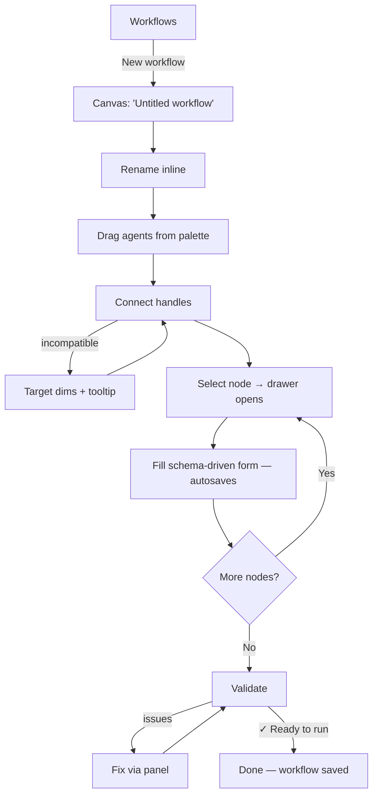
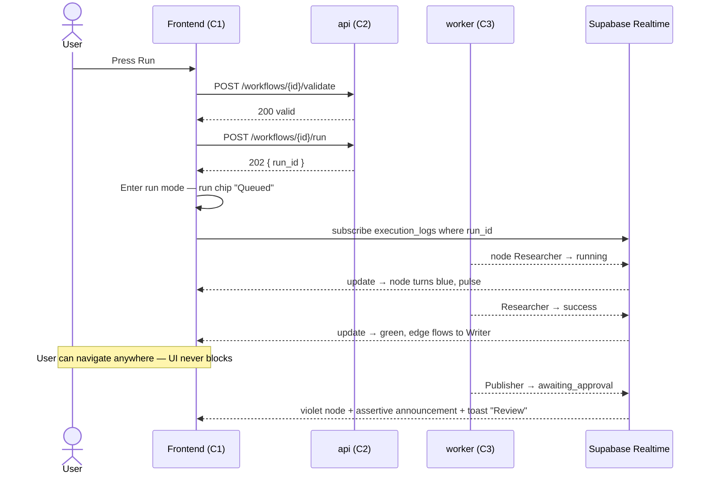
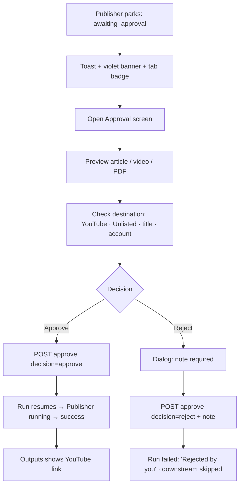
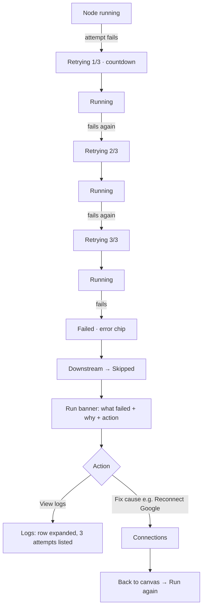
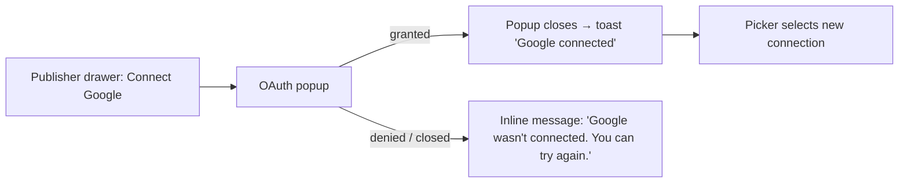
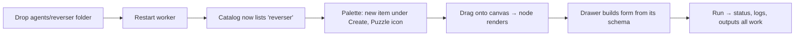

# Isnad — Design System
## Brand, patterns, UI foundations, components, screens and review deck for the Visual AI-Agent Workflow Platform

**Graduation Project — Milestone 3 (Implementation and Testing)**
King Faisal University · College of Computer Sciences and Information Technology · Department of Computer Science

| | |
|---|---|
| **Document** | `DESIGN-SYSTEM.md` — the design twin of [`GP-plan.md`](GP-plan.md) |
| **Version** | 1.0 — first complete draft |
| **Date** | 14 September 2026 (W1) |
| **Owner** | Ahmed Saleh Almutairi — C1 `frontend` |
| **Reviewers** | Hasan (C2/C3 — status and run states), Zain (C4 — agent forms and icons), Mohammed (C7 — tokens in CI, deployment screenshots) |
| **Status** | Draft for team review. Items marked **PROPOSED** need a row in the Decisions Log before they are treated as final. |
| **Working product name** | **Isnad** — PROPOSED (decision D-02, see §32) |

---

This guide defines the visual language, the interaction rules and the building blocks that make the platform feel like one product — no matter which of the four team members built the screen.

At its core, the platform is about **a chain of work that can be trusted**: a Researcher hands notes to a Writer, the Writer hands an article to a Video agent, and nothing leaves the platform until a human approves it. Every handoff is validated, logged and visible. The design system exists to make that chain *seen*: what is running, what finished, what failed, what is waiting for you.

Whether you are building a React component, capturing a screenshot for the M3 report, drawing a figure for the Implementation Details chapter or preparing the supervisor review deck, these guidelines ensure every touchpoint says the same thing: **visible, verified, in your control.**

> **The one rule of this design system.** *Color means state.* The interface is monochrome — ink on paper — so that the moment something turns blue, green, red, orange or violet, the user knows a run has changed. Decoration never borrows a status color.

---

## How this document was built

The team supplied three reference files. Each one was studied in full and each one shaped a different part of this document.

| Reference | What it is | What this document borrows from it |
|---|---|---|
| **Straightforward Brand Guidelines** (Figma Community, Figma Sites template — "Redo") | A one-page brand book: Brand Strategy → Personality → Logo → Color → Typography → Art Direction, with a numbered superscript navigation, a grain-gradient hero, primary / secondary / gradient palettes with hex codes, a sans + serif type pairing with leading and tracking rules per size band, logo clearspace, secondary lockups, an "incorrect usage" list, partnership lockups and photography direction | The whole of **Part A** (§01–§06): its section order, the vision / mission / promise triad, sample copy blocks, the palette tables, the per-size typography rules, the logo don'ts and the art direction principles |
| **Future Patterns** (The Visual Team, Figma Community design file, CC BY 4.0) | A library of cyberpunk-inspired, slightly brutalist line-art patterns and symbols — parallel wave lines, contour blobs, concentric rings, radial bursts, sparkles and crosses — in white 1px strokes on black with a neon-yellow accent, meant as ornaments and background fillers | **Part B** (§07–§09): a controlled pattern and symbol library drawn in the same 1px line-art style, the black + neon accent pairing (our *Ink* + *Volt*), and — critically — strict rules for where ornament is allowed and where it is not |
| **Mobile Product Review** (Figma Slides template, CC BY 4.0, 21 slides) | A product review deck: cover on a grainy dark gradient, agenda split into Parts, a gradient section divider per Part (blue, green, magenta), statement slides (big title left, paragraph right), three-goal slides, insight slides with an image block, feature grids, phone mockups with three feature callouts, a wall of device frames, a bento "modules" layout with a big number, a Q&A closer, and a consistent footer (logo square · deck name · date · section · page number) | **Part H** (§27): the supervisor review and final defense deck template, slide by slide. Its Goals → Strategy → Design concepts → Q&A structure also shapes how **Part E** presents each screen (purpose → evidence → concept → acceptance) |

Everything else — tokens, components, canvas behavior, run states, schema-driven forms, screens, UX writing — is derived from `GP-plan.md`: the seven components, the node states in §5.2, the API in §5.3, the agent specifications in §5.4, the requirements in §8.1 and the test cases in §8.3.

---

## Contents

**Part A — Brand**
- §01 Brand Strategy
- §02 Personality & Voice
- §03 Logo
- §04 Color
- §05 Typography
- §06 Art Direction

**Part B — Patterns & Symbols**
- §07 Pattern Library
- §08 Iconography & Symbols
- §09 Gradients & Texture

**Part C — Product Foundations**
- §10 Layout & Grid
- §11 Spacing, Radius, Borders & Elevation
- §12 Motion
- §13 Accessibility

**Part D — Components**
- §14 Core Components
- §15 Canvas Components
- §16 The Status System
- §17 Schema-Driven Forms
- §18 Feedback Patterns — loading, empty, error, confirm

**Part E — Screens & Flows**
- §19 Information Architecture & Routes
- §20 User Flows
- §21 Screen Specifications (S-01 to S-09)
- §22 Responsive Behavior

**Part F — Content**
- §23 UX Writing & Microcopy Library

**Part G — Implementation**
- §24 Design Tokens — CSS, Tailwind, JSON, TypeScript
- §25 Frontend File Structure
- §26 Figma File Structure

**Part H — Review Deck**
- §27 Product Review Deck Template

**Part I — Governance**
- §28 Ownership & Change Process
- §29 Design QA Checklist
- §30 Design Timeline W1–W12
- §31 Traceability — requirements to design to tests
- §32 Open Design Decisions

**Appendices**
- A. Glossary
- B. Changelog

---
---

# PART A — BRAND

---

## 01 · Brand Strategy

### The problem

Producing one piece of content today means working through five tools by hand: a search engine to research, a document editor to write, a video editor to assemble, YouTube Studio or Google Drive to publish, and an email client to distribute. Each step is manual, each handoff is a copy and paste, and when one step fails nobody notices until the end. M1 §4.5 asks the project to measure exactly this manual pipeline against the automated one.

The people who feel this most are not engineers. They are content creators, small marketing teams, lecturers and student clubs — people who can describe the pipeline in a sentence but cannot write the code to automate it (NFR-03).

### What the product is

A visual workspace where anyone can **drag AI agents onto a canvas, connect them into a chain, press Run, and watch the work move from one agent to the next** — research, writing, images, video, publishing and email — with a human approval gate before anything is published, automatic retries when something fails, and a log of every step.

### The name — PROPOSED

**Isnad** (إسناد) is the classical term for a *chain of transmission*: a sequence in which each link receives something from the link before it and passes it on, and where the trustworthiness of the whole chain depends on every link being verified.

That is the platform, exactly:

| Isnad, the idea | Isnad, the product |
|---|---|
| A chain of links, in order | A workflow of agents, topologically sorted |
| Each link receives and passes on | Each agent consumes the previous agent's output |
| Every link must be verified | Every handoff is validated by a Pydantic schema |
| The chain is recorded | Every node execution writes an `execution_logs` row |
| A broken link invalidates what follows | A failed node halts the run and marks downstream nodes *skipped* |

The name is short (5 letters), easy to say in English and Arabic, rooted in the team's own culture, and it describes the core promise rather than the technology. The wordmark is always lowercase: **isnad**.

> Until D-02 is approved, use "the platform" in the M3 report prose and keep "Isnad" to the UI, the deck and the design files. Renaming later costs one token (`--brand-name`) and one logo file.

### Positioning statement

> For **non-technical content creators** who lose hours moving work between research, writing, video and publishing tools, **Isnad** is a **visual AI-agent workflow platform** that **runs the whole pipeline end to end from a single canvas**. Unlike general automation tools that hide what happens between steps, Isnad **shows every handoff as it happens, retries failures on its own, and publishes nothing until you approve it.**

### Audiences

| Audience | Who | What they need from the design | Where they meet it |
|---|---|---|---|
| **Primary — the Creator** | A non-technical person producing a blog post, a video or a newsletter | Obvious next steps, plain language, confidence that nothing goes public by accident | Canvas, Run monitor, Approval, Outputs |
| **Secondary — the Evaluator** | Dr. Hasan Alkahtani, Dr. Asrar Alhaque, the GPC committee | Evidence: every requirement visible in a screen, every claim backed by a log or a number | Screenshots in the report, the review deck, the live demo |
| **Tertiary — the Builder** | The four team members and a future student extending the platform | A single source of truth for tokens and components; a new agent that "just appears" in the palette | This document, `frontend/src/design-system/`, the Figma file |
| **Usability participants** | Non-technical people in the W11 sessions (US-01) | To complete "produce a blog post and email it to yourself" with no help | Every screen, unaided |

### Brand pillars

| Pillar | Meaning | How it shows up in the design |
|---|---|---|
| **Visible** | You can always see where your work is | Live node status on the canvas; the status bar; the log viewer; no silent spinners |
| **Verified** | Every handoff is checked before the next step starts | Validation panel before Run; type-compatible edges; readable errors that name the problem |
| **In control** | A human decides what leaves the platform | Approval gate is a first-class node state with its own color (violet) and its own screen; Cancel is always one click away while running |
| **Modular** | Agents are plug-ins, not features | The palette and the configuration drawer build themselves from `/agents/catalog`; a seventh agent needs zero design work (AT-12) |

### Vision · Mission · Promise

| | |
|---|---|
| **Our Vision — why we exist** | A world where anyone with an idea can turn it into finished, published content without writing a line of code. |
| **Our Mission — what we do** | Chain specialised AI agents into a visible, verifiable pipeline that researches, writes, produces, publishes and distributes content end to end. |
| **Our Promise — how we help** | You see every step, nothing is published without your approval, and when something breaks we tell you what happened and try again. |

---

## 02 · Personality & Voice

Isnad's voice brings the product to life through every label, message and error it shows. People trust an automation tool when it speaks like a calm, competent colleague: it tells you what it is doing, it admits when something went wrong, and it tells you what to do next.

### Personality traits

| We are | We are not | In practice |
|---|---|---|
| **Clear** | Clinical | "Writer has no upstream Researcher" — not "Validation error 422" |
| **Calm** | Passive | "Retrying in 4 seconds (attempt 2 of 3)" — not a frozen spinner, and not "ERROR!!" |
| **Confident** | Boastful | "Your article is ready" — not "Our revolutionary AI has crafted a masterpiece" |
| **Honest** | Alarmist | "YouTube rejected the upload: the file is over the 256 GB limit" — not "Something went wrong" |
| **Helpful** | Chatty | One sentence of help, one action — not a paragraph of reassurance |
| **Human** | Anthropomorphic | Agents *run*, *finish* and *fail* — they do not *think*, *feel* or *want* |

### Voice principles

1. **Say what happened, then what to do.** Every message answers "what is the state?" and, where relevant, "what can I do about it?"
2. **Name things the way the user sees them.** The node is "Writer", not `agent_type=writer`; the run is "Run #14", not a UUID.
3. **Use verbs the user controls.** *Run, Approve, Reject, Cancel, Retry, Download, Connect.*
4. **Never blame the user.** "This field is required" — not "You forgot the topic".
5. **Be specific with numbers.** "3 of 5 steps finished", "1m 24s", "attempt 2 of 3".
6. **Sentence case everywhere.** "Run workflow", not "Run Workflow".

### Tone by moment

| Moment | Tone | Example |
|---|---|---|
| First visit / empty state | Inviting, brief | "Start with a template, or drag your first agent onto the canvas." |
| Editing | Quiet, out of the way | "Saved · just now" |
| Validation | Precise, constructive | "2 issues to fix before running. Email has no recipients." |
| Running | Informative, steady | "Video is rendering — long videos can take a few minutes. You can leave this page." |
| Retrying | Reassuring, factual | "Publisher failed to reach YouTube. Retrying in 4s (attempt 2 of 3)." |
| Success | Warm, understated | "Run finished in 6m 12s. 4 files are ready." |
| Needs approval | Direct, respectful of the decision | "Publisher is waiting for your approval before uploading to YouTube." |
| Failure | Honest, actionable | "Run stopped. Publisher failed 3 times: your Google connection has expired. Reconnect Google, then run again." |
| Destructive action | Serious, explicit | "Delete “Weekly tech digest”? Its 12 runs and their files will be deleted. This cannot be undone." |

### Sample copy

**Your pipeline, one canvas.**
Research, writing, video, publishing and email used to mean five tools and an afternoon of copy and paste. Drag the agents you need, connect them in order, and press Run.

**See every handoff.**
Each agent lights up as it works and passes its result to the next. If a step fails, it tries again on its own — and if it still cannot finish, it tells you exactly why.

**Nothing goes public without you.**
Publishing and email steps wait for your approval. Preview the article, watch the video, then decide.

**Built to grow.**
Every agent is a plug-in. When a new one is added, it appears in your palette with its settings ready — no update needed.

### Word list

| Use | Avoid | Why |
|---|---|---|
| workflow | pipeline (in UI), flow, automation, zap | One word for the saved canvas. "Pipeline" is fine in the report. |
| run (noun and verb) | execution, execute, job, trigger | `execution_runs` is a table name, not a user word |
| agent | bot, AI, model, node (in UI) | "Node" is a developer word; users see agents on the canvas |
| step | node, task (in UI) | "3 of 5 steps" reads better than "3 of 5 nodes" |
| connect / connection | edge, link, wire | For agent-to-agent arrows |
| approve / reject | accept / decline, OK / cancel | Matches UC-04 and the `approvals.decision` values |
| file | artefact, artifact, asset, output (in UI) | "Outputs" is allowed as a screen name only |
| Google connection | credential, OAuth token | `credentials` is a table name |
| failed | crashed, errored, broke | Matches `node_status` |
| skipped | cancelled (for downstream nodes) | Skipped = never ran because something before it failed |
| Retrying | Re-executing, re-running | |
| generated | AI-generated magic, created by AI | Neutral and accurate |

---

## 03 · Logo

### Concept

The Isnad mark is **three nodes on a single line** — the smallest possible chain. The first two nodes are outlined (links that have passed their work on); the last node is solid (where the work has arrived). Read left to right, it is a handoff. Read as a whole, it is a verified chain.

The mark is drawn with the same 1px-stroke, geometric line language as the pattern library (§07), so the logo and the ornaments feel like one family.

### Construction

The mark sits on a grid of **64 × 24 units**. One unit = 1/24 of the mark height.

```
  unit grid: 64 × 24

      ○───────────○───────────●
   ┌──┴──┐     ┌──┴──┐     ┌──┴──┐
   │ r=5 │     │ r=5 │     │ r=5 │    node radius      = 5u (diameter 10u = "x")
   └─────┘     └─────┘     └─────┘    node centres     = 6u, 32u, 58u
                                      connector        = 2u stroke, gaps of 0u at node edge
                                      node stroke      = 2u (outlined nodes)
                                      last node        = solid fill
```

Reference SVG (source of truth for `frontend/src/assets/brand/isnad-mark.svg`):

```svg
<svg xmlns="http://www.w3.org/2000/svg" viewBox="0 0 64 24" fill="none" aria-label="Isnad">
  <line x1="11" y1="12" x2="27" y2="12" stroke="currentColor" stroke-width="2"/>
  <line x1="37" y1="12" x2="53" y2="12" stroke="currentColor" stroke-width="2"/>
  <circle cx="6"  cy="12" r="4" stroke="currentColor" stroke-width="2"/>
  <circle cx="32" cy="12" r="4" stroke="currentColor" stroke-width="2"/>
  <circle cx="58" cy="12" r="5" fill="currentColor"/>
</svg>
```

> The outlined circles use `r="4"` with a 2-unit stroke so their outer edge lands exactly on radius 5 — the same visual size as the solid final node.

### Wordmark

- Typeface: **Geist SemiBold (600)**, lowercase `isnad`.
- Tracking: −2%.
- The x-height of the wordmark equals the node diameter (`x`) of the mark.
- The dot of the `i` is **not** replaced with a node — the mark already carries the idea; doing it twice is noise.

### Lockups

| Lockup | Composition | Use |
|---|---|---|
| **Primary — horizontal** | Mark on the left, wordmark on the right, gap = 1x, wordmark vertically centred on the connector line | App top bar, auth screen, report title page, deck footer, README |
| **Secondary — stacked** | Mark centred above the wordmark, gap = 1x | Square spaces: social avatar, CD/DVD label, splash |
| **Mark only** | The three nodes | Favicon, browser tab, app icon, deck footer square, loading splash |
| **Wordmark only** | `isnad` | Only where the mark already appears nearby (e.g. a slide that already has the mark in its footer) |

```
Primary                         Secondary              Mark only
○──○──●  isnad                  ○──○──●                ○──○──●
                                 isnad
```

### Clearspace

Keep a clear zone equal to **1x (one node diameter)** on every side of any lockup. Nothing — text, pattern, image edge, other logos — enters that zone. On gradients and patterns, the clear zone is measured from the outer edge of the outermost node.

### Minimum size

| Lockup | Digital (min width) | Print (min width) |
|---|---|---|
| Primary horizontal | 96 px | 25 mm |
| Secondary stacked | 48 px | 15 mm |
| Mark only | 16 px (favicon) | 6 mm |

Below 24 px, use the favicon-optimised mark (`isnad-mark-16.svg`): node radius increased to 5.5u and connector stroke to 2.5u so it survives pixel snapping.

### Color versions

| Version | Mark | Wordmark | Background | Use |
|---|---|---|---|---|
| **Ink** (default) | Ink `#0B0B0A` | Ink | Paper `#FAFAF8` or white | App (light), report, documents |
| **Paper** (reversed) | Paper `#FAFAF8` | Paper | Ink `#0B0B0A` or any §09 gradient | App (dark), deck covers and dividers |
| **Volt accent** | Final node Volt `#D7FF3A`, other nodes Paper | Paper | Ink only | Deck cover, splash, the one "hero" moment per surface |
| **One-color print** | Black | Black | White | Photocopies, the dark-green hard-bound cover emboss (in gold or white foil — follow the binder's single-color process) |

### Incorrect usage

- Do not stretch, squash or resize the mark and wordmark independently.
- Do not rotate the logo or set the chain vertically.
- Do not change the number of nodes, or fill all three.
- Do not color the nodes in status colors — the logo is never "green" or "red".
- Do not put Volt on a light background (contrast 1.10 : 1 — it disappears).
- Do not outline the wordmark or add a drop shadow, glow or bevel.
- Do not reverse the lockup (wordmark left, mark right).
- Do not apply a gradient to the logo itself — gradients are backgrounds, never fills of the mark.
- Do not place the logo on a busy screenshot or a pattern at full opacity without a solid backing panel.
- Do not recreate the wordmark in another typeface.

### Partnership lockup — King Faisal University

For the report title page, the CD/DVD label and the deck cover:

```
 [ KFU logo ]   │   ○──○──●  isnad
```

- The two logos share the same **optical height**; the KFU logo sits on the left as the institution.
- A 1px vertical rule in the current text color separates them, with a gap of 2x on each side.
- Use the KFU logo exactly as supplied by the university; never recolor it to match Isnad.

### Logo files to export

| File | Format | Size |
|---|---|---|
| `isnad-lockup-primary-ink.svg` / `-paper.svg` | SVG | vector |
| `isnad-lockup-stacked-ink.svg` / `-paper.svg` | SVG | vector |
| `isnad-mark.svg`, `isnad-mark-16.svg` | SVG | vector |
| `favicon.ico` | ICO | 16, 32, 48 |
| `apple-touch-icon.png` | PNG | 180 × 180, mark Paper on Ink |
| `og-image.png` | PNG | 1200 × 630, G-1 gradient + Paper primary lockup |

---

## 04 · Color

Isnad's palette is designed to keep attention on the work. Ink and paper carry the interface; a single electric accent, **Volt**, marks the brand and the most important action; and a small, strictly controlled set of **status colors** tells the user what their run is doing.

### Color principles

1. **Monochrome first.** Every screen must be fully usable in ink, paper and neutrals alone.
2. **Color means state.** Blue, green, red, orange and violet are reserved for run and node states (§16). They are never used for decoration, agent identity or branding.
3. **Volt is rare.** The brand accent covers at most ~5% of any screen: the Run button, the selected-node focus glow on dark, the final node of the logo, a deck highlight.
4. **Never color alone.** Every status color is paired with an icon and a text label (WCAG 1.4.1).
5. **Contrast is measured, not guessed.** Every text pairing below was checked against WCAG 2.1 (§13).

### Primary palette

| Swatch | Name | Hex | RGB | Role |
|---|---|---|---|---|
| ⬛ | **Ink** | `#0B0B0A` | 11, 11, 10 | Primary text, primary buttons, logo, dark-theme background |
| ⬜ | **Paper** | `#FAFAF8` | 250, 250, 248 | App background, text on Ink, light-theme ground |
| 🟩 | **Volt** | `#D7FF3A` | 215, 255, 58 | Brand accent: Run button fill, logo final node on Ink, deck highlights. **Only ever with Ink text or on an Ink ground.** |
| 🟦 | **Signal Blue** | `#2456F5` | 36, 86, 245 | Interactive: links, focus ring, selection, and the *running* state |

### Secondary palette — accent support

| Name | Hex | RGB | Role |
|---|---|---|---|
| Volt 700 | `#5C7000` | 92, 112, 0 | Volt-family text on light backgrounds (5.33 : 1 on Paper), e.g. "Generated" spark label |
| Blue 700 | `#1A43CC` | 26, 67, 204 | Link hover, pressed selection, blue text on Blue 50 |
| Blue 50 | `#EAF0FF` | 234, 240, 255 | Selection background, running tint, info banner |

### Neutral scale — "Graphite"

A warm-neutral grey scale, very slightly yellow-shifted so that Paper feels like paper rather than a screen.

| Token | Hex | RGB | Light-theme role | Dark-theme role |
|---|---|---|---|---|
| `neutral-0` | `#FFFFFF` | 255, 255, 255 | Raised surfaces: cards, nodes, drawer, dialogs | — |
| `neutral-25` | `#FAFAF8` | 250, 250, 248 | **Paper** — app background | Primary text (use `#EDEDEA` for long text) |
| `neutral-50` | `#F4F4F1` | 244, 244, 241 | Sunken surfaces: canvas, table header, code blocks | — |
| `neutral-100` | `#E9E9E5` | 233, 233, 229 | Hover background, skipped chip, dividers on sunken | — |
| `neutral-200` | `#D6D6D1` | 214, 214, 209 | Default borders and dividers (decorative) | — |
| `neutral-300` | `#B9B9B3` | 185, 185, 179 | Disabled text on white, canvas dots | — |
| `neutral-400` | `#8E8E88` | 142, 142, 136 | Input borders and icons (3.15 : 1 — meets 3 : 1 for UI), pending state | Subtle text (5.50 : 1 on surface) |
| `neutral-500` | `#6B6B66` | 107, 107, 102 | Secondary text (5.13 : 1 on Paper) | Strong borders (3.69 : 1) — use `#71716C` |
| `neutral-600` | `#53534F` | 83, 83, 79 | Muted text on tinted chips (6.35 : 1 on neutral-100) | — |
| `neutral-700` | `#3D3D3A` | 61, 61, 58 | Strong text in tables, cancelled state | Decorative borders |
| `neutral-800` | `#262624` | 38, 38, 36 | Tooltip background | Hover background |
| `neutral-900` | `#161615` | 22, 22, 21 | — | Surface (cards, nodes, drawer) |
| `neutral-950` | `#0B0B0A` | 11, 11, 10 | **Ink** — primary text, primary button | Background |

### Status palette

Every node and run state has one color family. See §16 for the full status system.

| State family | Solid (icons, borders, fills) | Text on light | Tint (light bg) | Dark-theme text / solid | Dark-theme tint |
|---|---|---|---|---|---|
| **Running** — blue | `#2456F5` | `#1A43CC` | `#EAF0FF` | `#7A9BFF` | `#111A3D` |
| **Success** — green | `#12805C` | `#0B6B4C` | `#E3F5EC` | `#4FD1A1` | `#0B2A20` |
| **Failed** — red | `#C8251D` | `#A51D16` | `#FDECEA` | `#FF7A70` | `#3A1311` |
| **Retrying** — orange | `#B85400` | `#963F00` | `#FFF1E5` | `#FFA15C` | `#3A2008` |
| **Awaiting approval** — violet | `#6D3FD9` | `#5530B3` | `#F0EBFF` | `#B69CFF` | `#22184A` |
| **Pending** — neutral | `#8E8E88` | `#6B6B66` | `#F4F4F1` | `#8E8E88` | `#1F1F1D` |
| **Skipped** — neutral | `#8E8E88` | `#53534F` | `#E9E9E5` | `#A3A39E` | `#1F1F1D` |
| **Cancelled** (run only) — ink | `#3D3D3A` | `#3D3D3A` | `#E9E9E5` | `#A3A39E` | `#1F1F1D` |

RGB reference for the status solids: blue 36, 86, 245 · green 18, 128, 92 · red 200, 37, 29 · orange 184, 84, 0 · violet 109, 63, 217.

> **Why violet for approval, not amber?** Amber reads as "warning" and sits too close to the orange *retrying* state. Approval is not a problem — it is a decision waiting for a person. Violet is distinct from every other state and color-blind simulations keep it separable from blue when paired with its hand icon.

### Semantic tokens

Components never use raw hex values. They use semantic tokens, which switch between themes.

| Token | Light | Dark | Used for |
|---|---|---|---|
| `--color-bg` | `#FAFAF8` | `#0B0B0A` | Page background |
| `--color-bg-sunken` | `#F4F4F1` | `#0B0B0A` | Canvas, table header, code blocks |
| `--color-surface` | `#FFFFFF` | `#161615` | Cards, nodes, drawer, dialogs |
| `--color-surface-raised` | `#FFFFFF` | `#1F1F1D` | Menus, popovers, toasts |
| `--color-surface-hover` | `#F4F4F1` | `#262624` | Row hover, ghost button hover |
| `--color-surface-inverse` | `#0B0B0A` | `#FAFAF8` | Tooltips, primary button |
| `--color-border` | `#D6D6D1` | `#3D3D3A` | Dividers, card outlines (decorative) |
| `--color-border-strong` | `#8E8E88` | `#71716C` | Inputs, checkboxes, node outline (≥ 3 : 1) |
| `--color-text` | `#0B0B0A` | `#EDEDEA` | Primary text |
| `--color-text-muted` | `#6B6B66` | `#A3A39E` | Secondary text, help text, timestamps |
| `--color-text-subtle` | `#8E8E88` | `#8E8E88` | Placeholder, disabled (not for essential info) |
| `--color-text-inverse` | `#FAFAF8` | `#0B0B0A` | Text on inverse surfaces |
| `--color-accent` | `#D7FF3A` | `#D7FF3A` | Run button fill, brand highlight |
| `--color-on-accent` | `#0B0B0A` | `#0B0B0A` | Text and icons on Volt |
| `--color-interactive` | `#2456F5` | `#7A9BFF` | Links, selection |
| `--color-interactive-hover` | `#1A43CC` | `#A3BAFF` | Link hover |
| `--color-focus` | `#2456F5` | `#7A9BFF` | Focus ring |
| `--color-selection-bg` | `#EAF0FF` | `#111A3D` | Selected row, selected palette item |
| `--color-danger` | `#C8251D` | `#FF7A70` | Destructive buttons, error text |

### Usage proportions

A typical app screen should read roughly as:

| Share | Color |
|---|---|
| ~70% | Paper / white surfaces |
| ~20% | Ink text and neutrals |
| ~5% | Status colors (only where something is happening) |
| ≤ 5% | Volt (the Run button and the logo) |

A screen with no active run should contain **no status color at all** except the last-run badge.

### Data visualisation palette

For the charts in Results & Metrics and the M3 Result Analysis chapter (latency, retry rate, handoff success). Charts are not statuses, so they use an ordered categorical set that still avoids implying failure:

| Order | Color | Hex | Typical series |
|---|---|---|---|
| 1 | Ink | `#0B0B0A` | Automated / measured |
| 2 | Neutral 400 | `#8E8E88` | Manual baseline / target |
| 3 | Signal Blue | `#2456F5` | Researcher, or series 3 |
| 4 | Volt 700 | `#5C7000` | Writer, or series 4 |
| 5 | Violet | `#6D3FD9` | Video, or series 5 |
| 6 | Orange | `#B85400` | Publisher, or series 6 |

Red and green are used in charts **only** for pass/fail, success/failure counts. Always direct-label series; never rely on the legend alone.

---

## 05 · Typography

Isnad's typography balances the precision of a technical tool with the warmth of an editorial product. A modern geometric sans carries the interface; a refined serif is reserved for moments of storytelling; a monospace carries anything the machine produced verbatim.

### Typefaces

| Role | Typeface | Weights used | License | Why |
|---|---|---|---|---|
| **Primary sans** — UI, headings, body | **Geist** | 400 Regular, 500 Medium, 600 SemiBold | SIL Open Font License | Clean, highly legible at 12–14 px in dense UIs; excellent tabular figures for durations and counts; neutral enough to let status color speak |
| **Secondary serif** — editorial accent | **Instrument Serif** | 400 Regular, 400 Italic | SIL Open Font License | Adds credibility and a human voice to covers, section dividers and marketing headlines — the same sans + serif contrast the reference brand book uses |
| **Monospace** — machine output | **Geist Mono** | 400, 500 | SIL Open Font License | Log lines, run and node IDs, JSON previews, durations in tables, code in the setup guide |

All three are free, open-source and available on Google Fonts and as `@fontsource` packages. **They are self-hosted** in the frontend build (not loaded from a CDN) so that the app and the CD/DVD copy work offline — see D-06.

### Fallback stacks

```css
--font-sans:  "Geist Sans", "Geist", ui-sans-serif, system-ui, -apple-system, "Segoe UI", Roboto, "Helvetica Neue", Arial, sans-serif;
--font-serif: "Instrument Serif", ui-serif, Georgia, "Times New Roman", serif;
--font-mono:  "Geist Mono", ui-monospace, "SFMono-Regular", Menlo, Consolas, "Liberation Mono", monospace;
```

> **Family name.** `@fontsource/geist-sans` declares the family as **"Geist Sans"**, while Google Fonts serves the same face as **"Geist"** (which is what `landing/` loads). Both names are listed in `--font-sans` so the stack resolves whichever source is in use — a stack naming only one of them falls back silently to `system-ui` under the other.

### Where each typeface is allowed

| Surface | Sans | Serif | Mono |
|---|---|---|---|
| App UI — controls, labels, tables, forms | ✅ | ❌ | ✅ values only |
| App UI — page titles | ✅ | ❌ | ❌ |
| Auth screen hero headline | ✅ | ✅ (≥ 40 px) | ❌ |
| Empty-state headline | ✅ | ✅ (≥ 24 px) | ❌ |
| Log viewer, IDs, JSON | ❌ | ❌ | ✅ |
| Review deck titles | ✅ | ✅ section dividers | ❌ |
| Report figures and captions | ✅ | ❌ | ✅ code |
| README / SETUP.md | (rendered by GitHub) | | ✅ commands |

### Leading and tracking by size band

Like the reference brand book, leading tightens and tracking goes negative as size grows.

| Size band | Leading (line-height) | Tracking (letter-spacing) | Typical use |
|---|---|---|---|
| 11–13 px | 140% | +0.5% (0 for mono) | Captions, badges, table cells |
| 14–16 px | 150% | 0% | Body, form fields, UI default |
| 17–24 px | 135% | −0.5% | Section titles, drawer titles |
| 25–40 px | 120% | −1% | Page titles, deck statements |
| 41–64 px | 110% | −2% | Hero and deck titles |
| > 64 px | 100% | −3% | Deck covers and dividers only |

### Type scale

The **app** uses a 14 px base because it is a dense tool. The **deck, report figures and auth hero** use the display sizes.

| Token | Font | Size / line-height | Weight | Tracking | Use |
|---|---|---|---|---|---|
| `display-2xl` | Sans or Serif | 96 / 96 | 500 (sans) · 400 (serif) | −3% | Deck cover title |
| `display-xl` | Sans or Serif | 72 / 72 | 500 · 400 | −3% | Deck section dividers |
| `display-lg` | Sans | 56 / 62 | 500 | −2% | Deck statement titles, auth hero |
| `display-md` | Sans or Serif | 44 / 48 | 500 · 400 | −2% | Empty-state heroes, report cover |
| `heading-xl` | Sans | 32 / 38 | 600 | −1% | Page title (Workflow list) |
| `heading-lg` | Sans | 24 / 30 | 600 | −1% | Screen title (Approval, Outputs) |
| `heading-md` | Sans | 18 / 24 | 600 | −0.5% | Drawer title, card title, dialog title |
| `heading-sm` | Sans | 15 / 22 | 600 | 0% | Section title in drawer, table group |
| `body-lg` | Sans | 16 / 24 | 400 | 0% | Approval article preview, marketing body |
| `body-md` | Sans | 14 / 21 | 400 | 0% | **App default** |
| `body-md-strong` | Sans | 14 / 21 | 500 | 0% | Node title, button label, field label |
| `body-sm` | Sans | 13 / 18 | 400 | +0.5% | Help text, node config summary, metadata |
| `caption` | Sans | 12 / 16 | 500 | +0.5% | Badges, status chips, timestamps |
| `overline` | Sans | 11 / 16 | 600 | +6%, UPPERCASE | Palette group labels ("CREATE", "DISTRIBUTE") |
| `mono-md` | Mono | 13 / 20 | 400 | 0% | Log lines, JSON viewer |
| `mono-sm` | Mono | 12 / 16 | 400 | 0% | IDs, durations in tables, retry counters |

### Typographic rules

1. **Sentence case** for every heading, button and label. Uppercase only for `overline`.
2. **Tabular figures** (`font-variant-numeric: tabular-nums`) wherever numbers update or align: durations, counters, retry counts, table columns, the run timer.
3. **Maximum line length** 72 characters for reading text (approval article preview uses `max-width: 68ch`).
4. **Serif never below 24 px**, and never in controls.
5. **No italics in the app UI.** Serif italic is allowed on the deck and report cover only.
6. **Two weights per screen** in practice: 400 and 600, with 500 for labels.
7. **Numbered sections use superscript** in navigation and deck agendas, following the reference: `Canvas⁰³`, `Brand Strategy⁰¹`.
8. **Truncate with an ellipsis, never wrap** node titles and table cells; reveal the full value in a tooltip.

### Sample

> **Heading-xl — Your workflows**
> Body-md — Each workflow is a chain of agents. Press Run to start one, or open it to change its steps.
> Caption — LAST RUN · 14 SEP, 16:05 · 6m 12s
> Mono-sm — run_7f3c2a · retry_count=2 · duration_ms=84210

---

## 06 · Art Direction

Isnad's imagery reinforces the brand's core values — **visibility, verification and control** — by showing the product itself, real output and real people doing real work. The platform is the hero. Nothing about the imagery should suggest a mysterious black box.

### Principles

| Principle | Direction |
|---|---|
| **The product is the picture** | Screenshots of the real running app are the primary imagery for the report, the deck and the README. Always captured from the deployed build, never mocked in Figma after the fact. |
| **Real data, never lorem ipsum** | Use the seed demo user and the three template workflows (blog only; blog → video → YouTube; research → PDF → email) with real topics. A log that shows a real retry is worth more than a clean one. |
| **Clean and calm** | Flat Paper or a single §09 gradient behind device frames. No perspective tilts beyond 0°, no floating 3D phones, no reflections. |
| **Line, not illustration** | Ornament comes only from the §07 pattern library. No hand-drawn illustration style, no isometric art. |
| **No AI clichés** | No robots, glowing brains, circuit-board heads, humanoid faces, blue binary rain, or sparkles everywhere. The one sparkle (§08 Spark) marks generated content and nothing else. |
| **People with focus** | If photography is used (deck, poster), show real creators and students at work — a laptop with the canvas open, a person reviewing a video before approving. Well lit, uncluttered, candid. |

### Screenshots

| Rule | Spec |
|---|---|
| Resolution | Capture at 2× device pixel ratio. Desktop frame 1440 × 900 CSS px; mobile 390 × 844. |
| Browser chrome | Remove it. Use a clean frame (§26 `Frame / Browser`) with an 8 px radius and `shadow-3`. |
| Theme | Light theme for the report (prints better); dark theme allowed in the deck. |
| Personal data | Only the demo account (`demo@isnad.local` — PROPOSED seed email). Blur or replace any real email address, Google account name or YouTube channel ID. |
| State | Capture the meaningful moment: canvas mid-run with one node running and one green; an approval with a real article; a log row with `retry_count = 2`. |
| Annotations | Numbered callouts (a 20 px Ink circle with a Paper numeral) linked to a caption list below the figure — never arrows drawn over the UI. |
| File naming | `fig-<chapter>-<nn>-<screen>-<state>.png`, e.g. `fig-impl-03-canvas-running.png` |
| Caption style | "Figure 4.3 — The workflow canvas during a run. (1) Researcher finished, (2) Writer running, (3) Publisher waiting for approval." |

The screenshot list is the **📸 Screenshots & Evidence** database (GP-plan §8.7). §21 gives a report caption for every screen.

### Device frames (from the review-deck reference)

- **Laptop frame** — for canvas, logs, outputs.
- **Phone frame** — for approval and run monitor on mobile (§22), showing the product works "from a phone on mobile data" (W11 deployment goal).
- **Wall of screens** — a grid of phone frames on Paper, used once in the deck to show breadth.
- Frames are flat line drawings in Ink at 1.5 px, matching the logo and pattern stroke language.

### Diagrams (report figures and deck)

For the architecture-in-production diagram (W11), the state machine, sequence diagrams and the component map:

| Element | Spec |
|---|---|
| Boxes | 1.5 px Ink stroke, 8 px radius, white fill, `body-md-strong` label, `body-sm` sub-label |
| Containers / deployables | Dashed 1.5 px `neutral-400` outline, `overline` label top-left |
| Arrows | 1.5 px Ink, open chevron head; label in `caption` on a Paper backing |
| Focal path | One path per diagram may be highlighted in Volt (on Ink ground) or Signal Blue (on Paper) |
| External services | `neutral-50` fill, no stroke, `body-sm` label |
| Status in diagrams | Use the status palette exactly as in the app |
| Font | Geist only |
| Export | SVG for the web, 300 dpi PNG for the printed report |

### Photography (optional — deck and poster only)

| Theme | Direction |
|---|---|
| **Creators at work** | Candid shots of people writing, filming or editing, in natural light, with a laptop showing Isnad. |
| **The review moment** | A person looking at a finished video or article before pressing Approve — the human-in-the-loop idea. |
| **Team and campus** | The four team members working together at KFU, for the acknowledgments slide and the defense opener. |
| **Treatment** | Natural color, slight lift in shadows, no heavy filters, no duotone. Crop to 3:2 or 16:9. |

---
---

# PART B — PATTERNS & SYMBOLS

---

## 07 · Pattern Library

A small library of line-art patterns gives Isnad a recognisable texture — the same engineered, slightly brutalist line language as the *Future Patterns* reference, redrawn around one idea: **things connected in a chain, moving from one to the next.**

Patterns are ornament. Ornament is powerful and easy to overuse, so every pattern below has a meaning, a list of places it may appear, and a list of places it must never appear.

### Construction rules (all patterns)

| Rule | Spec |
|---|---|
| Stroke | 1 px at 1× (scale with the artboard; never thicker than 1.5 px in the app) |
| Color | Ink on light, Paper on dark, or Volt on Ink. Never a status color. Never two colors in one pattern. |
| Fill | None. Patterns are strokes and dots only. |
| Opacity in the app | ≤ 12% (≤ 20% in dark theme) |
| Opacity in deck / report cover / auth hero | Up to 100% |
| Text over pattern | Only with a solid backing panel, or at ≥ 24 px on ≤ 12% pattern |
| Format | SVG in `frontend/src/assets/patterns/`, `currentColor` stroke so CSS controls the color |
| Motion | Only P-03 and P-04 animate, and only as defined in §12 |

### The patterns

#### P-01 · Node Grid

```
·   ·   ·   ·   ·   ·   ·   ·
·   ·   ·   ·   ·   ·   ·   ·
·   ·   ·   ·   ·   ·   ·   ·
```

| | |
|---|---|
| **Construction** | 1 px dots on a 16 px square grid (24 px at zoom < 50% via React Flow `Background` gap) |
| **Meaning** | The empty workspace — a place where nodes can land |
| **Use** | Canvas background (`--color-canvas-dot`: `neutral-300` light, `neutral-700` dark) |
| **Never** | Behind forms, tables, the approval preview or any text block |
| **Implementation** | React Flow `<Background variant="dots" gap={16} size={1} />` — no SVG file needed |

#### P-02 · Handoff Lines

```
~~~~~~~~~~~~~~~~~~~~~~~~~~~~~~~~~~~~~~
 ~~~~~~~~~~~~~~~~~~~~~~~~~~~~~~~~~~~~~~
  ~~~~~~~~~~~~~~~~~~~~~~~~~~~~~~~~~~~~~~
```

| | |
|---|---|
| **Construction** | 24–40 parallel sine-wave lines, 1 px, 8 px apart, each wave phase-shifted by 4° from the previous so the set appears to flow |
| **Meaning** | Work moving through the chain |
| **Use** | Auth screen hero panel, deck cover, report cover, README banner, `og-image` |
| **Never** | Inside the app shell after login |

#### P-03 · Pulse Rings

```
        (   (   ( ● )   )   )
```

| | |
|---|---|
| **Construction** | 3–5 concentric circles around a centre point, radii increasing by 8 px, stroke opacity decreasing 100% → 20% outward |
| **Meaning** | Something is working right now |
| **Use** | The halo behind a *running* node's status icon (animated, §12); the app loading splash; the "rendering video" progress illustration |
| **Never** | On more than one element per node; on a node that is not running |

#### P-04 · Burst

```
          \  |  /
        ──   ✦   ──
          /  |  \
```

| | |
|---|---|
| **Construction** | 24 radial 1 px rays of alternating length (100% / 60%) around an empty centre |
| **Meaning** | The chain completed |
| **Use** | Played **once** (600 ms) around the run summary card when a whole run succeeds; the "Run finished" empty-state art on Outputs |
| **Never** | On individual node success (that would fire five times per run and lose meaning); on partial success |

#### P-05 · Chain Rule

```
○──────○──────○──────○──────○──────○──────○
```

| | |
|---|---|
| **Construction** | Repeating unit: 6 px outlined circle + 40 px 1 px line; derived directly from the logo |
| **Meaning** | A section boundary; "this belongs to Isnad" |
| **Use** | Divider in deck slides above the footer; report chapter-opener rule; `SETUP.md` banner; between major sections of the auth page |
| **Never** | As a table row divider or list separator inside the app |

#### P-06 · Contour

```
     ╭────────╮
   ╭─┤ ╭────╮ ├─╮
   │ │ │ ◯  │ │ │
   ╰─┤ ╰────╯ ├─╯
     ╰────────╯
```

| | |
|---|---|
| **Construction** | 6–10 nested, irregular closed curves (topographic contour style), 1 px, 6 px apart |
| **Meaning** | Space waiting to be filled |
| **Use** | Empty states: no workflows, no runs, no files yet, no logs; 404 page |
| **Never** | Next to real data; in error states (errors must feel concrete, not atmospheric) |

### Pattern usage matrix

| Surface | P-01 Grid | P-02 Lines | P-03 Rings | P-04 Burst | P-05 Chain | P-06 Contour |
|---|---|---|---|---|---|---|
| Auth screen | — | ✅ hero | — | — | ✅ | — |
| Workflow list | — | — | — | — | — | ✅ empty only |
| Canvas | ✅ | — | ✅ running node | — | — | ✅ empty canvas |
| Config drawer | — | — | — | — | — | — |
| Run monitor | — | — | ✅ running node | ✅ once, on success | — | — |
| Approval | — | — | — | — | — | — |
| Logs | — | — | — | — | — | ✅ empty only |
| Outputs | — | — | — | ✅ empty "ready" art | — | ✅ empty only |
| Deck | — | ✅ cover | — | — | ✅ footer rule | ✅ Q&A |
| Report | — | ✅ cover | — | — | ✅ chapter rule | — |

---

## 08 · Iconography & Symbols

### Icon library

Isnad uses **Lucide** (`lucide-react`, already in the C1 dependency list). One library, one style, no mixing.

| Property | Spec |
|---|---|
| Stroke width | `1.75` (set once via a wrapper component; Lucide's default 2 is heavier than Geist at 14 px) |
| Sizes | 14 px (inline in `caption`), 16 px (default, buttons and chips), 20 px (node header, nav), 24 px (empty states, drawer header), 32 px (palette hover preview) |
| Color | `currentColor` — icons inherit the text color of their context |
| Alignment | Optically centred on the text x-height; 6 px gap to a label at 14 px, 8 px at 16 px |
| Accessibility | Decorative icons `aria-hidden="true"`; icon-only buttons need `aria-label` and a tooltip |

### Agent icons

Agents are identified by **icon and name**, never by color (color means state). The palette groups them into two families.

| Agent | `agent_type` | Lucide icon | Family | Icon tile |
|---|---|---|---|---|
| Researcher | `researcher` | `Telescope` | Create | Paper tile, Ink icon |
| Writer | `writer` | `PenLine` | Create | Paper tile, Ink icon |
| Image | `image` | `Image` | Create | Paper tile, Ink icon |
| Video | `video` | `Clapperboard` | Create | Paper tile, Ink icon |
| Publisher | `publisher` | `UploadCloud` | Distribute | Ink tile, Volt icon |
| Email | `email` | `Mail` | Distribute | Ink tile, Volt icon |
| *Any new agent* (AT-12) | from manifest | `manifest.icon` if it names a Lucide icon, else `Puzzle` | `manifest.family` if present, else Create | Per family |

> **The Create / Distribute split is meaningful:** Distribute agents are the ones that send content *out* of the platform. The Ink tile makes them visually heavier on the canvas, which is exactly where the approval gate lives. PROPOSED: add optional `icon` and `family` fields to `AgentManifest` in `contracts/manifest.py` (D-04) so a new agent can pick its own icon without a frontend change.

### Status icons

| Status | Lucide icon | Animated? |
|---|---|---|
| pending | `CircleDashed` | No |
| running | `LoaderCircle` | Spins (1 s linear), plus P-03 halo |
| success | `CircleCheck` | No (200 ms scale-in on transition) |
| failed | `CircleX` | No (one 300 ms shake on transition, disabled with reduced motion) |
| retrying | `RotateCw` | Spins once per attempt |
| awaiting_approval | `Hand` | No (gentle 2 s opacity breathe — reduced motion: none) |
| skipped | `CircleSlash` | No |
| cancelled (run) | `Ban` | No |

### Action icons

| Action | Icon | Action | Icon |
|---|---|---|---|
| Run | `Play` | Cancel run | `Square` |
| Save | `Save` (only in menus; save is automatic) | Validate | `ShieldCheck` |
| Approve | `Check` | Reject | `X` |
| Configure | `SlidersHorizontal` | Require approval | `Hand` |
| Delete | `Trash2` | Duplicate | `Copy` |
| Download | `Download` | Open published link | `ExternalLink` |
| Copy value | `Clipboard` | Retry / run again | `RefreshCw` |
| Logs | `ScrollText` | Outputs | `FolderOpen` |
| Connections | `KeyRound` | Settings | `Settings` |
| Zoom in / out / fit | `ZoomIn` / `ZoomOut` / `Maximize` | Undo / Redo | `Undo2` / `Redo2` |
| Export CSV | `FileSpreadsheet` | PDF / DOCX / MP4 file | `FileText` / `FileType` / `FileVideo` |
| Search | `Search` | More | `Ellipsis` |
| Sign out | `LogOut` | Help | `CircleHelp` |

### Brand symbols

Drawn in the pattern library's line style (not from Lucide). Each symbol has one meaning and is used only for that meaning.

| Symbol | Name | Meaning | Where |
|---|---|---|---|
| ✦ | **Spark** | "This content was generated by an agent" | A `caption`-size badge "✦ Generated" on article previews, image thumbnails and video cards in Approval and Outputs. Supports transparency about AI output. |
| ○──● | **Handoff** | Output of one step feeding the next | Between the "from" and "to" agent names in the log viewer and in edge tooltips: `Researcher ○──● Writer` |
| ‖ | **Gate** | A human decision point | On the approval badge of a node that requires approval, and on the approval screen header |
| ○ | **Node** | A single step | Bullet in the deck agenda and in the run summary step list |
| ✕ | **Cross** | Close / dismiss | Deck and report ornaments only; in the app use Lucide `X` |

---

## 09 · Gradients & Texture

Grain gradients — soft, blurred color fields with a fine noise texture — give covers and dividers atmosphere, as in both the brand-book hero and the review-deck section slides. In Isnad they are **structural**: each gradient belongs to one part of the story.

### Gradient palette

| ID | Name | Stops | Meaning | Deck part |
|---|---|---|---|---|
| **G-1** | **Handoff** | Ink `#0B0B0A` at top-left → `#1E3A5F` → Signal Blue `#2456F5` → `#9FB6FF` at bottom-right | Movement, the chain in motion | Cover, Part 2 — How it works |
| **G-2** | **Signal** | Ink `#0B0B0A` → `#13463A` → `#1F8A66` → Volt `#D7FF3A` | Growth, results, success | Part 1 — Goals, Part 4 — Results |
| **G-3** | **Review** | Ink `#0B0B0A` → `#3B1F5C` → Violet `#6D3FD9` → `#E86AD8` | Human judgement, the approval gate | Part 3 — Design concepts, Q&A |
| **G-4** | **Dawn** | `#B6C9CF` → `#FBBF5A` → `#F26B2A` | Warmth, people, the team | Acknowledgments, team slide, poster |

### CSS recipe

```css
.gradient-handoff {
  background:
    radial-gradient(120% 90% at 100% 100%, #9FB6FF 0%, transparent 45%),
    radial-gradient(100% 80% at 85% 70%, #2456F5 0%, transparent 55%),
    radial-gradient(90% 90% at 40% 40%, #1E3A5F 0%, transparent 70%),
    #0B0B0A;
}

/* grain overlay — add as a pseudo-element on any gradient surface */
.grain::after {
  content: "";
  position: absolute;
  inset: 0;
  pointer-events: none;
  opacity: 0.08;
  mix-blend-mode: overlay;
  background-image: url("data:image/svg+xml;utf8,<svg xmlns='http://www.w3.org/2000/svg' width='200' height='200'><filter id='n'><feTurbulence type='fractalNoise' baseFrequency='0.9' numOctaves='2' stitchTiles='stitch'/></filter><rect width='100%' height='100%' filter='url(%23n)'/></svg>");
}
```

### Rules

| Rule | Detail |
|---|---|
| Where allowed | Auth hero panel, deck covers and section dividers, report cover, `og-image`, the 404 page |
| Where never | Anywhere inside the logged-in app shell: canvas, drawer, tables, nodes, buttons, toasts |
| Text on gradient | Paper only, `display-*` sizes only (≥ 44 px), top-left aligned with a 96 px margin on 1920 slides; the Ink corner of every gradient is always top-left so the title sits on the darkest area |
| Logo on gradient | Paper version only |
| Grain | 6–10% opacity; 0% when exporting for print if the printer bands |
| One per surface | Never place two different gradients on one slide or page |

---
---

# PART C — PRODUCT FOUNDATIONS

---

## 10 · Layout & Grid

### Breakpoints

| Token | Min width | Target devices | Canvas editing |
|---|---|---|---|
| `xs` | 0 | Phones portrait | Read-only |
| `sm` | 640 px | Phones landscape, small tablets | Read-only |
| `md` | 768 px | Tablets portrait | Read-only |
| `lg` | 1024 px | Tablets landscape, small laptops | ✅ Editing (drawer overlays canvas) |
| `xl` | 1280 px | Laptops | ✅ Editing (drawer pushes canvas) |
| `2xl` | 1536 px | Desktops | ✅ Editing, palette expanded by default |

### App shell

```
┌──────────────────────────────────────────────────────────────────────────────┐
│ TOP BAR  56px   ○──○──● isnad  /  Weekly tech digest ✎   Saved · just now    │
│                                          [Validate]  [▶ Run ▾]   (?)  (HA)   │
├───────────┬──────────────────────────────────────────────────┬───────────────┤
│ PALETTE   │ CANVAS  (fills remaining space)                  │ DRAWER        │
│ 264px     │                                                  │ 400px         │
│ (56px     │   · · · · · · · · · · · · · · · · · · · · · ·    │ (min 360,     │
│ collapsed)│   ·  ┌──────────┐     ┌──────────┐          ·    │  max 560,     │
│           │   ·  │Researcher│────▶│  Writer  │          ·    │  resizable)   │
│ CREATE    │   ·  └──────────┘     └──────────┘          ·    │               │
│ ▢ Research│   · · · · · · · · · · · · · · · · · · · · · ·    │               │
│ ▢ Writer  │                                     ┌───────┐    │               │
│ ...       │                            controls │minimap│    │               │
├───────────┴──────────────────────────────────────┴───────┴────┴───────────────┤
│ STATUS BAR 32px   3 steps · ✓ Valid · Last run succeeded 2h ago · 100%        │
└──────────────────────────────────────────────────────────────────────────────┘
```

| Region | Size | Behavior |
|---|---|---|
| Top bar | 56 px tall, full width | Sticky; logo links to Workflow list; workflow name editable inline |
| Palette (left rail) | 264 px; collapses to 56 px icon rail; hidden < `lg` | Collapse state remembered per user in `localStorage` |
| Canvas | Remaining space | Full-bleed; no padding |
| Drawer (right) | 400 px default, resizable 360–560 px | `xl`+: pushes the canvas; `lg`: overlays with `shadow-4`; < `lg`: full-screen sheet |
| Status bar | 32 px tall | Canvas screen only |
| Bottom sheet (mobile) | Up to 90% of viewport height | Replaces drawer on < `md` |

### Page layouts (non-canvas screens)

Workflow list, Logs, Outputs, Approval and Connections use a **centred page layout**:

| Property | Value |
|---|---|
| Max content width | 1200 px (Logs: 1440 px because tables are wide; Approval preview column: 68ch) |
| Columns | 12 |
| Gutter | 24 px (`lg`+), 16 px below |
| Outer margin | 32 px (`lg`+), 24 px (`md`), 16 px (`xs`–`sm`) |
| Page header | `heading-xl` title + `body-md` muted description + right-aligned primary action; 32 px below the top bar, 24 px to content |
| Section spacing | 40 px between major sections, 24 px between cards |

### Deck and report grid

| Surface | Artboard | Margins | Columns | Gutter | Footer |
|---|---|---|---|---|---|
| Review deck slide | 1920 × 1080 | 96 px left/right, 96 px top | 12 | 24 px | Baseline at y = 1016 |
| Report figure | 160 mm wide (A4 with 25 mm margins) | — | — | — | Caption below, `body-sm` |
| Poster (optional) | A1 portrait | 40 mm | 6 | 10 mm | Chain rule + logos |

### Z-index scale

| Token | Value | Layer |
|---|---|---|
| `z-canvas` | 0 | Canvas and nodes (React Flow manages internal order) |
| `z-canvas-controls` | 5 | Minimap, zoom controls |
| `z-shell` | 10 | Top bar, palette, status bar |
| `z-drawer` | 20 | Config drawer |
| `z-dropdown` | 30 | Menus, selects, popovers |
| `z-sheet` | 40 | Mobile bottom sheet + scrim |
| `z-dialog` | 50 | Dialogs + scrim |
| `z-toast` | 60 | Toasts |
| `z-tooltip` | 70 | Tooltips |

---

## 11 · Spacing, Radius, Borders & Elevation

### Spacing scale (4 px base)

| Token | px | Typical use |
|---|---|---|
| `space-0` | 0 | — |
| `space-0.5` | 2 | Icon-to-badge nudge |
| `space-1` | 4 | Chip inner gap, tight icon gap |
| `space-1.5` | 6 | Icon-to-label gap at 14 px |
| `space-2` | 8 | Button inner gap, list item vertical padding |
| `space-3` | 12 | Node inner padding, input horizontal padding |
| `space-4` | 16 | Card padding (compact), form field spacing |
| `space-5` | 20 | Drawer section padding |
| `space-6` | 24 | Card padding (default), page gutter |
| `space-8` | 32 | Page margin, header-to-content |
| `space-10` | 40 | Section spacing |
| `space-12` | 48 | Empty-state vertical padding |
| `space-16` | 64 | Auth panel padding |
| `space-20` | 80 | Deck inner spacing |
| `space-24` | 96 | Deck margins |

Rule of thumb: **inside a component use 4–16; between components use 16–40; between sections use 40+.**

### Radius

| Token | px | Use |
|---|---|---|
| `radius-none` | 0 | Tables, canvas |
| `radius-xs` | 4 | Status chips, badges, checkboxes, kbd |
| `radius-sm` | 6 | Buttons, inputs, selects, palette items, tooltips |
| `radius-md` | 10 | Agent nodes, cards, menus, toasts |
| `radius-lg` | 16 | Drawer inner corners, dialogs, approval preview panel, bottom sheet top corners |
| `radius-xl` | 24 | Deck content cards (matches the review-deck reference's rounded slide cards) |
| `radius-full` | 9999 | Avatars, handles, pill toggles, P-03 rings |

### Borders

| Token | Value | Use |
|---|---|---|
| `border-default` | 1 px `--color-border` | Cards, dividers, table rows |
| `border-strong` | 1 px `--color-border-strong` | Inputs, node outline at rest, checkboxes |
| `border-selected` | 1.5 px `--color-text` (Ink) | Selected node, selected card |
| `border-status` | 1.5 px status solid | Node outline while running / failed / retrying / awaiting approval |
| `border-dashed` | 1.5 px dashed `--color-border-strong`, 4-4 | Skipped node, invalid edge (red), drop target |
| `focus-ring` | 2 px `--color-focus`, 2 px offset (`outline`) | Every focusable element |

### Elevation

Isnad is mostly flat. Shadows indicate that something floats above the canvas or page.

| Level | Token | Light value | Dark value | Use |
|---|---|---|---|---|
| 0 | `shadow-0` | none | none | Page content, table |
| 1 | `shadow-1` | `0 1px 2px rgb(11 11 10 / 0.06)` | `0 0 0 1px #262624` | Cards, nodes at rest |
| 2 | `shadow-2` | `0 2px 6px rgb(11 11 10 / 0.08), 0 1px 2px rgb(11 11 10 / 0.06)` | `0 0 0 1px #3D3D3A` | Hovered node, palette drag preview, dropdown |
| 3 | `shadow-3` | `0 8px 24px rgb(11 11 10 / 0.10), 0 2px 6px rgb(11 11 10 / 0.06)` | `0 8px 24px rgb(0 0 0 / 0.5)` | Node while dragging, popovers, screenshot frames |
| 4 | `shadow-4` | `0 16px 48px rgb(11 11 10 / 0.14), 0 4px 12px rgb(11 11 10 / 0.08)` | `0 16px 48px rgb(0 0 0 / 0.6)` | Drawer (overlay mode), dialogs, toasts |

> In dark theme, elevation is carried by lighter surfaces and hairline borders rather than shadows, which are invisible on Ink.

---

## 12 · Motion

Motion in Isnad has one job: **explain a change of state.** A node appears where you dropped it, a drawer slides from the side it lives on, a running node pulses because it is working. Nothing moves just to look alive.

### Duration tokens

| Token | ms | Use |
|---|---|---|
| `duration-instant` | 0 | Reduced-motion replacements |
| `duration-fast` | 120 | Hover, press, chip color change, tooltip |
| `duration-base` | 200 | Status crossfade, dropdown, node drop, toast |
| `duration-slow` | 320 | Drawer, bottom sheet, dialog |
| `duration-deliberate` | 600 | Run-complete burst (P-04), success check draw |
| `duration-loop` | 1600 | Running pulse ring cycle |

### Easing tokens

| Token | Curve | Use |
|---|---|---|
| `ease-standard` | `cubic-bezier(0.2, 0, 0, 1)` | Most transitions |
| `ease-enter` | `cubic-bezier(0, 0, 0, 1)` | Things arriving: drawer open, toast in, node drop |
| `ease-exit` | `cubic-bezier(0.3, 0, 1, 1)` | Things leaving: drawer close, toast out |
| `ease-linear` | `linear` | Spinners, edge flow, progress bars |

### Motion catalogue

| Interaction | Motion | Duration / easing | Reduced motion |
|---|---|---|---|
| Hover on node / card | Shadow 1 → 2 | fast / standard | Instant |
| Drop node on canvas | Scale 0.96 → 1, opacity 0 → 1 | base / enter | Opacity only |
| Connect edge | Edge draws from source to target (stroke-dashoffset) | base / standard | Instant |
| Open drawer | Slide in 24 px from right + fade | slow / enter | Fade only |
| Close drawer | Slide out 24 px + fade | base / exit | Fade only |
| Node status change | Border and chip color crossfade | base / standard | Instant |
| Node → running | P-03 pulse ring: scale 1 → 1.6, opacity 0.5 → 0, looping | loop / ease-out | Static ring, no loop |
| Active edge (source succeeded, target running) | Dashed stroke flows toward target (`stroke-dashoffset` −16 per 800 ms) | 800 ms / linear, looping | Solid blue edge, no flow |
| Node → success | Check icon scales 0.6 → 1 | base / enter | Instant |
| Node → failed | Horizontal shake ±3 px, 2 cycles | 300 ms / standard | None — chip appears |
| Retry countdown | Circular progress around `RotateCw` depletes over the backoff delay | = delay / linear | Numeric countdown only |
| Awaiting approval | Hand icon opacity 1 → 0.6 → 1 | 2000 ms / standard, looping | Static |
| Run succeeded | P-04 burst around the run summary card, once | deliberate / enter | None |
| Toast in / out | Slide up 8 px + fade / fade | base / enter · fast / exit | Fade |
| Skeleton | Shimmer gradient sweep | 1200 ms / linear, looping | Static `neutral-100` blocks |
| Page change | None (instant) — the app is a tool, not a story | — | — |

### Rules

1. **Respect `prefers-reduced-motion: reduce`** — every looping animation stops; every transform becomes a fade or is removed.
2. **Never animate layout that the user is reading.** Log rows append without pushing the scroll position (sticky "New rows ↓" pill instead).
3. **At most one looping animation per node.** A running node has the pulse ring; its spinner icon counts as part of it.
4. **Canvas pan and zoom are never animated by the app** except "Fit view" (320 ms / standard).
5. **Motion never delays an action.** Buttons respond on press; animations play alongside, not before.

---

## 13 · Accessibility

The platform is designed for non-technical users (NFR-03), and the usability sessions in W11 will expose every barrier. Isnad targets **WCAG 2.1 Level AA** on every screen.

### Contrast — measured

All ratios below were calculated with the WCAG 2.1 relative-luminance formula. AA requires 4.5 : 1 for normal text, 3 : 1 for large text (≥ 24 px, or ≥ 18.66 px bold) and for UI component boundaries.

| Pair | Ratio | Passes |
|---|---|---|
| Ink `#0B0B0A` on Paper `#FAFAF8` | 18.84 : 1 | AAA text |
| Neutral 600 `#53534F` on Paper | 7.39 : 1 | AAA text |
| Neutral 500 `#6B6B66` on Paper (muted text) | 5.13 : 1 | AA text |
| Neutral 500 on Neutral 50 `#F4F4F1` | 4.86 : 1 | AA text |
| Neutral 400 `#8E8E88` on Paper (input border, icons) | 3.15 : 1 | AA UI component — **not for text** |
| Ink on Volt `#D7FF3A` (Run button) | 17.12 : 1 | AAA text |
| Volt on Paper | 1.10 : 1 | ❌ **Never** |
| Volt 700 `#5C7000` on Paper | 5.33 : 1 | AA text |
| Signal Blue `#2456F5` on Paper (links, focus) | 5.40 : 1 | AA text, AA UI |
| White on Signal Blue | 5.64 : 1 | AA text |
| Blue 700 `#1A43CC` on Blue 50 `#EAF0FF` (running chip) | 6.77 : 1 | AA text |
| Green `#12805C` on Paper | 4.71 : 1 | AA text |
| Green 700 `#0B6B4C` on Green 50 `#E3F5EC` (success chip) | 5.75 : 1 | AA text |
| Red `#C8251D` on Paper | 5.38 : 1 | AA text |
| White on Red (danger button) | 5.62 : 1 | AA text |
| Red 700 `#A51D16` on Red 50 `#FDECEA` (failed chip) | 6.59 : 1 | AA text |
| Orange `#B85400` on Paper | 4.67 : 1 | AA text |
| Orange 700 `#963F00` on Orange 50 `#FFF1E5` (retrying chip) | 6.31 : 1 | AA text |
| Violet `#6D3FD9` on Paper | 5.97 : 1 | AA text |
| Violet 700 `#5530B3` on Violet 50 `#F0EBFF` (approval chip) | 7.33 : 1 | AAA text |
| Neutral 600 on Neutral 100 `#E9E9E5` (skipped chip) | 6.35 : 1 | AA text |
| **Dark** — text `#EDEDEA` on bg `#0B0B0A` | 16.79 : 1 | AAA text |
| **Dark** — text on raised `#1F1F1D` | 14.07 : 1 | AAA text |
| **Dark** — muted `#A3A39E` on surface `#161615` | 7.15 : 1 | AAA text |
| **Dark** — subtle `#8E8E88` on surface | 5.50 : 1 | AA text |
| **Dark** — strong border `#71716C` on surface | 3.69 : 1 | AA UI |
| **Dark** — blue `#7A9BFF` on tint `#111A3D` | 6.42 : 1 | AA text |
| **Dark** — green `#4FD1A1` on tint `#0B2A20` | 8.03 : 1 | AAA text |
| **Dark** — red `#FF7A70` on tint `#3A1311` | 6.45 : 1 | AA text |
| **Dark** — orange `#FFA15C` on tint `#3A2008` | 7.56 : 1 | AAA text |
| **Dark** — violet `#B69CFF` on tint `#22184A` | 7.08 : 1 | AAA text |
| **Dark** — Volt on surface | 15.74 : 1 | AAA |

### Non-color cues

Every status is communicated three ways: **color + icon + text label**. A user with any form of color blindness, or a greyscale printout of the report, must still be able to tell a failed node from a successful one. Skipped nodes additionally use a dashed outline; awaiting-approval nodes additionally show the Gate badge.

### Keyboard

| Context | Key | Action |
|---|---|---|
| Global | `Tab` / `Shift+Tab` | Move focus through top bar → palette → canvas → drawer → status bar |
| Global | `?` | Open keyboard shortcuts dialog |
| Global | `Esc` | Close the topmost dialog, sheet, menu or drawer; deselect on canvas |
| Palette | `↑` `↓` | Move between agents |
| Palette | `Enter` | Add the focused agent to the canvas at the centre of the viewport (keyboard alternative to drag) |
| Canvas | `Tab` | Cycle focus through nodes in topological order |
| Canvas | Arrow keys | Move the selected node 8 px (`Shift` = 32 px) |
| Canvas | `Enter` | Open the configuration drawer for the focused node |
| Canvas | `C` | Start a connection from the focused node; `Tab` to choose a target; `Enter` to confirm (keyboard alternative to dragging an edge) |
| Canvas | `Delete` / `Backspace` | Delete selected node or edge (undo toast appears) |
| Canvas | `Ctrl/⌘ + D` | Duplicate selected node |
| Canvas | `Ctrl/⌘ + Z` / `Ctrl/⌘ + Shift + Z` | Undo / redo |
| Canvas | `Ctrl/⌘ + Enter` | Run workflow |
| Canvas | `Ctrl/⌘ + Shift + V` | Validate workflow |
| Canvas | `+` / `-` / `0` / `1` | Zoom in / out / fit view / 100% |
| Approval | `A` / `R` | Focus Approve / Reject button (never triggers without `Enter`) |
| Logs | `F` | Focus the filter field |

### Screen readers

| Situation | Implementation |
|---|---|
| Node status changes during a run | A visually hidden `aria-live="polite"` region announces "Writer: running", "Writer: finished in 42 seconds" |
| Failure or approval required | `aria-live="assertive"`: "Run stopped. Publisher failed after 3 attempts." / "Publisher is waiting for your approval." |
| Canvas | React Flow nodes get `role="group"` and `aria-label="Writer, step 2 of 5, status success"`; edges are announced as "Researcher connects to Writer" |
| Accessible step list | The Run monitor always offers a **Steps list** (ordered list of nodes with status) next to the canvas view — the full run is operable without the graph |
| Forms | Every input has a visible `<label>`; help text and server errors are linked with `aria-describedby`; errors use `aria-invalid="true"` |
| Icon-only buttons | `aria-label` plus a tooltip with the same text |
| Tables | Real `<table>` markup with `<th scope>`; sortable columns expose `aria-sort` |
| Toasts | `role="status"` (info/success) or `role="alert"` (error) |
| Media | Generated videos are previewed with native `<video controls>`; the video card shows the narration script as a text alternative |

### Focus

- Visible 2 px Signal Blue ring with 2 px offset on **every** focusable element (`:focus-visible`). Never `outline: none` without a replacement.
- Opening the drawer moves focus to its title; closing returns focus to the node that opened it.
- Dialogs trap focus; the initial focus goes to the least destructive action (e.g. **Cancel** in "Delete workflow?").

### Touch and pointer

- Minimum target size **44 × 44 px** on touch screens (`pointer: coarse`); 32 px minimum on desktop.
- Node handles are 10 px visually but have a 24 px invisible hit area.
- No action depends on hover alone; tooltips also open on focus and long-press.

### Text and zoom

- Layouts must work at 200% browser zoom and with text-only zoom (no fixed-height text containers).
- Use `rem` for type; the root is 16 px and the app base is `0.875rem` (14 px).
- Use **CSS logical properties** (`margin-inline-start`, `padding-inline`) throughout. Arabic localisation is out of scope (M1 §3.2), but logical properties make an RTL build cheap for future work at no cost now.

### Testing accessibility

| Check | Tool | When |
|---|---|---|
| Automated rules | `@axe-core/playwright` inside the Playwright E2E suite — fail on serious/critical | Every PR from W4 |
| Lighthouse accessibility score ≥ 95 | Chrome Lighthouse | W9 and W11 |
| Keyboard-only pass of US-01 task | Manual | W9 |
| Screen reader smoke test | VoiceOver (macOS) or NVDA (Windows) | W10 |
| Color-blind simulation of canvas and logs | Chrome DevTools → Rendering → Emulate vision deficiencies | W9 |
| Reduced motion | DevTools → Emulate `prefers-reduced-motion` | W9 |

---
---
---

# PART D — COMPONENTS

Every component below lists its **anatomy, variants, sizes, states, tokens, behavior, accessibility** and **do / don't**. Components live in `frontend/src/design-system/components/` (§25). Tailwind classes shown are indicative; the token names are the contract.

---

## 14 · Core Components

### 14.1 Button

**Anatomy:** `[ icon? ] [ label ] [ trailing icon / spinner? ]` inside a container with `radius-sm`.

**Variants**

| Variant | Background | Text / icon | Border | Use |
|---|---|---|---|---|
| **Primary** | Ink (`--color-surface-inverse`) | Paper | none | The main action of a page: *New workflow*, *Approve*, *Connect Google* |
| **Accent — Run** | Volt | Ink | none | **Only** *Run* and *Run again*. One per screen. |
| **Secondary** | Surface | Ink | `border-strong` | *Validate*, *Download*, *Export CSV*, *Cancel* in dialogs |
| **Ghost** | transparent | Ink | none | Toolbar actions, table row actions, *Undo* |
| **Danger** | Red `#C8251D` | White | none | *Delete workflow*, *Reject* (in confirm dialog), *Cancel run* (in confirm dialog) |
| **Danger secondary** | Surface | Red 700 | 1 px Red | *Reject* on the approval screen, *Cancel run* on the monitor |
| **Link** | transparent | Signal Blue, underline on hover | none | Inline navigation: "View logs", "Reconnect Google" |

**Sizes**

| Size | Height | Horizontal padding | Label | Icon | Use |
|---|---|---|---|---|---|
| `sm` | 28 px | 10 px | `caption` 12/16 · 500 | 14 px | Table rows, node context actions, chips |
| `md` | 36 px | 14 px | `body-md-strong` 14 · 500 | 16 px | **Default** — top bar, drawer, forms |
| `lg` | 44 px | 20 px | 16 · 500 | 20 px | Auth forms, approval decision bar, mobile |

**States**

| State | Treatment |
|---|---|
| Default | As variant |
| Hover | Primary: `neutral-800`; Accent: Volt with 8% Ink overlay; Secondary/Ghost: `--color-surface-hover` |
| Pressed | Translate Y +1 px, background one step darker |
| Focus-visible | `focus-ring` |
| Disabled | 40% opacity, `cursor: not-allowed`, keeps its label; **a disabled button always has a tooltip explaining why** ("Fix 2 issues before running") |
| Loading | Label stays, spinner replaces the leading icon, width does not change, `aria-busy="true"`, not clickable |

**The Run split button**

```
┌──────────────┬───┐
│  ▶  Run      │ ▾ │     ▾ menu: Validate only · Run with mock agents (dev only) · Run history
└──────────────┴───┘
```

- While a run is in progress the button becomes **Secondary "■ Cancel run"** (danger secondary) and the Run menu is hidden.
- If validation has errors, pressing Run opens the Validation panel instead of failing silently.
- The *mock agents* item is shown only when the API reports `ENVIRONMENT=development` (used for demos and CI; never in production).

**Do / Don't**

| ✅ Do | ❌ Don't |
|---|---|
| Use one Primary and at most one Accent per view | Put two Volt buttons on one screen |
| Write labels as verb + noun: "Run workflow", "Export CSV" | Write "OK", "Submit", "Yes" |
| Keep destructive actions visually separated from safe ones | Put *Reject* next to *Approve* with the same styling |

### 14.2 Icon button

- Square: 28 / 36 / 44 px for `sm` / `md` / `lg`; icon 14 / 16 / 20 px.
- Variants: Ghost (default) and Secondary.
- Always has `aria-label` and a tooltip (delay 400 ms, instant when moving between toolbar buttons).
- Toggle icon buttons (e.g. palette collapse) expose `aria-pressed`.

### 14.3 Text input

```
Label                                    ← body-md-strong, 6 px below
┌──────────────────────────────────────┐
│ Placeholder / value                  │ ← 36 px height (md), 12 px horizontal padding
└──────────────────────────────────────┘
Help text or error message                ← body-sm, 6 px above
```

| State | Border | Background | Message |
|---|---|---|---|
| Default | `border-strong` | Surface | Help text in `text-muted` |
| Hover | Ink 60% | Surface | — |
| Focus | 1.5 px Signal Blue + focus ring | Surface | — |
| Filled | `border-strong` | Surface | — |
| Error | 1.5 px Red | Surface | `CircleX` 14 px + message in Red 700, `aria-invalid` |
| Disabled | `border` | `neutral-50` | Text `text-subtle` |
| Read-only | none | `neutral-50` | Value in `text` — used while a run is in progress |

Variants: **Textarea** (min 3 rows, auto-grow to 12 rows, character counter when `maxLength` is set), **Number** (stepper buttons, respects `minimum`/`maximum`, tabular numbers), **Search** (leading `Search` icon, clear button), **Password** (show/hide toggle; auth only).

### 14.4 Select, segmented control, combobox

| Component | When | Spec |
|---|---|---|
| **Segmented control** | 2–4 short mutually exclusive options visible at once (Writer *length*: Short · Medium · Long) | 32 px height, `radius-sm`, selected segment Surface + `shadow-1` on `neutral-100` track |
| **Select** | 5–12 options | Native-feeling listbox, 36 px trigger, menu `shadow-2`, max height 320 px, type-ahead |
| **Combobox** | > 12 options or free text allowed | Input with filtered listbox |
| **Radio cards** | 2–3 options that need a description (Publisher *platform*: YouTube · Google Drive) | Card per option with icon, title, `body-sm` description; selected = `border-selected` |

### 14.5 Switch, checkbox, radio

| Component | Size | Use |
|---|---|---|
| Switch | 36 × 20 px track, 16 px thumb; on = Ink track, Volt thumb **on dark only**, Paper thumb on light | Instant settings: *Require approval*, *Include links* |
| Checkbox | 16 px box, `radius-xs`, checked = Ink fill with Paper check | Multi-select in tables, "I understand" confirmations |
| Radio | 16 px circle, selected = Ink ring + Ink dot | Rare; prefer segmented control |

Switches never require a Save — the value applies immediately and the node autosaves.

### 14.6 Tag input (arrays)

For email recipients, YouTube tags and any `array` of strings.

- Chips inside an input: `caption` text, `radius-xs`, `neutral-100` background, `X` remove button (hit area 24 px).
- `Enter`, `,` or paste with commas creates chips; invalid chips (e.g. malformed email) show a Red outline and a tooltip.
- `Backspace` in an empty input selects the last chip; a second `Backspace` removes it.

### 14.7 Badge and status chip

| Type | Anatomy | Spec |
|---|---|---|
| **Status chip** | `[icon] Label` | 22 px height, `radius-xs`, `caption` 12/16 · 500, 6 px horizontal padding, status tint background + status text color (§16) |
| **Count badge** | `3` | 18 px min width, `radius-full`, `caption`, Ink bg + Paper text (or Red for errors) |
| **Meta badge** | `✦ Generated`, `Requires approval`, `Mock`, `Dev` | 20 px, `radius-xs`, `neutral-100` bg, `neutral-600` text; *Generated* uses Volt 700 text |

### 14.8 Card

- Surface background, `border-default`, `radius-md`, `shadow-1`, padding 24 px (compact 16 px).
- Clickable cards: whole card is the link target, hover `shadow-2`, focus ring on the card, secondary actions in a `More` menu so there is no nested interactive element conflict.
- **Workflow card** (Workflow list): name (`heading-sm`), step icons row (agent icons in order, max 6, `+2` overflow), last run status chip + relative time, `More` menu (Duplicate, Rename, Delete).
- **File card** (Outputs): type icon, file name, size and type (`mono-sm`), `✦ Generated` badge, Download button, preview thumbnail for images/video.

### 14.9 Tabs

- 40 px height, `body-md-strong`, 16 px gap; active tab Ink text + 2 px Ink underline; inactive `text-muted`.
- Use for: Run monitor (*Canvas · Steps · Logs · Files*), Approval preview (*Article · Video · PDF*).
- Keyboard: arrow keys move between tabs (roving `tabindex`), `role="tablist"`.

### 14.10 Dropdown menu and context menu

- `surface-raised`, `radius-md`, `shadow-2`, 4 px padding, items 32 px high with 16 px icon + label + optional shortcut (`kbd`).
- Destructive items last, separated by a divider, Red 700 text.
- Canvas right-click and node `More` button open the same menu.

### 14.11 Tooltip

- `surface-inverse` (Ink) with Paper `caption` text, `radius-sm`, 6 × 8 px padding, max width 240 px, 6 px arrow.
- Delay 400 ms on hover, immediate on keyboard focus; dismiss on `Esc`.
- Never put interactive content or essential information only in a tooltip.

### 14.12 Dialog

- Width 440 px (confirm) or 640 px (content); `radius-lg`; `shadow-4`; scrim Ink at 40%.
- Header: `heading-md` title + close icon button. Body: `body-md`. Footer: actions right-aligned, least destructive first in tab order, destructive action last.
- Confirm dialogs name the object and the consequence; for irreversible deletes the user types nothing — clarity is enough — but the button repeats the verb: **Delete workflow**.

### 14.13 Drawer

- Right side, 400 px, `surface`, left border `border-default`, `shadow-4` when overlaying.
- Header (64 px): agent icon tile + agent name (`heading-md`) + agent type (`caption`, muted) + close. Optional tabs below.
- Body scrolls; footer is sticky when the drawer has actions.
- Resizable by dragging its left edge (360–560 px); width persisted per user.

### 14.14 Toast

| Variant | Icon | Duration | Role |
|---|---|---|---|
| Info | `Info` | 5 s | `status` |
| Success | `CircleCheck` (green) | 5 s | `status` |
| Warning | `TriangleAlert` (orange) | 8 s | `status` |
| Error | `CircleX` (red) | **Until dismissed** | `alert` |
| Undo | `Undo2` | 6 s with a depleting bar | `status` |

- Bottom-right on desktop (24 px from edges), bottom-centre full-width on mobile; max 3 stacked, newest on top.
- `surface-raised`, `radius-md`, `shadow-4`, 360 px wide, optional single action (link-button).
- Pauses its timer while hovered or focused.

### 14.15 Inline alert / banner

| Variant | Background | Border-left | Use |
|---|---|---|---|
| Info | Blue 50 | 3 px Blue | "Editing works best on a larger screen." |
| Warning | Orange 50 | 3 px Orange | "Your Google connection expires in 2 days." |
| Error | Red 50 | 3 px Red | "This run stopped. Publisher failed after 3 attempts." |
| Approval | Violet 50 | 3 px Violet | "This run is waiting for your approval." + **Review** button |
| Neutral | `neutral-50` | 3 px `neutral-400` | "Running with mock agents — nothing will be published." |

Banners sit at the top of the content area, full width of the content column, `radius-sm`, 12 × 16 px padding, `body-md` text, optional action on the right.

### 14.16 Data table

Used by the Log viewer, Workflow list (table view) and Connections.

| Property | Spec |
|---|---|
| Row height | 44 px default, 36 px compact (Logs) |
| Header | `neutral-50` background, sentence-case `body-sm` at weight 600 (no uppercase), sticky |
| Cell padding | 12 px horizontal |
| Dividers | 1 px `border-default` between rows, none between columns |
| Numbers | Right-aligned, `mono-sm`, tabular |
| Status column | Status chip |
| Hover | `surface-hover` |
| Selected / expanded | `selection-bg` + 2 px Signal Blue left border |
| Sorting | Header button with `ArrowUpDown` / `ArrowUp` / `ArrowDown`, `aria-sort` |
| Expandable rows | Chevron in first column; expanded region shows error message and retry attempts in `mono-md` on `neutral-50` |
| Empty | Table header stays; body shows the empty state (§18) |
| Loading | 5 skeleton rows |
| Overflow | Horizontal scroll inside the table container; first column sticky on mobile |

### 14.17 Progress

| Type | Spec | Use |
|---|---|---|
| **Linear determinate** | 4 px track `neutral-100`, fill status color, `radius-full`, value label right (`mono-sm`) | Run progress "3 of 5 steps" |
| **Linear indeterminate** | 30% segment sliding (linear 1.2 s) | Long node without progress info |
| **Spinner** | `LoaderCircle` 16 px spinning | Inline loading < 10 s |
| **Elapsed timer** | `mono-sm` "1m 24s", updates every second | Every running node, run header |
| **Long-task card** | P-03 rings + "Video is rendering" + elapsed time + "Long videos can take a few minutes. You can leave this page — we'll keep going." | Video node > 10 s (W5 requirement: a five-minute render must not look like a hang) |

### 14.18 Skeleton

- `neutral-100` blocks (`neutral-800` dark) with `radius-xs`, shimmer per §12.
- Mirror the real layout (same heights and positions) so nothing jumps when data arrives.
- Shown only if loading takes longer than 300 ms (avoid flash).

### 14.19 Empty state

```
            [ P-06 contour art, 160 px ]

           No workflows yet                    ← heading-lg (or serif display-md on first-run)
   Start from a template or build your own      ← body-md muted, max 44ch
   chain of agents.

      [ Use a template ]   [ New workflow ]     ← secondary + primary
```

### 14.20 JSON / code viewer

- `neutral-50` background, `radius-sm`, `mono-md`, 16 px padding, line numbers optional.
- Syntax colors are **neutral-only** (keys Ink 600, strings Ink, numbers Volt 700, null `text-subtle`) so they never look like status.
- Copy button top-right; collapsible objects; max height 400 px with internal scroll.
- Used for: agent output `content_json` in Logs (expand row), catalog schema in dev tools.

### 14.21 Avatar and user menu

- 32 px circle, initials in `caption` 600 on `neutral-100` (e.g. "HA").
- Menu: email (muted), *Connections*, *Keyboard shortcuts*, *Theme: Light / Dark / System*, divider, *Sign out*.
- No roles, teams or sharing items — out of scope (M1 §3.2).

### 14.22 Breadcrumb

- `body-md`; separators are `/` in `text-subtle`; current item Ink 500 and editable inline on the canvas (workflow name).
- Collapses to "← Workflows" on < `md`.

### 14.23 Kbd

- `mono-sm`, 20 px height, `radius-xs`, `border-default`, `neutral-50` background, 1 px bottom border `border-strong`.

---

## 15 · Canvas Components

The canvas is built on **React Flow v11**. These components override React Flow's defaults so the canvas looks and behaves like Isnad.

### 15.1 Agent palette

```
┌───────────────────────────┐
│ 🔍 Search agents           │
├───────────────────────────┤
│ CREATE                    │  ← overline
│ ┌───┐ Researcher          │
│ │ 🔭│ Finds sources on a   │  ← body-sm muted, 1 line
│ └───┘ topic               │
│ ┌───┐ Writer              │
│ │ ✎ │ Turns notes into an  │
│ └───┘ article             │
│ ┌───┐ Image               │
│ ┌───┐ Video               │
│                           │
│ DISTRIBUTE                │
│ ┌───┐ Publisher     ‖     │  ← Gate symbol: requires approval by default
│ ┌───┐ Email         ‖     │
├───────────────────────────┤
│ Templates ▸               │
└───────────────────────────┘
```

| Property | Spec |
|---|---|
| Source of truth | `GET /agents/catalog` — the palette renders whatever the catalog returns, grouped by `family` (§08) |
| Item | 56 px height, 32 px icon tile (`radius-sm`), name `body-md-strong`, description `body-sm` muted truncated to 1 line (full text in tooltip) |
| Interaction | Drag onto canvas; or focus + `Enter` to add at viewport centre; or double-click |
| Drag preview | A ghost of the node (§15.2) at 80% opacity with `shadow-3`, snapping to the 16 px grid |
| Search | Filters by name and description; empty result: "No agent matches 'tiktok'." |
| Collapsed | 56 px rail with icon tiles only, tooltip on hover/focus |
| Loading | 6 skeleton items |
| Catalog error | Inline alert "Couldn't load agents. [Retry]" — the canvas stays usable for existing nodes |
| New agent (AT-12) | Appears automatically in its family, sorted alphabetically after the built-in six — **no design or code change** |

### 15.2 Agent node

The most important component in the product.

```
         ●  ← target handle (left, vertically centred)
┌──────────────────────────────────────────┐
│ ┌────┐  Writer                      ⋯    │  header: icon tile · name · more
│ │ ✎  │  WRITER · STEP 2                  │  overline muted: type · position
│ └────┘                                    │
│ ─────────────────────────────────────────│
│ Medium · Informative · Blog post          │  config summary (body-sm muted, max 2 lines)
│ ─────────────────────────────────────────│
│ [⟳ Running]   0:42                  ‖    │  footer: status chip · elapsed · gate badge
└──────────────────────────────────────────┘
                                          ●  ← source handle (right)
```

| Part | Spec |
|---|---|
| Size | Width 248 px fixed; min height 96 px; height grows with config summary (max 2 lines) |
| Container | Surface, `radius-md`, `border-strong` at rest, `shadow-1` |
| Header | 32 px icon tile + name (`body-md-strong`, truncate) + `More` icon button (`sm`, visible on hover/focus/selected) |
| Sub-label | `overline` muted: `WRITER · STEP 2` (step = topological position, shown after validation) |
| Config summary | Up to 3 key values joined by " · " from the configuration; if required config is missing: Red 700 "Missing: topic" |
| Footer | Status chip (hidden when `idle` in edit mode) · elapsed time or duration (`mono-sm`) · Gate badge if `requires_approval` |
| Handles | 10 px circles, Surface fill, 1.5 px `border-strong`; hit area 24 px; source right, target left |
| Error chip | When failed: a Red 50 strip below the footer with the error's first line (truncate) + "View log" link (FR-06 / W9 "error chips") |
| Retry strip | When retrying: Orange 50 strip "Attempt 2 of 3 · next in 4s" with countdown ring |

**Node states — edit mode**

| State | Visual |
|---|---|
| Idle (default) | `border-strong`, `shadow-1` |
| Hover | `shadow-2`, More button visible |
| Selected | `border-selected` (1.5 px Ink) + `shadow-2`; drawer opens |
| Focus-visible | Focus ring outside the border |
| Dragging | `shadow-3`, no rotation or tilt, cursor `grabbing` |
| Invalid (from `/validate`) | 1.5 px dashed Red border + Red count badge on the top-right corner ("2") + summary line in Red 700 |
| Missing config | Same as invalid; drawer opens scrolled to the first missing field |
| Read-only (run in progress) | Handles hidden, More menu limited to *View log* / *View output* |

**Node states — run mode** (full detail in §16)

| Status | Border | Chip | Extra |
|---|---|---|---|
| pending | `border-strong` | `CircleDashed Pending` (neutral) | Node content at 70% opacity |
| running | 1.5 px Blue | `LoaderCircle Running` (blue) | P-03 pulse halo behind the icon tile; elapsed timer |
| retrying | 1.5 px Orange | `RotateCw Retrying 2/3` (orange) | Retry strip with countdown |
| awaiting_approval | 1.5 px Violet | `Hand Needs approval` (violet) | **Review** button (Primary `sm`) in the footer |
| success | `border-strong` + Green left accent 3 px | `CircleCheck Done` (green) | Duration; "View output" in More |
| failed | 1.5 px Red | `CircleX Failed` (red) | Error chip |
| skipped | 1.5 px dashed `neutral-400` | `CircleSlash Skipped` (neutral) | Content 50% opacity, tooltip "Skipped because Publisher failed" |

### 15.3 Edge (connection)

| State | Stroke | Style | Marker |
|---|---|---|---|
| Default | 1.5 px `neutral-400` | Smooth-step (orthogonal with 8 px corner radius) | Small open chevron at target |
| Hover | 2 px Ink | — | Delete button (×) appears at the midpoint |
| Selected | 2 px Ink | — | Delete button stays |
| Connecting (drag in progress) | 1.5 px Signal Blue, dashed 4-4 | Follows cursor | — |
| Invalid (cycle or incompatible type) | 1.5 px Red, dashed 4-4 | — | Red `CircleX` at midpoint with tooltip naming the problem |
| **Run: waiting** (source not finished) | 1.5 px `neutral-300` | — | — |
| **Run: active** (source succeeded, target running) | 2 px Blue, dashed 6-10, flowing toward target | §12 edge flow | — |
| **Run: completed** (both ends succeeded) | 1.5 px Ink | Solid | — |
| **Run: broken** (target failed / skipped) | 1.5 px `neutral-400`, dashed 4-4 | — | — |

**Edge label (optional, on hover):** the data handed over, from the contracts types — `notes · sources → Writer`. Rendered as a `caption` chip on Surface with `border-default` at the midpoint.

**Connection rules shown while dragging** (mirroring `/validate`'s "type-compatible edges"):
- Compatible target handles: 2 px Green ring + scale 1.2.
- Incompatible target handles: node dims to 40% opacity with tooltip "Email can't receive an image directly".
- A node can't connect to itself; a connection that would create a cycle is refused with a toast: "That connection would create a loop."

> The compatibility map comes from the catalog (each manifest's input and output types). The frontend never hard-codes agent-to-agent rules — if the catalog does not provide types yet, allow the drop and let `/validate` report the problem.

### 15.4 Canvas top bar

```
○──○──● isnad  /  Weekly tech digest ✎    Saved · just now      [🛡 Validate] [▶ Run ▾]  (?)  (HA)
```

| Element | Spec |
|---|---|
| Logo | Mark only on < `xl`; links to `/workflows` |
| Breadcrumb | "Workflows / *name*"; name inline-editable (click or `F2`), max 80 chars, `Enter` saves, `Esc` reverts |
| Save status | `body-sm` muted: "Saving…" → "Saved · just now" → "Saved · 2 min ago"; on failure: Red "Not saved — retrying" with Retry link. Graph autosaves 800 ms after the last change (debounced `PUT /workflows/{id}`) |
| Validate | Secondary button; result opens the Validation panel |
| Run | Accent split button (§14.1) |
| During a run | Save status replaced by run chip: "● Run #14 · Running · 1m 24s"; Validate hidden; Run → Cancel run |

### 15.5 Validation panel

A panel docked above the status bar (collapsible, max 40% height) listing the issues returned by `POST /workflows/{id}/validate`.

```
┌─────────────────────────────────────────────────────────────────────────┐
│ ⚠ 3 issues to fix before running                                    ✕  │
├─────────────────────────────────────────────────────────────────────────┤
│ ✕  Writer has no upstream Researcher.                    [Go to Writer] │
│ ✕  Email is missing recipients.                          [Go to Email]  │
│ ✕  Publisher needs a Google connection.              [Connect Google]   │
└─────────────────────────────────────────────────────────────────────────┘
```

- Each issue: `CircleX` Red + message from the server, verbatim + one action ("Go to node" selects, centres and opens the drawer; or a direct fix like *Connect Google*).
- **All messages come from the server** (GP-plan §5.3 conventions) — the client renders what `/validate` says and never invents its own validation rules.
- When all issues are fixed the panel shows "✓ Ready to run" in Green for 2 s and collapses.

### 15.6 Status bar

`32 px · body-sm muted · separated by " · "`

| Slot | Content |
|---|---|
| Left | "5 steps" · validation state ("✓ Valid" / "3 issues" as a button that opens the panel / "Not validated") |
| Centre | Last run: status chip + relative time + link "View run" |
| Right | Zoom percentage (button → zoom menu) · "Mock agents" meta badge when `FAKE_ADAPTERS=true` |

### 15.7 Canvas controls and minimap

- Controls: vertical group bottom-left above the status bar: Zoom in, Zoom out, Fit view, Lock (toggle interactivity); icon buttons `md`, Surface, `radius-sm`, `shadow-1`.
- Minimap: bottom-right, 180 × 120 px, `neutral-50` background, nodes rendered as rectangles in `neutral-400` — or in their **status color during a run**, so the minimap doubles as a run overview; hidden < `xl`.

### 15.8 Node context menu

| Item | Shortcut | Notes |
|---|---|---|
| Configure | `Enter` | Opens drawer |
| Require approval | — | Toggle with check; locked on for Distribute agents (D-08) with tooltip "Publishing always needs approval" |
| Duplicate | `⌘D` | New node offset by 32 px, same config, no edges |
| Disconnect all | — | Removes the node's edges |
| View last output | — | Only if a previous run produced output |
| View log | — | Only in run mode |
| Delete | `⌫` | Red 700, bottom; undo toast |

### 15.9 Canvas empty state

Centred on the canvas over P-06 at 12% opacity:

> **Start your chain**
> Drag **Researcher** from the left to begin, or start from a template.
> [ Use a template ]

With an animated hint (reduced motion: static) — a ghost Researcher node sliding from the palette to the centre once, 1.2 s, the first time only.

### 15.10 Run mode overlay

When a run starts from the canvas, the canvas switches to **run mode** without navigating away:

- A 40 px run header replaces the status bar content: "Run #14 · Running · 1m 24s · 2 of 5 steps" + progress bar + *View logs* + *Cancel run*.
- Editing is locked (read-only nodes, no palette drag); the palette collapses to its rail with a tooltip "Editing is paused while this workflow runs."
- The drawer, if opened on a node, shows that node's live status, input summary and output preview instead of the form.
- When the run ends: success → P-04 burst on the run header + toast "Run finished in 6m 12s. 4 files ready. [View files]"; failure → error banner with the failing node and action; the canvas returns to edit mode after the user dismisses the banner or edits anything.

---

## 16 · The Status System

Status is the heart of Isnad's interface. This section is the **single source of truth** for how every run and node state looks, reads and behaves. It maps one-to-one onto `node_status` in `execution_logs` and `run_status` in `execution_runs` (GP-plan §5.2), and onto `NodeState` / `RunState` in `contracts/run.py`.

### 16.1 Node status — master table

| `node_status` | Label (UI) | Icon | Solid | Chip text / bg | Node border | Motion | Screen reader text | Terminal? |
|---|---|---|---|---|---|---|---|---|
| `pending` | Pending | `CircleDashed` | `#8E8E88` | `#6B6B66` / `#F4F4F1` | `border-strong` | none | "{Agent}: pending" | No |
| `running` | Running | `LoaderCircle` | `#2456F5` | `#1A43CC` / `#EAF0FF` | 1.5 px blue | spin + pulse ring | "{Agent}: running" | No |
| `retrying` | Retrying 2/3 | `RotateCw` | `#B85400` | `#963F00` / `#FFF1E5` | 1.5 px orange | countdown ring | "{Agent} failed, retrying, attempt 2 of 3" | No |
| `awaiting_approval` | Needs approval | `Hand` | `#6D3FD9` | `#5530B3` / `#F0EBFF` | 1.5 px violet | breathe | "{Agent} is waiting for your approval" (assertive) | No |
| `success` | Done | `CircleCheck` | `#12805C` | `#0B6B4C` / `#E3F5EC` | strong + 3 px green left | scale-in | "{Agent}: finished in {duration}" | Yes |
| `failed` | Failed | `CircleX` | `#C8251D` | `#A51D16` / `#FDECEA` | 1.5 px red | shake once | "{Agent} failed: {first line of error}" (assertive) | Yes |
| `skipped` | Skipped | `CircleSlash` | `#8E8E88` | `#53534F` / `#E9E9E5` | dashed neutral | none | "{Agent}: skipped" | Yes |

### 16.2 Run status — master table

GP-plan §5.2 names the `run_status` type without listing its values. The design needs a closed set; PROPOSED values (D-07):

| `run_status` | Label | Icon | Color family | Where the user sees it |
|---|---|---|---|---|
| `queued` | Queued | `Clock` | Pending (neutral) | Between `POST /run` (202) and the worker picking up the job |
| `running` | Running | `LoaderCircle` | Running (blue) | Any node running or retrying |
| `awaiting_approval` | Needs approval | `Hand` | Approval (violet) | A node is parked at `awaiting_approval` |
| `succeeded` | Succeeded | `CircleCheck` | Success (green) | All nodes `success` |
| `failed` | Failed | `CircleX` | Failed (red) | A node failed terminally, or approval was rejected |
| `cancelled` | Cancelled | `Ban` | Cancelled (ink) | User pressed Cancel run (`POST /runs/{id}/cancel`) |

> **Rejecting an approval halts the run** (GP-plan W7). The design shows it as run `failed` with the reason "Rejected by you: {note}", and the rejected node as `failed` with a Gate icon in its error chip — so a rejection is never confused with a technical error. If Hasan's implementation adds a distinct `rejected` value, it takes the Failed family with the `X` icon and label "Rejected".

### 16.3 Node state machine



> **Where approval sits:** the gate parks the node *before* it performs its side effect (the upload or the send), so the preview shows the content that *will* be published. The approval screen previews the upstream outputs (article, video, PDF) and the node's configuration (platform, title, recipients).

### 16.4 Run state machine



### 16.5 Retry presentation

The orchestrator uses `retry_with_backoff(max_retries=3, delay=2**attempt + random())` (M2 §7.3.3).

| Attempt | What the node shows | Log row |
|---|---|---|
| 1st failure | Orange border · "Retrying 1/3" · "next in ~2s" countdown | `retry_count = 1`, `error_message` appended |
| 2nd failure | "Retrying 2/3" · "next in ~4s" | `retry_count = 2` |
| 3rd failure | "Retrying 3/3" · "next in ~8s" | `retry_count = 3` |
| Final failure | Red · "Failed" · error chip · downstream nodes → Skipped | run → `failed` |

- The countdown shows **whole seconds, rounded up**, and is labelled "about" (`~`) because of jitter.
- **Agent reformat attempts (R5 / RB-02) are not shown as retries.** An in-agent reformat is part of one attempt; only orchestrator retries increment the visible counter. This keeps the UI consistent with `retry_count` and the NFR-02 numbers.

### 16.6 Status in every surface

| Surface | How status appears |
|---|---|
| Canvas node | Border + chip + motion (§15.2) |
| Edge | Waiting / active / completed / broken (§15.3) |
| Minimap | Node rectangles filled with the status solid |
| Run header | Run chip + progress "3 of 5 steps" |
| Steps list | Ordered list: step number · icon tile · agent name · status chip · duration |
| Workflow card | Last run chip + relative time |
| Browser tab title | `● Running — Weekly tech digest · Isnad` / `✓ Done — …` / `✕ Failed — …` / `✋ Needs approval — …` so a user in another tab notices |
| Favicon | Mark with a 6 px status dot bottom-right during a run (blue / violet / green / red) |
| Log table | Chip per row |
| Toast | On terminal run states and on approval requests only — never per node |

---

## 17 · Schema-Driven Forms

The configuration drawer **builds itself** from each agent's JSON Schema returned by `GET /agents/catalog` (GP-plan §5.3, W3: "adding a new agent to the catalog makes a working form appear with zero frontend changes"). This section defines the exact mapping so that any schema Zain writes renders predictably.

### 17.1 JSON Schema → component mapping

| Schema | Rendered component | Notes |
|---|---|---|
| `type: string` | Text input | `maxLength` → counter; `minLength` → validation message |
| `type: string` + `format: textarea` or `maxLength > 200` | Textarea | Auto-grow |
| `type: string` + `enum` with 2–4 values | Segmented control | Labels from `x-enum-labels` or title-cased values |
| `type: string` + `enum` with 5–12 values | Select | |
| `type: string` + `enum` with > 12 values | Combobox | |
| `type: string` + `format: email` | Email input | |
| `type: string` + `format: uri` | URL input with `Link` icon | |
| `type: integer` / `number` | Number input with stepper | `minimum`, `maximum`, `multipleOf` respected; `x-unit` shown as suffix ("sources", "seconds") |
| `type: integer` with `minimum` and `maximum` and range ≤ 20 | Slider + number | e.g. Researcher `num_sources` 1–10 |
| `type: boolean` | Switch | Label right of switch |
| `type: array` of `string` | Tag input | `format: email` items validate each chip |
| `type: array` of `enum` | Checkbox group (≤ 6) or multi-select | |
| `type: object` | Fieldset with `heading-sm` legend | Nested one level max; deeper objects render as JSON editor (dev only) |
| `x-widget: credential` + `x-provider: google` | **Credential picker** (§17.3) | Never a raw text field for secrets |
| `x-widget: upstream` | **Upstream binding chip** (§17.4) | Value comes from a previous agent's output |
| `readOnly: true` | Read-only input | |
| `default` | Pre-filled value | Shown with "Default" hint until changed |
| `description` | Help text under the field | |
| `title` | Field label | Falls back to the property name in sentence case |
| `required` | Required marker | See §17.2 |
| `x-order` | Field order | Otherwise schema property order |
| `x-group` | Collapsible section in the drawer | e.g. "Advanced" collapsed by default |
| *Unknown type* | Read-only JSON viewer + inline alert "This setting can't be edited here yet." | Never crash the drawer |

> The `x-*` keys are **PROPOSED extensions** (D-04). They must be agreed in `contracts/manifest.py` with two approvals, because Zain writes them and Ahmed renders them. Pydantic v2 emits them via `json_schema_extra`.

### 17.2 Field anatomy and rules

```
Topic  *                                        ← label · required asterisk (Red 700, aria-hidden) + "required" in sr-only text
┌──────────────────────────────────────────┐
│ The future of solar energy in Saudi Arabia│
└──────────────────────────────────────────┘
What should the Researcher look into?          ← description (help)
```

- **Required fields:** mark required fields with `*`, and add "Fields marked * are required" once at the top of the drawer.
- **Validation timing:** on blur for format errors; on Validate / Run for missing required fields; server messages from `/validate` are attached to the matching field by JSON pointer when provided.
- **Autosave:** every change patches the node's `configuration` locally and triggers the debounced workflow save; there is **no Save button** in the drawer.
- **Secrets never render** in the form, the graph JSON or the URL (Invariant 4).

### 17.3 Credential picker

```
Google account *
┌──────────────────────────────────────────┐
│ (G) hasan.team@gmail.com         ✓  ▾   │
└──────────────────────────────────────────┘
Connected 3 Sep · expires in 58 days             [Manage connections]
```

| State | Display |
|---|---|
| No connections | Secondary button "Connect Google" → OAuth popup → returns and selects the new connection |
| Connected, valid | Account email + Green check |
| Expiring (< 7 days) | Orange `TriangleAlert` + "Expires in 3 days — Reconnect" |
| Expired / revoked | Red `CircleX` + "Connection expired — Reconnect"; the node shows "Missing: Google connection" and `/validate` reports it |
| Loading | Skeleton input |

The picker stores only the `credentials.id` reference in `configuration`.

### 17.4 Upstream binding chip

When an input is supplied by the previous agent (e.g. Writer's `notes` from Researcher), the field is replaced by a chip instead of an empty input:

```
Notes
┌──────────────────────────────────────────┐
│ ○──● From Researcher · notes, sources     │
└──────────────────────────────────────────┘
Filled automatically when Researcher finishes.
```

- If no compatible upstream exists, the chip is Red: "Needs an upstream Researcher" with *Go to canvas* — mirroring the validation message.

### 17.5 Per-agent form specifications

Derived from GP-plan §5.4 and M2 §6.5.2. Field names must match the Pydantic models in `contracts/agent_io.py`; the labels, controls and defaults below are the PROPOSED UX, to be confirmed with Zain in W1–W2.

**Researcher**

| Field | Control | Default | Validation |
|---|---|---|---|
| `topic` — Topic | Textarea (2 rows) | — | Required, 3–300 chars |
| `num_sources` — Number of sources | Slider + number, suffix "sources" | 5 | 1–10 |

**Writer**

| Field | Control | Default | Validation |
|---|---|---|---|
| `notes` — Notes | Upstream chip (Researcher) | — | Required upstream |
| `length` — Length | Segmented: Short (~400 words) · Medium (~800) · Long (~1500) | Medium | Required |
| `style` — Style | Select: Informative · Persuasive · Conversational · Academic | Informative | Required |
| `format` — Format | Segmented: Blog post · Article · Video script | Blog post | Required |

**Image**

| Field | Control | Default | Validation |
|---|---|---|---|
| `prompt` — What should the image show? | Textarea, or upstream chip "From Writer · title" | Upstream title | Required |
| `count` — Number of images | Number | 1 | 1–4 |
| `aspect` — Shape | Segmented: Landscape 16:9 · Square 1:1 | Landscape | — |

**Video**

| Field | Control | Default | Validation |
|---|---|---|---|
| `script` — Script | Upstream chip "From Writer · article" | — | Required upstream |
| `voice` — Narration voice | Select (gTTS languages/accents available) | English (US) | Required |
| `resolution` — Resolution | Segmented: 720p · 1080p | 720p | — |
| Help banner | Info: "Videos are built from slides and narration. A 3-minute video usually takes 2–5 minutes to render." | | |

**Publisher**

| Field | Control | Default | Validation |
|---|---|---|---|
| `platform` — Publish to | Radio cards: YouTube · Google Drive | YouTube | Required |
| `credential_id` — Google account | Credential picker | — | Required |
| `title` — Title | Text, or upstream chip "From Writer · title" | Upstream | Required, ≤ 100 chars (YouTube limit) |
| `description` — Description | Textarea, or upstream "From Writer · summary" | Upstream | ≤ 5000 chars |
| `tags` — Tags (YouTube only) | Tag input | — | ≤ 500 chars total |
| `privacy` — Visibility (YouTube only) | Segmented: Unlisted · Private · Public | **Unlisted** (risk R2 fallback) | — |
| `requires_approval` — Require approval | Switch, **locked on** | On | D-08 |

**Email**

| Field | Control | Default | Validation |
|---|---|---|---|
| `recipients` — To | Tag input (email) | Signed-in user's email | Required, ≥ 1 valid email |
| `subject` — Subject | Text, or upstream "From Writer · title" | Upstream | Required, ≤ 150 chars |
| `body` — Message | Textarea | "Here's the latest from {workflow name}:" | Required |
| `links` — Include links | Upstream chip "From Publisher · link" + switch *Attach PDF* | On | — |
| `requires_approval` — Require approval | Switch, locked on | On | D-08 |

### 17.6 Drawer layout

```
┌──────────────────────────────────────┐
│ ┌──┐ Writer                       ✕  │  64px header
│ └──┘ WRITER · STEP 2                 │
├──────────────────────────────────────┤
│ [ Settings ]  [ Last output ]        │  tabs (Last output only if one exists)
├──────────────────────────────────────┤
│ Fields marked * are required         │
│                                      │
│ Notes                                │
│ ○──● From Researcher · notes          │
│                                      │
│ Length *                             │
│ [ Short | Medium | Long ]            │
│                                      │
│ Style *                              │
│ [ Informative            ▾ ]         │
│                                      │
│ ▸ Advanced                           │
├──────────────────────────────────────┤
│ Require approval            ( ○ )    │  sticky footer
│ Saved · just now                     │
└──────────────────────────────────────┘
```

---

## 18 · Feedback Patterns

### 18.1 Loading

| Duration | Pattern |
|---|---|
| < 300 ms | Nothing — avoid flashes |
| 300 ms – 1 s | Skeleton for new content; inline spinner for actions (button loading state) |
| 1 – 10 s | Skeleton / spinner + no text |
| > 10 s | Progress with explanation and elapsed time (§14.17 long-task card) |
| Background (run in progress) | Live status — never a blocking spinner; the user can navigate anywhere (NFR-01) |

Data loading uses **TanStack Query**: show cached data immediately with a subtle "Updating…" `caption` in the page header while refetching; never blank a screen that already has data.

### 18.2 Empty states

| Screen | Title | Body | Actions | Art |
|---|---|---|---|---|
| Workflow list (first visit) | Build your first chain | Start from a template or drag agents onto a blank canvas. | *Use a template* · **New workflow** | P-06 |
| Workflow list (search) | No workflows match "{query}" | Check the spelling or clear the search. | *Clear search* | none |
| Canvas | Start your chain | Drag Researcher from the left to begin. | *Use a template* | P-06 12% |
| Run history | No runs yet | Press Run on the canvas to start this workflow. | **Open canvas** | P-06 |
| Logs | Nothing logged yet | Logs appear as soon as the first step starts. | — | P-06 |
| Outputs (run running) | Files will appear here | Each file shows up as soon as its step finishes. | — | P-03 static |
| Outputs (run failed before files) | No files were created | The run stopped before any step produced a file. | *View logs* | none |
| Connections | No connections yet | Connect a Google account to publish to YouTube and Drive and to send email. | **Connect Google** | P-06 |
| Approval (nothing pending) | Nothing to review | You'll see content here when a step needs your approval. | *Back to run* | none |

### 18.3 Errors — the formula

Every error message follows: **What happened. Why (if known). What to do.**

| Layer | Pattern | Example |
|---|---|---|
| Field | Inline under field, Red 700 + icon | "Enter at least one recipient." |
| Workflow validation | Validation panel + node red dashed border | "Writer has no upstream Researcher." |
| Action failed (API 4xx/5xx) | Error toast with *Retry* | "Couldn't save the workflow. Check your connection and try again. [Retry]" |
| Node failure during run | Error chip on node + log row + run banner | "Publisher failed after 3 attempts: Google rejected the upload because the connection has expired. [Reconnect Google]" |
| Session expired | Dialog "You've been signed out" → *Sign in again* (returns to the same URL; unsaved graph is kept locally and restored) | |
| Not found / no access | Full-page state "This workflow doesn't exist or isn't yours." + *Back to workflows* (RLS: other users' workflows return 404, never 403, so their existence isn't revealed) | |
| Offline | Top banner "You're offline. Changes will save when you reconnect." | |
| Unexpected (500) | Toast "Something went wrong on our side. The team has the details. [Retry]" + `request_id` in `mono-sm` for bug reports. This is the only place "something went wrong" is allowed. | |

**Never show:** stack traces, raw exception class names, HTTP status codes alone, or JSON error bodies (RB-03: "a readable UI error, not a stack trace"). The raw error is available in the log viewer's expanded row for the curious.

### 18.4 Confirmations

| Action | Pattern | Copy |
|---|---|---|
| Delete node / edge | **No dialog** — undo toast (6 s) | "Writer deleted. [Undo]" |
| Delete workflow | Dialog, Danger button | "Delete “Weekly tech digest”? Its 12 runs and their files will be deleted. This can't be undone." · **Delete workflow** · Cancel |
| Cancel run | Dialog, Danger button | "Cancel this run? Steps that haven't started will be skipped. Files already created are kept." · **Cancel run** · Keep running |
| Reject approval | Dialog with **required** note textarea | "Reject and stop this run? Publisher won't upload anything." · Note: "Tell future you why (required)" · **Reject** · Back |
| Approve | **No dialog** — the approval screen *is* the confirmation; button reads the consequence | **Approve and publish to YouTube** |
| Disconnect Google | Dialog | "Disconnect hasan.team@gmail.com? Workflows that use it will need a new connection before they can run." |
| Leave canvas with unsaved changes | Only if save failed | "Your latest changes haven't saved. Leave anyway?" |

### 18.5 Success feedback

| Event | Feedback |
|---|---|
| Workflow saved | Save status text only (no toast) |
| Validation passed | "✓ Ready to run" in panel, 2 s |
| Run started | Canvas enters run mode; no toast |
| Run succeeded | P-04 burst + toast with *View files* |
| Approval recorded | Toast "Approved. Publisher is uploading now." and return to the run |
| File downloaded | Browser download; no toast |
| Google connected | Toast "Google connected." |
| Log exported | Browser download; no toast |

---
---
---

# PART E — SCREENS & FLOWS

---

## 19 · Information Architecture & Routes

### Sitemap

```
isnad
├── Sign in                      /login
├── Create account               /register
└── (signed in)
    ├── Workflows                /workflows                          S-02
    │   └── Workflow (canvas)    /workflows/:workflowId              S-03 (+ S-04 drawer)
    │       └── Run history      /workflows/:workflowId/runs
    ├── Run                      /runs/:runId                        S-05
    │   ├── Approval             /runs/:runId/approve/:nodeId        S-06
    │   ├── Logs                 /runs/:runId/logs                   S-07
    │   └── Files                /runs/:runId/outputs                S-08
    ├── Connections              /settings/connections               S-09
    └── Not found                *                                   (404)
```

### Route table

| Route | Screen | Auth | API used (GP-plan §5.3) | Requirements | Tests |
|---|---|---|---|---|---|
| `/login`, `/register` | S-01 Auth | Public | `POST /auth/login`, `/auth/register` | — | — |
| `/workflows` | S-02 Workflow list | ✅ | `GET /workflows`, `POST /workflows`, `DELETE /workflows/{id}` | UC-01 | AT-01 |
| `/workflows/:id` | S-03 Canvas + S-04 Drawer | ✅ | `GET/PUT /workflows/{id}`, `POST /workflows/{id}/validate`, `POST /workflows/{id}/run`, `GET /agents/catalog` | FR-01, FR-02, UC-01, UC-03, NFR-04 | AT-01, AT-02, AT-08, AT-12 |
| `/workflows/:id/runs` | Run history (list) | ✅ | Run list for workflow (**endpoint not in §5.3 — needed**, see D-09) | UC-02, UC-06 | — |
| `/runs/:runId` | S-05 Run monitor | ✅ | `GET /runs/{id}` + Realtime on `execution_logs`, `POST /runs/{id}/cancel` | UC-02, NFR-01 | AT-07, AT-11 |
| `/runs/:runId/approve/:nodeId` | S-06 Approval | ✅ | `GET /runs/{id}`, `GET /outputs/{id}`, `POST /runs/{id}/nodes/{node_id}/approve` | UC-04, UC-05 | AT-09 |
| `/runs/:runId/logs` | S-07 Logs | ✅ | `GET /runs/{id}/logs` | FR-06, UC-06 | AT-06, AT-10 |
| `/runs/:runId/outputs` | S-08 Outputs | ✅ | `GET /runs/{id}`, `GET /outputs/{id}` | FR-03, FR-04, FR-05 | AT-03, AT-04, AT-05 |
| `/settings/connections` | S-09 Connections | ✅ | Credentials endpoints (**not in §5.3 — needed for W6**, D-09) | FR-05 | — |

### Navigation model

- **No global sidebar.** The product has one primary object (the workflow) and one secondary object (the run). The top bar's logo always returns to Workflows; the breadcrumb carries the rest: `Workflows / Weekly tech digest / Run #14 / Logs`.
- **Run sub-pages share a tab bar** under the run header: *Overview · Logs · Files* (+ a violet *Approval* tab with a count badge while something is waiting).
- **Deep links are stable.** The approval URL can be opened from the email notification or a toast and lands directly on the decision.
- Unauthenticated access to any signed-in route redirects to `/login?next=<route>`.

---

## 20 · User Flows

### F-01 · First run (new user → first finished workflow)



### F-02 · Create and configure a workflow (UC-01, UC-03)



### F-03 · Execute and monitor (UC-02, NFR-01)



> If Realtime is not ready in W3, the frontend polls `GET /runs/{id}` every 2 s (GP-plan W3 allows this). The design is identical either way; only the data hook changes.

### F-04 · Review and publish (UC-04, UC-05)



### F-05 · Failure and recovery (FR-06, UC-06)



### F-06 · Connect a Google account



### F-07 · A developer adds a seventh agent (NFR-04, AT-12) — what the user sees



**Design acceptance for AT-12:** no component, token, icon mapping or copy file in `frontend/` is edited. If the manifest provides `icon` and `family` (D-04), they are used; otherwise the fallbacks apply.

---

## 21 · Screen Specifications

Each screen follows the same structure: purpose → requirements and tests → layout → components → data → states → interactions → acceptance → report caption.

---

### S-01 · Auth — Sign in / Create account

**Purpose:** Get a returning user into their workflows in under 10 seconds; get a new user an account without friction.
**Requirements / tests:** Supabase Auth (D-01); precondition for every AT.
**Screenshot row:** "Auth — Supabase Auth email + password sign-in" (W2).

```
┌───────────────────────────────────────┬──────────────────────────────────────┐
│                                       │                                      │
│  ○──○──● isnad                        │   G-1 gradient + P-02 lines          │
│                                       │                                      │
│  Sign in                              │                                      │
│  Welcome back.                        │   Your pipeline,                     │
│                                       │   one canvas.            (serif 56)  │
│  Email                                │                                      │
│  [                                 ]  │   Research, write, produce, publish  │
│  Password                   Forgot?   │   and email — from one chain of      │
│  [                              👁 ]  │   agents you can watch.              │
│                                       │                                      │
│  [        Sign in (Primary lg)     ]  │                                      │
│                                       │                                      │
│  New here? Create an account          │  ○──────○──────○──────○  (P-05)      │
│                                       │                                      │
│  King Faisal University · CCSIT       │                                      │
└───────────────────────────────────────┴──────────────────────────────────────┘
          form column 480px max                 hero ≥ lg only
```

| Element | Spec |
|---|---|
| Layout | Two columns ≥ `lg` (form 40%, hero 60%); single column below with a 160 px gradient header strip |
| Title | `heading-xl` "Sign in" / "Create account" |
| Fields | Email (`autocomplete="email"`), Password (`current-password` / `new-password`, show/hide); register adds Confirm password |
| Primary action | Primary `lg`, full width |
| Errors | Invalid credentials: form-level Red inline alert "That email and password don't match." (never say which is wrong); rate-limited: "Too many attempts. Try again in a minute." |
| Password rules (register) | Shown before typing: "At least 8 characters." Live check mark when met |
| Loading | Button loading state; fields read-only |
| After success | Redirect to `next` or `/workflows` |
| Footer | `caption` muted: KFU · CCSIT · "Graduation Project 2026" |
| Out of scope | Social login, magic links, roles — not in M1/M2 |

---

### S-02 · Workflows

**Purpose:** See every saved workflow and its last run at a glance; start a new one.
**Requirements / tests:** UC-01; AT-01 starts here; seed templates (GP-plan W2).
**Screenshot row:** "Workflow list — saved workflows with last-run status, New / Duplicate / Delete" (W2).

```
┌──────────────────────────────────────────────────────────────────────────────┐
│ ○──○──● isnad                                               (?)  (HA)        │
├──────────────────────────────────────────────────────────────────────────────┤
│                                                                              │
│  Workflows                                               [ + New workflow ]  │
│  Each workflow is a chain of agents. Open one to edit or run it.             │
│                                                                              │
│  [🔍 Search workflows      ]            Sort: Last edited ▾     [▦] [☰]      │
│                                                                              │
│  START FROM A TEMPLATE                                                       │
│  ┌──────────────────┐ ┌──────────────────┐ ┌──────────────────┐              │
│  │ Blog post        │ │ Blog → Video →   │ │ Research → PDF → │              │
│  │ 🔭 ✎             │ │ YouTube          │ │ Email            │              │
│  │ 2 steps          │ │ 🔭 ✎ 🎬 ☁  4 st. │ │ 🔭 ✎ ✉  3 steps  │              │
│  └──────────────────┘ └──────────────────┘ └──────────────────┘              │
│                                                                              │
│  YOUR WORKFLOWS (5)                                                          │
│  ┌──────────────────┐ ┌──────────────────┐ ┌──────────────────┐              │
│  │ Weekly tech      │ │ Solar energy     │ │ Club newsletter  │              │
│  │ digest        ⋯  │ │ explainer     ⋯  │ │               ⋯  │              │
│  │ 🔭 ✎ 🖼 🎬 ☁ ✉    │ │ 🔭 ✎ 🎬 ☁         │ │ 🔭 ✎ ✉            │              │
│  │ ✓ Done · 2h ago  │ │ ✋ Needs approval │ │ ✕ Failed · 1d    │              │
│  └──────────────────┘ └──────────────────┘ └──────────────────┘              │
└──────────────────────────────────────────────────────────────────────────────┘
```

| Element | Spec |
|---|---|
| Header | Title + description + Primary "New workflow" (creates `Untitled workflow` and opens canvas) |
| Templates row | 3 cards from the seed data; clicking duplicates the template into the user's workflows and opens it; hidden once the user has ≥ 3 workflows (still available via "New workflow ▾ From template") |
| Views | Grid (default, 3 columns `xl`, 2 `md`, 1 `xs`) / Table (name · steps · last run · last edited · actions) |
| Card | §14.8 workflow card; a card whose last run is `awaiting_approval` shows the violet chip and a **Review** link |
| Sort | Last edited (default) · Name · Last run |
| More menu | Open · Rename · Duplicate · Delete |
| Data | `GET /workflows` (with last-run summary — confirm the payload includes it, D-09) |
| States | Loading: 6 skeleton cards · Empty: §18.2 · Error: inline alert with Retry |
| Acceptance | ☐ New workflow opens a canvas in < 1 s · ☐ Deleting asks for confirmation and removes the card · ☐ Last-run chip matches `execution_runs.status` · ☐ Works at 390 px wide |

---

### S-03 · Canvas

**Purpose:** Build a workflow by dragging agents and connecting them; run it and watch it.
**Requirements / tests:** FR-01, FR-02, UC-01, UC-02, NFR-04; AT-01, AT-02, AT-07, AT-12.
**Screenshot row:** "Canvas — agent palette, connected nodes, top bar, status bar" (W2; **retake in W8 with all agents wired — the headline figure**).

```
┌──────────────────────────────────────────────────────────────────────────────────────────┐
│ ○──○──● / Workflows / Weekly tech digest ✎   Saved · just now   [🛡 Validate] [▶ Run ▾] (HA)│
├──────────┬───────────────────────────────────────────────────────────────────────────────┤
│🔍 Search │ · · · · · · · · · · · · · · · · · · · · · · · · · · · · · · · · · · · · · ·   │
│          │ ·  ┌────────────┐    ┌────────────┐    ┌────────────┐                     ·   │
│CREATE    │ ·  │🔭 Researcher│───▶│✎ Writer     │───▶│🎬 Video     │                     ·   │
│🔭 Research│ ·  │ Solar · 5  │    │ Med · Blog │    │ 720p · US  │                     ·   │
│✎ Writer  │ ·  └────────────┘    └─────┬──────┘    └─────┬──────┘                     ·   │
│🖼 Image   │ ·                          │                 ▼                            ·   │
│🎬 Video   │ ·                          │           ┌────────────┐    ┌────────────┐   ·   │
│          │ ·                          └──────────▶│☁ Publisher ‖│───▶│✉ Email    ‖ │   ·   │
│DISTRIBUTE│ ·                                      │ YouTube    │    │ 3 people   │   ·   │
│☁ Publisher│ ·                                      └────────────┘    └────────────┘   ·   │
│✉ Email   │ · [+][-][⤢][🔒]                                               ┌────────┐  ·   │
│          │ · · · · · · · · · · · · · · · · · · · · · · · · · · · · · · · │minimap │· ·   │
├──────────┴───────────────────────────────────────────────────────────────────────────────┤
│ 5 steps · ✓ Valid · Last run ✓ Done 2h ago · View run                    100% · Mock   │
└──────────────────────────────────────────────────────────────────────────────────────────┘
```

| Element | Spec |
|---|---|
| Components | Top bar §15.4 · Palette §15.1 · Nodes §15.2 · Edges §15.3 · Validation panel §15.5 · Status bar §15.6 · Controls & minimap §15.7 · Drawer §14.13 / §17 |
| Data | `GET /workflows/{id}` (graph_definition), `GET /agents/catalog`; autosave `PUT /workflows/{id}` debounced 800 ms; `POST /validate` on demand and before Run |
| Layout persistence | Node positions saved in `graph_definition`; viewport (zoom/pan) saved per user locally |
| New node placement | Dropped at cursor, snapped to 16 px grid; keyboard add at viewport centre, offset if occupied |
| Auto-layout | "Tidy up" in the canvas context menu: left-to-right topological layout, 80 px horizontal gap, 40 px vertical gap (PROPOSED, P2) |
| Run mode | §15.10 |
| States | Loading: skeleton top bar + centred spinner on canvas · Empty: §15.9 · Catalog error: palette alert · Save error: top bar status · 404: full-page |
| Undo/redo | Local history of 50 graph changes |
| Acceptance (AT-01) | ☐ Drag Researcher, Writer, Publisher; connect in order; reload → same graph · ☐ (AT-02) palette shows every catalog agent, each draggable with its own form · ☐ (AT-07) run updates without refresh · ☐ (AT-12) new agent appears with zero frontend edits |
| Report caption | "Figure — The workflow canvas. Agents are dragged from the palette (left), connected into a chain and configured in the drawer. The status bar confirms the workflow is valid." |

---

### S-04 · Configuration drawer

**Purpose:** Set an agent's parameters without writing code.
**Requirements / tests:** UC-03, NFR-03, NFR-04; AT-08.
**Screenshot row:** "Config drawer — schema-driven form; Researcher and Writer side by side" (W3).

Layout: §17.6. Behavior: §17.1–§17.5.

| Element | Spec |
|---|---|
| Opens | Select a node, `Enter` on focused node, "Configure" in context menu, "Go to node" from validation |
| Tabs | *Settings* (form) · *Last output* (preview of this node's output from the most recent run, read-only) |
| Form | Built from catalog JSON Schema — no per-agent React code |
| Footer | Require approval switch · save status |
| Run mode | Tabs become *Status* (live status, attempts, duration, error) · *Input* (upstream summary) · *Output* |
| Mobile | Full-height bottom sheet |
| Acceptance (AT-08) | ☐ Researcher shows topic + number of sources · ☐ Writer shows length, style, format · ☐ Invalid values show inline errors · ☐ Values persist in `agent_nodes.configuration` after reload |
| Report caption | "Figure — The configuration drawer builds its form from each agent's schema, so a new agent needs no interface changes." |

---

### S-05 · Run monitor

**Purpose:** Follow a run in real time, understand where it is, and act (approve, cancel, view logs, get files).
**Requirements / tests:** UC-02, FR-06, NFR-01; AT-07, AT-11.
**Screenshot row:** "Run monitor — live node status, elapsed time, cancel" (W3 — catch it mid-run, one node running and one green).

```
┌──────────────────────────────────────────────────────────────────────────────┐
│ ○──○──● / Workflows / Weekly tech digest / Run #14                    (HA)   │
├──────────────────────────────────────────────────────────────────────────────┤
│  Run #14                                              [■ Cancel run]         │
│  ● Running · started 16:05 · 1m 24s · 3 of 6 steps     ▓▓▓▓▓▓▓▓░░░░░░  50%    │
│  ┌──────────────────────────────────────────────────────────────────────┐    │
│  │ ✋ Publisher is waiting for your approval.               [ Review ]   │    │  (appears when parked)
│  └──────────────────────────────────────────────────────────────────────┘    │
│  [ Overview ]  [ Logs ]  [ Files 2 ]  [ Approval ● ]                          │
├──────────────────────────────────────────────┬───────────────────────────────┤
│  CANVAS (read-only, run mode)                │  STEPS                        │
│                                              │  1 🔭 Researcher  ✓ Done  0:18 │
│   🔭 ✓ ──── ✎ ✓ ════▶ 🎬 ⟳ ─ ─ ☁ ○ ─ ─ ✉ ○    │  2 ✎ Writer      ✓ Done  0:42 │
│              ▲ flowing edge                  │  3 🖼 Image       ✓ Done  0:09 │
│                                              │  4 🎬 Video       ⟳ Running    │
│                                              │    Rendering… 0:15            │
│                                              │  5 ☁ Publisher   ○ Pending    │
│                                              │  6 ✉ Email       ○ Pending    │
└──────────────────────────────────────────────┴───────────────────────────────┘
```

| Element | Spec |
|---|---|
| Run header | Title "Run #{n}" (per-workflow sequence; UUID in `mono-sm` tooltip) · run chip · start time · live elapsed · "x of y steps" · progress bar in run color · Cancel run (danger secondary, confirm dialog) |
| Banners | Approval (violet) when parked · Error (red) on failure with cause + action · Neutral "Running with mock agents" in dev |
| Tabs | Overview · Logs · Files (count) · Approval (violet dot, only when pending) |
| Overview | Split: read-only canvas (60%) + Steps list (40%) ≥ `xl`; stacked below (Steps first on mobile) |
| Steps list | Ordered by topological position; each row expandable to show attempts and error; the accessible alternative to the canvas |
| Terminal states | Succeeded: header chip green + burst + "Run again" (Accent) + "View files" · Failed: red banner "Run stopped at {Agent}: {reason}" + "View logs" + fix action + "Run again" · Cancelled: neutral banner "You cancelled this run at 16:08." |
| Data | `GET /runs/{id}` initial; Realtime subscription on `execution_logs` for this `run_id` (or 2 s polling fallback) |
| Performance note | The UI never waits for the worker; all actions stay responsive during a render (NFR-01, AT-11) |
| Acceptance (AT-07) | ☐ Each node moves pending → running → success in order · ☐ No manual refresh needed · ☐ Elapsed time ticks · ☐ Cancel halts and marks remaining steps skipped |
| Report caption | "Figure — Live run monitor. Researcher and Writer have finished (green), Video is rendering (blue, animated) and the distribution steps are pending." |

---

### S-06 · Approval review

**Purpose:** Let a person see exactly what will be published and decide.
**Requirements / tests:** UC-04, UC-05; AT-09. Evidence for the human-in-the-loop requirement.
**Screenshot row:** "Approval — UC-04 human-in-the-loop review before publication" (W7).

```
┌──────────────────────────────────────────────────────────────────────────────┐
│ ○──○──● / … / Run #14 / Approval                                      (HA)   │
├──────────────────────────────────────────────────────────────────────────────┤
│  ‖  Review before publishing                                                 │
│  Publisher is waiting for your approval. Nothing has been uploaded yet.      │
│                                                                              │
├───────────────────────────────────────────────┬──────────────────────────────┤
│  [ Article ]  [ Video ]  [ PDF ]              │  WHERE IT'S GOING            │
│                                               │  ☁ YouTube                    │
│  ✦ Generated                                  │  Account  hasan.team@gmail… │
│                                               │  Visibility  Unlisted        │
│  The Future of Solar Energy in Saudi Arabia   │  Title  The Future of Sol…  │
│  (heading-lg)                                 │  Tags  solar, saudi, …      │
│                                               │                              │
│  Saudi Arabia receives some of the highest    │  THEN                        │
│  solar irradiance in the world… (body-lg,     │  ✉ Email → 3 recipients      │
│  68ch, scrollable)                            │  (also needs approval)       │
│                                               │                              │
│  Sources (5)                                  │  WAITING SINCE               │
│  1. IRENA — Renewable Capacity Statistics ↗   │  16:07 · 3 min               │
│                                               │                              │
├───────────────────────────────────────────────┴──────────────────────────────┤
│  Note (optional for approve, required for reject)                            │
│  [                                                                        ]  │
│                           [ Reject… ]   [ ✓ Approve and publish to YouTube ]  │
└──────────────────────────────────────────────────────────────────────────────┘
```

| Element | Spec |
|---|---|
| Header | Gate symbol + `heading-lg` "Review before publishing" + `body-md` "{Agent} is waiting for your approval. Nothing has been uploaded yet." |
| Preview tabs | Only tabs for outputs that exist: **Article** (rendered markdown, `body-lg`, 68ch, `✦ Generated` badge, sources list with external links) · **Video** (native `<video controls>` 16:9 with poster = thumbnail, duration, narration script disclosure) · **PDF / DOCX** (embedded PDF viewer; DOCX shows file card + download) · **Images** (grid) |
| Destination panel | What will happen on approve: platform, account, visibility, title, description, tags; for Email: recipients, subject; then "THEN" lists downstream steps and whether they also need approval |
| Decision bar | Sticky bottom; note textarea (collapsed to one line until focused); Reject (danger secondary → dialog, note required) · Approve (Primary `lg`, label names the consequence) |
| After decision | Approve → toast "Approved. Publisher is uploading now." → back to run monitor · Reject → run failed banner "Rejected by you" |
| Audit | Footer `caption` muted after decision: "Approved by hasan.team@gmail.com at 16:10 · note: 'Looks good'" (from `approvals`) |
| Already decided | If opened after a decision: read-only with the decision banner; buttons hidden |
| Mobile | Single column: header → destination summary (collapsed) → preview → sticky decision bar (44 px buttons) |
| Acceptance (AT-09) | ☐ Run parks and nothing is published before approval · ☐ Approve resumes · ☐ Reject halts · ☐ Both recorded in `approvals` with who, when, note |
| Report caption | "Figure — Approval screen. The generated article and video are previewed alongside the exact destination; nothing is published until the user approves." |

---

### S-07 · Logs

**Purpose:** Show exactly what happened in a run — every step, attempt, duration and error — and export it.
**Requirements / tests:** FR-06, UC-06; AT-06, AT-10, RB-01, RB-02, RB-03. Raw material for Results & Metrics tables.
**Screenshot row:** "Logs — per-node status, retry count, duration, error" (W9 during fault injection — a log with a real retry).

```
┌──────────────────────────────────────────────────────────────────────────────────┐
│  Run #14 · ✕ Failed · 16:05–16:11 · 6m 02s                   [⬇ Export CSV]      │
│  [ Overview ]  [ Logs ]  [ Files 3 ]                                             │
├──────────────────────────────────────────────────────────────────────────────────┤
│  [🔍 Filter…]   Status: All ▾   Agent: All ▾                 Times: Local ▾      │
├────┬──────────────┬─────────────┬──────────┬──────────┬────────┬─────────────────┤
│    │ Step         │ Status      │ Started  │ Duration │Retries │ Error           │
├────┼──────────────┼─────────────┼──────────┼──────────┼────────┼─────────────────┤
│ ›  │ 1 Researcher │ ✓ Done      │ 16:05:02 │   18.4 s │ 0      │ —               │
│ ›  │ 2 Writer     │ ✓ Done      │ 16:05:21 │   42.1 s │ 1      │ —               │
│ ⌄  │ 5 Publisher  │ ✕ Failed    │ 16:09:40 │ 1m 32 s  │ 3      │ Google connec…  │
│    │ ┌──────────────────────────────────────────────────────────────────────────┐ │
│    │ │ Attempt 1 · 16:09:40 · 2.1 s · invalid_grant: Token has been revoked.   │ │
│    │ │ Attempt 2 · 16:09:44 · 1.9 s · retry 1 of 3 after ~2s                   │ │
│    │ │ Attempt 3 · 16:09:50 · 2.0 s · retry 2 of 3 after ~4s                   │ │
│    │ │ Attempt 4 · 16:10:00 · 2.0 s · retry 3 of 3 after ~8s — run halted.     │ │
│    │ │ Email skipped.                                                          │ │
│    │ │ What to do: Reconnect Google, then run again.   [Reconnect Google]      │ │
│    │ │ ▸ Output JSON   ▸ Input summary                   log_id 7f3c… [Copy]   │ │
│    │ └──────────────────────────────────────────────────────────────────────────┘ │
│ ›  │ 6 Email      │ ⊘ Skipped   │ —        │ —        │ —      │ —               │
└────┴──────────────┴─────────────┴──────────┴──────────┴────────┴─────────────────┘
```

| Element | Spec |
|---|---|
| Table | §14.16 compact; columns: expand · Step (number + icon + name) · Status · Started · Completed (hidden < `xl`) · Duration · Retries · Error (first line) |
| Expanded row | Attempt timeline (from `error_message` history), human explanation + action when the error is recognised, collapsible *Output JSON* (§14.20) and *Input summary*, copyable IDs |
| Filters | Text (agent name, error text) · Status multi-select · Agent multi-select; filters reflected in the URL query |
| Time display | Local time `HH:mm:ss`, toggle to UTC; durations `18.4 s` / `1m 32s` (§23) |
| Live | During a run, rows update in place; new rows append with a "New rows ↓" pill if the user has scrolled |
| Export CSV | Downloads exactly the filtered rows with raw columns: `run_id, node_id, agent_type, status, started_at, completed_at, duration_ms, retry_count, error_message` — ISO 8601 UTC timestamps, so the file drops straight into the Results & Metrics tables (GP-plan W9) |
| States | Loading: 5 skeleton rows · Empty: §18.2 · Error: inline alert with Retry |
| Mobile | Rows become stacked cards: step + status chip on one line, duration + retries on the next, tap to expand |
| Acceptance (AT-10) | ☐ Per-node timestamps, status, retry count, duration and error shown · ☐ CSV export matches the table · ☐ (AT-06) a revoked credential shows 3 retries (4 attempts), run halted, downstream skipped |
| Report caption | "Figure — Execution log for a run with fault injection. Publisher retried three times with exponential backoff before halting the run; Email was skipped." |

---

### S-08 · Outputs (Files)

**Purpose:** Get everything a run produced — download files, open published links.
**Requirements / tests:** FR-03, FR-04, FR-05; AT-03, AT-04, AT-05.
**Screenshot row:** "Outputs — PDF, DOCX, MP4 downloads and published links" (W6, after a real YouTube and Drive publish).

```
┌──────────────────────────────────────────────────────────────────────────────┐
│  Run #14 · ✓ Succeeded · 6m 12s                              [▶ Run again]   │
│  [ Overview ]  [ Logs ]  [ Files 5 ]                                         │
├──────────────────────────────────────────────────────────────────────────────┤
│  PUBLISHED                                                                   │
│  ┌──────────────────────────────────┐ ┌──────────────────────────────────┐   │
│  │ ☁ YouTube · Unlisted              │ │ ✉ Email · sent to 3 people        │   │
│  │ The Future of Solar Energy…      │ │ Subject: The Future of Solar…    │   │
│  │ youtu.be/abc123   [Copy] [Open ↗]│ │ Sent 16:11 · id 18c2…            │   │
│  └──────────────────────────────────┘ └──────────────────────────────────┘   │
│                                                                              │
│  FILES                                                                       │
│  ┌──────────────┐ ┌──────────────┐ ┌──────────────┐ ┌──────────────┐         │
│  │ [▶ video     │ │ [thumbnail]  │ │ 📄           │ │ 📄           │         │
│  │   preview]   │ │              │ │              │ │              │         │
│  │ video.mp4    │ │ thumb.png    │ │ article.pdf  │ │ article.docx │         │
│  │ MP4 · 24 MB  │ │ PNG · 312 KB │ │ PDF · 180 KB │ │ DOCX · 42 KB │         │
│  │ 3:04 ✦       │ │ 1280×720 ✦   │ │ 4 pages ✦    │ │ ✦            │         │
│  │ [⬇ Download] │ │ [⬇ Download] │ │ [⬇ Download] │ │ [⬇ Download] │         │
│  └──────────────┘ └──────────────┘ └──────────────┘ └──────────────┘         │
│                                                                              │
│  ARTICLE (text)                                              [Copy markdown] │
│  The Future of Solar Energy in Saudi Arabia …                                │
└──────────────────────────────────────────────────────────────────────────────┘
```

| Element | Spec |
|---|---|
| Published section | One card per `agent_outputs` row of type `url`: platform icon, visibility, title, link (`mono-sm`), Copy + Open ↗ (opens in new tab with `rel="noopener"`) |
| Files section | File cards (§14.8) for `file` outputs; grouped by step in step order; video card plays inline on click |
| Text section | Article markdown rendered (collapsible) with Copy markdown |
| Download | Button calls `GET /outputs/{id}` → signed URL → browser download; the URL is never shown or stored in the page (it expires) |
| Per-file errors | If a signed URL fails: card shows "Couldn't prepare this download. [Try again]" |
| Running run | Files appear progressively; placeholder cards for expected files show "Waiting for Video…" skeleton |
| States | Empty variants in §18.2 |
| Acceptance | ☐ (AT-03) article, ≥ 1 image and playable MP4 listed · ☐ (AT-04) each downloads via signed URL and opens natively · ☐ (AT-05) YouTube and Drive links open; email card shows message id |
| Report caption | "Figure — Outputs of a completed run: the published YouTube link, the email confirmation, and downloadable MP4, PNG, PDF and DOCX files." |

---

### S-09 · Connections

**Purpose:** Manage the Google account(s) used to publish and send.
**Requirements / tests:** FR-05; GP-plan W6 (OAuth + encrypted credentials; credential picker).
**Screenshot row:** (add to Screenshots DB) "Connections — connected Google account with expiry".

```
┌──────────────────────────────────────────────────────────────────────────────┐
│  Connections                                            [ + Connect Google ] │
│  Accounts Isnad can use to publish and send email. We never show your        │
│  password or tokens.                                                         │
├──────────────────────────────────────────────────────────────────────────────┤
│  (G) hasan.team@gmail.com                                                    │
│      YouTube · Drive · Gmail        ✓ Connected · expires in 58 days         │
│      Used by 3 workflows                               [Reconnect] [Disconnect]│
└──────────────────────────────────────────────────────────────────────────────┘
```

| Element | Spec |
|---|---|
| Row | Provider logo (Google's official "G" per Google branding rules), account email, granted scopes as plain words, status chip (connected / expiring / expired), usage count, actions |
| Connect | OAuth popup; scopes explained before redirect in a small dialog: "Isnad will ask Google for permission to upload to YouTube, save to Drive and send email as you." |
| Security copy | "Tokens are stored encrypted and never appear in your workflows." |
| Disconnect | Confirm dialog (§18.4) |
| States | Empty §18.2 · Loading skeleton rows |

---

## 22 · Responsive Behavior

The canvas is a desktop tool; everything that happens *after* pressing Run must work on a phone (W11: "a URL works from a phone on mobile data").

| Screen | `xs`–`sm` (< 768) | `md` (768–1023) | `lg` (1024–1279) | `xl`+ (≥ 1280) |
|---|---|---|---|---|
| S-01 Auth | Single column, gradient strip header | Single column, wider form | Two columns | Two columns |
| S-02 Workflows | 1-column cards; New workflow as full-width button | 2 columns | 3 columns | 3 columns (4 at `2xl`) |
| S-03 Canvas | **Read-only** view with pinch-zoom; banner "Editing works best on a larger screen"; Run and Cancel still available | Read-only + drawer as sheet | Editable; palette collapsible; drawer overlays | Editable; drawer pushes canvas; minimap |
| S-04 Drawer | Bottom sheet (90% height) | Bottom sheet | Overlay drawer | Push drawer |
| S-05 Run monitor | Steps list only (canvas behind a "Show diagram" toggle) | Steps list + small canvas stacked | Split 50/50 | Split 60/40 |
| S-06 Approval | Single column, sticky 2-button decision bar | Single column | Two columns | Two columns |
| S-07 Logs | Card list | Table with horizontal scroll, sticky first column | Full table (Completed column hidden) | Full table |
| S-08 Outputs | 1-column cards | 2 columns | 3 columns | 4 columns |
| S-09 Connections | Stacked rows | Rows | Rows | Rows |
| Top bar | Logo mark + breadcrumb "←" + avatar; Run in a sticky bottom bar on canvas | Same + Run button | Full | Full |

Touch adaptations: 44 px targets, long-press opens node context menu, swipe down closes bottom sheets, no hover-only affordances.

---
---

# PART F — CONTENT

---

## 23 · UX Writing & Microcopy Library

This is the copy source for `frontend/src/design-system/copy/en.ts`. Changing copy means changing it here first.

### 23.1 Formatting rules

| Item | Rule | Example |
|---|---|---|
| Capitalisation | Sentence case | "Run workflow" |
| Agent names | Title case proper nouns | "Researcher", "Publisher" |
| Durations < 1 min | One decimal in tables, whole seconds live | `18.4 s` (table) · `0:18` (live timer) |
| Durations ≥ 1 min | `1m 32s`; ≥ 1 h `1h 04m` | |
| Timestamps — relative | < 1 min "just now"; < 1 h "12 min ago"; < 24 h "3h ago"; < 7 d "2d ago"; else absolute | |
| Timestamps — absolute | `14 Sep 2026, 16:05` (24-hour clock, day-month order) | |
| Timestamps — tables | `16:05:02`, full date in tooltip; CSV uses ISO 8601 UTC | |
| File sizes | `312 KB`, `24 MB` (1 KB = 1000 bytes), one decimal under 10 | `4.2 MB` |
| Counts | Numerals always; pluralise correctly | "1 step", "5 steps" |
| Run names | "Run #14" | |
| Ranges | En dash without spaces | `16:05–16:11` |
| Ellipsis | Single character `…` for truncation and for in-progress verbs | "Saving…" |
| Quotes | Curly double quotes around user-entered names | Delete “Weekly tech digest”? |
| Contractions | Allowed and encouraged | "can't", "isn't", "we'll" |
| Exclamation marks | Never | |
| "Please" | Avoid; be direct and polite through clarity | |

### 23.2 Buttons and actions

| Key | Copy |
|---|---|
| `workflow.new` | New workflow |
| `workflow.useTemplate` | Use a template |
| `workflow.rename` | Rename |
| `workflow.duplicate` | Duplicate |
| `workflow.delete` | Delete workflow |
| `canvas.validate` | Validate |
| `canvas.run` | Run |
| `canvas.runAgain` | Run again |
| `run.cancel` | Cancel run |
| `run.keepRunning` | Keep running |
| `run.viewLogs` | View logs |
| `run.viewFiles` | View files |
| `approval.review` | Review |
| `approval.approve` | Approve and publish to {platform} · Approve and send email |
| `approval.reject` | Reject… |
| `approval.rejectConfirm` | Reject and stop run |
| `logs.export` | Export CSV |
| `outputs.download` | Download |
| `outputs.open` | Open |
| `outputs.copyLink` | Copy link |
| `connections.connectGoogle` | Connect Google |
| `connections.reconnect` | Reconnect |
| `connections.disconnect` | Disconnect |
| `common.retry` | Try again |
| `common.undo` | Undo |
| `common.cancel` | Cancel |
| `common.back` | Back |
| `auth.signIn` | Sign in |
| `auth.createAccount` | Create account |
| `auth.signOut` | Sign out |

### 23.3 Validation messages (rendered from `/validate`)

The server owns these messages (GP-plan §5.3). This table is the **agreed wording** Hasan returns, so the UI reads consistently.

| Code (PROPOSED) | Message | Action button |
|---|---|---|
| `cycle_detected` | "These steps form a loop: {A} → {B} → {A}. Remove one connection." | Go to {A} |
| `orphan_node` | "{Agent} isn't connected to anything." | Go to {Agent} |
| `missing_upstream` | "{Agent} has no upstream {Required agent}." | Go to {Agent} |
| `incompatible_edge` | "{Source} can't pass its output to {Target}." | Go to connection |
| `missing_config` | "{Agent} is missing {field label}." | Go to {Agent} |
| `invalid_config` | "{Agent}: {field label} {problem} (e.g. must be between 1 and 10)." | Go to {Agent} |
| `missing_credential` | "{Agent} needs a Google connection." | Connect Google |
| `expired_credential` | "{Agent}'s Google connection has expired." | Reconnect Google |
| `empty_workflow` | "Add at least one agent before running." | — |
| `multiple_roots` (if disallowed) | "This workflow has more than one starting step. Connect them into one chain." | — |

### 23.4 Run and node messages

| Situation | Copy |
|---|---|
| Queued | "Queued — starting in a moment…" |
| Running header | "Running · {elapsed} · {done} of {total} steps" |
| Long node hint (Video) | "Video is rendering — long videos can take a few minutes. You can leave this page." |
| Retrying chip | "Retrying {n}/3" |
| Retry strip | "Attempt {n} of 3 failed. Trying again in ~{s}s." |
| Needs approval banner | "{Agent} is waiting for your approval." |
| Succeeded toast | "Run finished in {duration}. {n} files ready." |
| Failed banner | "Run stopped at {Agent}. {human reason}" |
| Skipped tooltip | "Skipped because {Agent} failed." / "Skipped because the run was cancelled." |
| Cancelled banner | "You cancelled this run at {time}." |
| Rejected banner | "Rejected by you at {time}: “{note}”" |
| Mock mode banner | "Running with mock agents — nothing will be published or sent." |
| Editing locked | "Editing is paused while this workflow runs." |

### 23.5 Human-readable error library

Agents and adapters raise errors; the UI maps known error codes to plain explanations. Unknown errors fall back to the first line of `error_message`.

| Source | Raw signal (examples) | Shown to the user | Action |
|---|---|---|---|
| Google OAuth | `invalid_grant`, `Token has been revoked` | "Your Google connection has expired or was removed." | Reconnect Google |
| YouTube | `quotaExceeded` | "YouTube's daily upload limit for this project has been reached. Try again tomorrow." | View logs |
| YouTube | `uploadLimitExceeded`, file too large | "YouTube rejected the file because it's too large." | View logs |
| YouTube / Drive | Timeout, `ConnectionError` | "Couldn't reach {service}. It may be a temporary network problem." | Run again |
| Drive | `storageQuotaExceeded` | "The Google Drive account is full." | Open Google Drive |
| Gmail / SMTP | `invalid recipient` | "One of the email addresses can't receive mail: {address}." | Edit Email step |
| OpenAI | `rate_limit_exceeded` | "The writing service is busy. Isnad tried 3 times." | Run again |
| OpenAI | `insufficient_quota` | "The writing service's credit has run out. Tell the project admin." | — |
| Search | `401`, invalid key | "The research service isn't set up correctly. Tell the project admin." | — |
| Pydantic (after reformat) | `ValidationError` in agent output | "{Agent} returned content in an unexpected shape (missing {field})." | View logs |
| FFmpeg | non-zero exit | "The video couldn't be assembled." | View logs |
| Worker lost (RB-01) | heartbeat timeout / worker restart | "This step was interrupted because the server restarted." | Run again |

### 23.6 Glossary for users (tooltips and help)

| Term | Explanation shown in the UI |
|---|---|
| Workflow | A saved chain of agents that you can run again and again. |
| Agent | A step that does one job, like researching or writing. |
| Run | One time a workflow is started, from the first step to the last. |
| Approval | A pause before publishing or sending, so you can check the content first. |
| Retry | When a step fails, Isnad tries again up to 3 times, waiting a little longer each time. |
| Skipped | A step that didn't run because an earlier step failed or the run was cancelled. |
| Connection | A Google account you've allowed Isnad to use for YouTube, Drive and Gmail. |
| Generated | Content created by an agent. Review it before sharing. |

---
---
---

# PART G — IMPLEMENTATION

---

## 24 · Design Tokens

Tokens are defined **once** in CSS custom properties and consumed by Tailwind, React components and React Flow. The Figma variables (§26) use the same names.

### 24.1 Token tiers

| Tier | Example | Who uses it |
|---|---|---|
| **Primitive** | `--neutral-400`, `--blue-600`, `--volt-500` | Only the semantic tier |
| **Semantic** | `--color-text-muted`, `--color-border-strong`, `--status-running-fg` | Components |
| **Component** | `--node-width`, `--drawer-width`, `--topbar-height` | One component family |

### 24.2 `tokens.css`

```css
/* frontend/src/design-system/tokens.css */
:root {
  /* ---------- primitives: neutrals ---------- */
  --neutral-0:   #FFFFFF;
  --neutral-25:  #FAFAF8;
  --neutral-50:  #F4F4F1;
  --neutral-100: #E9E9E5;
  --neutral-200: #D6D6D1;
  --neutral-300: #B9B9B3;
  --neutral-400: #8E8E88;
  --neutral-500: #6B6B66;
  --neutral-600: #53534F;
  --neutral-700: #3D3D3A;
  --neutral-800: #262624;
  --neutral-850: #1F1F1D;
  --neutral-900: #161615;
  --neutral-950: #0B0B0A;

  /* ---------- primitives: brand ---------- */
  --volt-500: #D7FF3A;
  --volt-700: #5C7000;
  --blue-50:  #EAF0FF;
  --blue-600: #2456F5;
  --blue-700: #1A43CC;

  /* ---------- primitives: status ---------- */
  --green-50:  #E3F5EC;  --green-600:  #12805C;  --green-700:  #0B6B4C;
  --red-50:    #FDECEA;  --red-600:    #C8251D;  --red-700:    #A51D16;
  --orange-50: #FFF1E5;  --orange-600: #B85400;  --orange-700: #963F00;
  --violet-50: #F0EBFF;  --violet-600: #6D3FD9;  --violet-700: #5530B3;

  /* ---------- semantic: surfaces & text (light) ---------- */
  --color-bg:                var(--neutral-25);
  --color-bg-sunken:         var(--neutral-50);
  --color-surface:           var(--neutral-0);
  --color-surface-raised:    var(--neutral-0);
  --color-surface-hover:     var(--neutral-50);
  --color-surface-inverse:   var(--neutral-950);
  --color-border:            var(--neutral-200);
  --color-border-strong:     var(--neutral-400);
  --color-text:              var(--neutral-950);
  --color-text-muted:        var(--neutral-500);
  --color-text-subtle:       var(--neutral-400);
  --color-text-inverse:      var(--neutral-25);
  --color-accent:            var(--volt-500);
  --color-on-accent:         var(--neutral-950);
  --color-interactive:       var(--blue-600);
  --color-interactive-hover: var(--blue-700);
  --color-focus:             var(--blue-600);
  --color-selection-bg:      var(--blue-50);
  --color-danger:            var(--red-600);
  --color-canvas-dot:        var(--neutral-300);

  /* ---------- semantic: status (solid / fg text / bg tint) ---------- */
  --status-pending-solid:   var(--neutral-400); --status-pending-fg:   var(--neutral-500); --status-pending-bg:   var(--neutral-50);
  --status-running-solid:   var(--blue-600);    --status-running-fg:   var(--blue-700);    --status-running-bg:   var(--blue-50);
  --status-retrying-solid:  var(--orange-600);  --status-retrying-fg:  var(--orange-700);  --status-retrying-bg:  var(--orange-50);
  --status-approval-solid:  var(--violet-600);  --status-approval-fg:  var(--violet-700);  --status-approval-bg:  var(--violet-50);
  --status-success-solid:   var(--green-600);   --status-success-fg:   var(--green-700);   --status-success-bg:   var(--green-50);
  --status-failed-solid:    var(--red-600);     --status-failed-fg:    var(--red-700);     --status-failed-bg:    var(--red-50);
  --status-skipped-solid:   var(--neutral-400); --status-skipped-fg:   var(--neutral-600); --status-skipped-bg:   var(--neutral-100);
  --status-cancelled-solid: var(--neutral-700); --status-cancelled-fg: var(--neutral-700); --status-cancelled-bg: var(--neutral-100);

  /* ---------- typography ---------- */
  --font-sans:  "Geist Sans", "Geist", ui-sans-serif, system-ui, -apple-system, "Segoe UI", Roboto, "Helvetica Neue", Arial, sans-serif;
  --font-serif: "Instrument Serif", ui-serif, Georgia, "Times New Roman", serif;
  --font-mono:  "Geist Mono", ui-monospace, "SFMono-Regular", Menlo, Consolas, "Liberation Mono", monospace;

  /* ---------- radius ---------- */
  --radius-xs: 4px; --radius-sm: 6px; --radius-md: 10px; --radius-lg: 16px; --radius-xl: 24px; --radius-full: 9999px;

  /* ---------- elevation ---------- */
  --shadow-1: 0 1px 2px rgb(11 11 10 / 0.06);
  --shadow-2: 0 2px 6px rgb(11 11 10 / 0.08), 0 1px 2px rgb(11 11 10 / 0.06);
  --shadow-3: 0 8px 24px rgb(11 11 10 / 0.10), 0 2px 6px rgb(11 11 10 / 0.06);
  --shadow-4: 0 16px 48px rgb(11 11 10 / 0.14), 0 4px 12px rgb(11 11 10 / 0.08);

  /* ---------- motion ---------- */
  --duration-fast: 120ms; --duration-base: 200ms; --duration-slow: 320ms; --duration-deliberate: 600ms; --duration-loop: 1600ms;
  --ease-standard: cubic-bezier(0.2, 0, 0, 1);
  --ease-enter:    cubic-bezier(0, 0, 0, 1);
  --ease-exit:     cubic-bezier(0.3, 0, 1, 1);

  /* ---------- component ---------- */
  --topbar-height: 56px;
  --statusbar-height: 32px;
  --palette-width: 264px;
  --palette-width-collapsed: 56px;
  --drawer-width: 400px;
  --node-width: 248px;
  --node-min-height: 96px;
  --handle-size: 10px;
  --canvas-grid: 16px;
}

/* ---------- dark theme: system preference unless the user chose light ---------- */
/* The block below is emitted twice by the token build (see build note):
   once as  @media (prefers-color-scheme: dark) { :root:not([data-theme="light"]) { … } }
   and once as the explicit toggle selector shown here. */
:root[data-theme="dark"] {
  --color-bg:                var(--neutral-950);
  --color-bg-sunken:         var(--neutral-950);
  --color-surface:           var(--neutral-900);
  --color-surface-raised:    var(--neutral-850);
  --color-surface-hover:     var(--neutral-800);
  --color-surface-inverse:   var(--neutral-25);
  --color-border:            var(--neutral-700);
  --color-border-strong:     #71716C;
  --color-text:              #EDEDEA;
  --color-text-muted:        #A3A39E;
  --color-text-subtle:       var(--neutral-400);
  --color-text-inverse:      var(--neutral-950);
  --color-interactive:       #7A9BFF;
  --color-interactive-hover: #A3BAFF;
  --color-focus:             #7A9BFF;
  --color-selection-bg:      #111A3D;
  --color-danger:            #FF7A70;
  --color-canvas-dot:        var(--neutral-700);

  --status-pending-solid:  var(--neutral-400); --status-pending-fg:  var(--neutral-400); --status-pending-bg:  var(--neutral-850);
  --status-running-solid:  #7A9BFF;            --status-running-fg:  #7A9BFF;            --status-running-bg:  #111A3D;
  --status-retrying-solid: #FFA15C;            --status-retrying-fg: #FFA15C;            --status-retrying-bg: #3A2008;
  --status-approval-solid: #B69CFF;            --status-approval-fg: #B69CFF;            --status-approval-bg: #22184A;
  --status-success-solid:  #4FD1A1;            --status-success-fg:  #4FD1A1;            --status-success-bg:  #0B2A20;
  --status-failed-solid:   #FF7A70;            --status-failed-fg:   #FF7A70;            --status-failed-bg:   #3A1311;
  --status-skipped-solid:  var(--neutral-400); --status-skipped-fg:  #A3A39E;            --status-skipped-bg:  var(--neutral-850);
  --status-cancelled-solid:#A3A39E;            --status-cancelled-fg:#A3A39E;            --status-cancelled-bg:var(--neutral-850);

  --shadow-1: 0 0 0 1px var(--neutral-800);
  --shadow-2: 0 0 0 1px var(--neutral-700);
  --shadow-3: 0 8px 24px rgb(0 0 0 / 0.5);
  --shadow-4: 0 16px 48px rgb(0 0 0 / 0.6);
}

@media (prefers-reduced-motion: reduce) {
  :root { --duration-fast: 0ms; --duration-base: 0ms; --duration-slow: 0ms; --duration-deliberate: 0ms; }
  *, *::before, *::after { animation-iteration-count: 1 !important; scroll-behavior: auto !important; }
}
```

> **Build note:** CSS cannot share one declaration block between a media query and an attribute selector. Generate the dark block twice from `tokens.json` (§24.4) with a tiny script, or use a PostCSS mixin — never maintain two hand-copied blocks.

### 24.3 Tailwind preset

```ts
// frontend/src/design-system/tailwind.preset.ts
import type { Config } from "tailwindcss";

const v = (name: string) => `var(--${name})`;

export default {
  darkMode: ["class", '[data-theme="dark"]'],
  theme: {
    extend: {
      colors: {
        bg:        { DEFAULT: v("color-bg"), sunken: v("color-bg-sunken") },
        surface:   { DEFAULT: v("color-surface"), raised: v("color-surface-raised"), hover: v("color-surface-hover"), inverse: v("color-surface-inverse") },
        border:    { DEFAULT: v("color-border"), strong: v("color-border-strong") },
        text:      { DEFAULT: v("color-text"), muted: v("color-text-muted"), subtle: v("color-text-subtle"), inverse: v("color-text-inverse") },
        accent:    { DEFAULT: v("color-accent"), on: v("color-on-accent") },
        interactive: { DEFAULT: v("color-interactive"), hover: v("color-interactive-hover") },
        focus:     v("color-focus"),
        selection: v("color-selection-bg"),
        danger:    v("color-danger"),
        status: Object.fromEntries(
          ["pending", "running", "retrying", "approval", "success", "failed", "skipped", "cancelled"].map((s) => [
            s,
            { solid: v(`status-${s}-solid`), fg: v(`status-${s}-fg`), bg: v(`status-${s}-bg`) },
          ]),
        ),
      },
      fontFamily: {
        sans:  ["var(--font-sans)"],
        serif: ["var(--font-serif)"],
        mono:  ["var(--font-mono)"],
      },
      fontSize: {
        "display-2xl": ["96px", { lineHeight: "96px", letterSpacing: "-0.03em", fontWeight: "500" }],
        "display-xl":  ["72px", { lineHeight: "72px", letterSpacing: "-0.03em", fontWeight: "500" }],
        "display-lg":  ["56px", { lineHeight: "62px", letterSpacing: "-0.02em", fontWeight: "500" }],
        "display-md":  ["44px", { lineHeight: "48px", letterSpacing: "-0.02em", fontWeight: "500" }],
        "heading-xl":  ["32px", { lineHeight: "38px", letterSpacing: "-0.01em", fontWeight: "600" }],
        "heading-lg":  ["24px", { lineHeight: "30px", letterSpacing: "-0.01em", fontWeight: "600" }],
        "heading-md":  ["18px", { lineHeight: "24px", letterSpacing: "-0.005em", fontWeight: "600" }],
        "heading-sm":  ["15px", { lineHeight: "22px", fontWeight: "600" }],
        "body-lg":     ["16px", { lineHeight: "24px" }],
        "body-md":     ["14px", { lineHeight: "21px" }],
        "body-sm":     ["13px", { lineHeight: "18px", letterSpacing: "0.005em" }],
        caption:       ["12px", { lineHeight: "16px", letterSpacing: "0.005em", fontWeight: "500" }],
        overline:      ["11px", { lineHeight: "16px", letterSpacing: "0.06em", fontWeight: "600" }],
        "mono-md":     ["13px", { lineHeight: "20px" }],
        "mono-sm":     ["12px", { lineHeight: "16px" }],
      },
      borderRadius: {
        xs: v("radius-xs"), sm: v("radius-sm"), md: v("radius-md"), lg: v("radius-lg"), xl: v("radius-xl"),
      },
      boxShadow: { 1: v("shadow-1"), 2: v("shadow-2"), 3: v("shadow-3"), 4: v("shadow-4") },
      transitionDuration: { fast: "120ms", base: "200ms", slow: "320ms", deliberate: "600ms" },
      transitionTimingFunction: { standard: v("ease-standard"), enter: v("ease-enter"), exit: v("ease-exit") },
      width:  { node: v("node-width"), drawer: v("drawer-width"), palette: v("palette-width") },
      height: { topbar: v("topbar-height"), statusbar: v("statusbar-height") },
      zIndex: { shell: "10", drawer: "20", dropdown: "30", sheet: "40", dialog: "50", toast: "60", tooltip: "70" },
      keyframes: {
        "pulse-ring": { "0%": { transform: "scale(1)", opacity: "0.5" }, "100%": { transform: "scale(1.6)", opacity: "0" } },
        "edge-flow":  { to: { strokeDashoffset: "-16" } },
        "breathe":    { "0%,100%": { opacity: "1" }, "50%": { opacity: "0.6" } },
        "shake":      { "0%,100%": { transform: "translateX(0)" }, "25%,75%": { transform: "translateX(-3px)" }, "50%": { transform: "translateX(3px)" } },
        "shimmer":    { "0%": { backgroundPosition: "-200% 0" }, "100%": { backgroundPosition: "200% 0" } },
      },
      animation: {
        "pulse-ring": "pulse-ring 1600ms cubic-bezier(0, 0, 0.2, 1) infinite",
        "edge-flow":  "edge-flow 800ms linear infinite",
        "breathe":    "breathe 2000ms var(--ease-standard) infinite",
        "shake":      "shake 300ms var(--ease-standard) 2",
        "shimmer":    "shimmer 1200ms linear infinite",
      },
    },
    screens: { sm: "640px", md: "768px", lg: "1024px", xl: "1280px", "2xl": "1536px" },
  },
} satisfies Partial<Config>;
```

### 24.4 `tokens.json` (source file, W3C Design Tokens format)

The single source that generates `tokens.css`, the Tailwind preset values and the Figma variables. Excerpt:

```json
{
  "color": {
    "neutral": {
      "25":  { "$type": "color", "$value": "#FAFAF8" },
      "400": { "$type": "color", "$value": "#8E8E88" },
      "950": { "$type": "color", "$value": "#0B0B0A" }
    },
    "volt":  { "500": { "$type": "color", "$value": "#D7FF3A" } },
    "blue":  { "600": { "$type": "color", "$value": "#2456F5" } }
  },
  "semantic": {
    "light": {
      "text":         { "$type": "color", "$value": "{color.neutral.950}" },
      "text-muted":   { "$type": "color", "$value": "{color.neutral.500}" },
      "border-strong":{ "$type": "color", "$value": "{color.neutral.400}" }
    },
    "dark": {
      "text":         { "$type": "color", "$value": "#EDEDEA" },
      "text-muted":   { "$type": "color", "$value": "#A3A39E" },
      "border-strong":{ "$type": "color", "$value": "#71716C" }
    }
  },
  "status": {
    "running": {
      "solid": { "$type": "color", "$value": "{color.blue.600}" },
      "fg":    { "$type": "color", "$value": "#1A43CC" },
      "bg":    { "$type": "color", "$value": "#EAF0FF" }
    }
  },
  "radius":   { "md": { "$type": "dimension", "$value": "10px" } },
  "duration": { "base": { "$type": "duration", "$value": "200ms" } }
}
```

### 24.5 `statusMeta.ts` — one map for every status surface

```ts
// frontend/src/design-system/status/statusMeta.ts
import {
  CircleDashed, LoaderCircle, RotateCw, Hand, CircleCheck, CircleX, CircleSlash, Ban, Clock,
  type LucideIcon,
} from "lucide-react";
// NodeStatus and RunStatus are generated from contracts/run.py via openapi.json — never re-declared here.
import type { NodeStatus, RunStatus } from "@/lib/api";

type Tone = "pending" | "running" | "retrying" | "approval" | "success" | "failed" | "skipped" | "cancelled";

export interface StatusMeta {
  label: string;
  tone: Tone;
  icon: LucideIcon;
  terminal: boolean;
  animate?: "spin" | "pulse" | "breathe";
  announce: "polite" | "assertive" | "off";
}

export const nodeStatusMeta: Record<NodeStatus, StatusMeta> = {
  pending:           { label: "Pending",        tone: "pending",  icon: CircleDashed, terminal: false, announce: "off" },
  running:           { label: "Running",        tone: "running",  icon: LoaderCircle, terminal: false, animate: "spin",    announce: "polite" },
  retrying:          { label: "Retrying",       tone: "retrying", icon: RotateCw,     terminal: false, animate: "spin",    announce: "polite" },
  awaiting_approval: { label: "Needs approval", tone: "approval", icon: Hand,         terminal: false, animate: "breathe", announce: "assertive" },
  success:           { label: "Done",           tone: "success",  icon: CircleCheck,  terminal: true,  announce: "polite" },
  failed:            { label: "Failed",         tone: "failed",   icon: CircleX,      terminal: true,  announce: "assertive" },
  skipped:           { label: "Skipped",        tone: "skipped",  icon: CircleSlash,  terminal: true,  announce: "off" },
};

export const runStatusMeta: Record<RunStatus, StatusMeta> = {
  queued:            { label: "Queued",         tone: "pending",   icon: Clock,        terminal: false, announce: "polite" },
  running:           { label: "Running",        tone: "running",   icon: LoaderCircle, terminal: false, animate: "spin", announce: "off" },
  awaiting_approval: { label: "Needs approval", tone: "approval",  icon: Hand,         terminal: false, announce: "assertive" },
  succeeded:         { label: "Succeeded",      tone: "success",   icon: CircleCheck,  terminal: true,  announce: "polite" },
  failed:            { label: "Failed",         tone: "failed",    icon: CircleX,      terminal: true,  announce: "assertive" },
  cancelled:         { label: "Cancelled",      tone: "cancelled", icon: Ban,          terminal: true,  announce: "polite" },
};

export const toneClasses: Record<Tone, { chip: string; border: string; solid: string }> = Object.fromEntries(
  (["pending", "running", "retrying", "approval", "success", "failed", "skipped", "cancelled"] as Tone[]).map((t) => [
    t,
    {
      chip:   `bg-status-${t}-bg text-status-${t}-fg`,
      border: `border-status-${t}-solid`,
      solid:  `text-status-${t}-solid`,
    },
  ]),
) as Record<Tone, { chip: string; border: string; solid: string }>;
```

> Because `Record<NodeStatus, …>` is exhaustive, **adding a status to `contracts/run.py` breaks the frontend type-check until it is designed** — the contract-drift check in CI (GP-plan Part 2) enforces the design system too.
>
> Tailwind cannot see dynamically built class names. Add the status classes to `safelist` in `tailwind.config.ts` (pattern `/^(bg|text|border)-status-/`).

### 24.6 Agent visual map

```ts
// frontend/src/design-system/agents/agentVisual.ts
import * as Icons from "lucide-react";
import type { AgentManifest } from "@/lib/api";

const builtIn: Record<string, { icon: keyof typeof Icons; family: "create" | "distribute" }> = {
  researcher: { icon: "Telescope",    family: "create" },
  writer:     { icon: "PenLine",      family: "create" },
  image:      { icon: "Image",        family: "create" },
  video:      { icon: "Clapperboard", family: "create" },
  publisher:  { icon: "UploadCloud",  family: "distribute" },
  email:      { icon: "Mail",         family: "distribute" },
};

export function agentVisual(m: AgentManifest) {
  const fromManifest = m.icon && m.icon in Icons ? (m.icon as keyof typeof Icons) : undefined; // D-04
  const base = builtIn[m.name];
  return {
    Icon: Icons[fromManifest ?? base?.icon ?? "Puzzle"] as Icons.LucideIcon,
    family: m.family ?? base?.family ?? "create",
  };
}
```

> **AT-12 note:** the built-in map is a convenience for the six agents, not a requirement. A new agent with no entry still renders (Puzzle icon, Create family). Once D-04 lands, the six built-in manifests should carry their own `icon` and `family`, and this map can be deleted — making the frontend fully agent-agnostic.

### 24.7 React Flow theming

```css
/* frontend/src/design-system/canvas/reactflow.css */
.react-flow { background: var(--color-bg-sunken); font-family: var(--font-sans); }
.react-flow__background { color: var(--color-canvas-dot); }

.react-flow__edge-path { stroke: var(--color-border-strong); stroke-width: 1.5; }
.react-flow__edge.selected .react-flow__edge-path,
.react-flow__edge:hover .react-flow__edge-path { stroke: var(--color-text); stroke-width: 2; }

.react-flow__edge.is-active .react-flow__edge-path {
  stroke: var(--status-running-solid); stroke-width: 2;
  stroke-dasharray: 6 10; animation: edge-flow 800ms linear infinite;
}
.react-flow__edge.is-completed .react-flow__edge-path { stroke: var(--color-text); }
.react-flow__edge.is-broken .react-flow__edge-path,
.react-flow__edge.is-invalid .react-flow__edge-path { stroke-dasharray: 4 4; }
.react-flow__edge.is-invalid .react-flow__edge-path { stroke: var(--status-failed-solid); }

.react-flow__handle {
  width: var(--handle-size); height: var(--handle-size);
  background: var(--color-surface); border: 1.5px solid var(--color-border-strong);
}
.react-flow__handle::after { content: ""; position: absolute; inset: -7px; } /* 24px hit area */
.react-flow__handle.connectingto.valid { border-color: var(--status-success-solid); transform: scale(1.2); }

.react-flow__minimap { background: var(--color-bg-sunken); border-radius: var(--radius-sm); box-shadow: var(--shadow-1); }
.react-flow__controls { box-shadow: var(--shadow-1); border-radius: var(--radius-sm); overflow: hidden; }
.react-flow__controls-button { background: var(--color-surface); border-color: var(--color-border); color: var(--color-text); }

@keyframes edge-flow { to { stroke-dashoffset: -16; } }
@media (prefers-reduced-motion: reduce) { .react-flow__edge.is-active .react-flow__edge-path { animation: none; stroke-dasharray: none; } }
```

---

## 25 · Frontend File Structure

The design system lives **inside C1** (`frontend/`), owned by Ahmed. It imports nothing from the backend except the generated API types — the same boundary rule as the rest of the frontend (GP-plan Part 2, C1: "depends on the generated OpenAPI types. Nothing else.").

```
frontend/
├── tailwind.config.ts                 # presets: [designSystemPreset]; safelist status classes
├── index.html                         # <html data-theme> set before paint to avoid theme flash
└── src/
    ├── lib/
    │   └── api.ts                     # GENERATED from openapi.json — NodeStatus, RunStatus, AgentManifest…
    ├── design-system/
    │   ├── tokens.json                # source of truth (§24.4)
    │   ├── tokens.css                 # generated from tokens.json (§24.2)
    │   ├── tailwind.preset.ts         # §24.3
    │   ├── fonts.css                  # @fontsource/geist, geist-mono, instrument-serif — self-hosted
    │   ├── copy/
    │   │   └── en.ts                  # §23 microcopy
    │   ├── status/
    │   │   ├── statusMeta.ts          # §24.5
    │   │   └── StatusChip.tsx
    │   ├── agents/
    │   │   ├── agentVisual.ts         # §24.6
    │   │   └── AgentIconTile.tsx
    │   ├── components/                # §14 core components
    │   │   ├── Button.tsx  IconButton.tsx  Input.tsx  Textarea.tsx  NumberInput.tsx
    │   │   ├── Select.tsx  Segmented.tsx  Combobox.tsx  RadioCards.tsx  Switch.tsx  Checkbox.tsx
    │   │   ├── TagInput.tsx  Badge.tsx  Card.tsx  Tabs.tsx  Menu.tsx  Tooltip.tsx
    │   │   ├── Dialog.tsx  Drawer.tsx  BottomSheet.tsx  Toast.tsx  Banner.tsx
    │   │   ├── DataTable.tsx  Progress.tsx  Skeleton.tsx  EmptyState.tsx  JsonViewer.tsx
    │   │   └── Avatar.tsx  Breadcrumb.tsx  Kbd.tsx
    │   ├── forms/                     # §17 schema-driven forms
    │   │   ├── SchemaForm.tsx         # JSON Schema → fields
    │   │   ├── fieldRegistry.ts       # the §17.1 mapping table, as code
    │   │   ├── CredentialPicker.tsx
    │   │   └── UpstreamBinding.tsx
    │   ├── canvas/                    # §15 canvas components
    │   │   ├── AgentPalette.tsx  AgentNode.tsx  AgentEdge.tsx
    │   │   ├── ValidationPanel.tsx  StatusBar.tsx  RunHeader.tsx
    │   │   └── reactflow.css          # §24.7
    │   ├── motion/
    │   │   └── useReducedMotion.ts
    │   └── patterns/                  # §07 SVGs, stroke="currentColor"
    │       ├── handoff-lines.svg  pulse-rings.svg  burst.svg  chain-rule.svg  contour.svg
    ├── assets/brand/                  # §03 logo files, favicons
    ├── pages/                         # S-01 … S-09 compose design-system components only
    └── dev/
        └── DesignSystemPage.tsx       # /dev/design — every component in every state (dev builds only)
```

### The `/dev/design` page

Instead of adding Storybook (not in the stack, and a fourth build to maintain), a single **kitchen-sink route** available only when `import.meta.env.DEV` renders every component in every state, both themes, and every node status. It serves three purposes:

1. Visual QA during development (§29).
2. A Playwright visual-regression snapshot target (`toHaveScreenshot`) — one page, cheap to run in CI with mock data.
3. A ready-made figure for the report showing the component library.

### Rules

| Rule | Why |
|---|---|
| Pages never use raw hex, raw px spacing or arbitrary Tailwind values (`bg-[#123456]`) | Tokens are the contract; ESLint rule `tailwindcss/no-arbitrary-value` enforces it |
| Pages never import `lucide-react` status icons directly — only `StatusChip` / `statusMeta` | One place decides how a status looks |
| No per-agent React component (no `WriterForm.tsx`) | NFR-04 — forms come from the schema |
| Copy strings live in `copy/en.ts` | One place to review wording; cheap future localisation |

---

## 26 · Figma File Structure

One Figma file, **"Isnad — Design System & Screens"**, owned by Ahmed, shared with edit access for the team and view access for the supervisor.

### Pages

| # | Page | Contents |
|---|---|---|
| 0 | **Cover** | Thumbnail frame: G-1 gradient, primary lockup, "Design System v1.0 · M3" |
| 1 | **Read me** | How to use the file, link to `DESIGN-SYSTEM.md`, changelog |
| 2 | **01 Brand** | Logo construction, lockups, clearspace, don'ts, partnership lockup — mirrors §03 |
| 3 | **02 Foundations** | Color swatches (bound to variables), type specimen, spacing, radius, elevation, motion notes, contrast table |
| 4 | **03 Patterns & Symbols** | P-01 to P-06, brand symbols, G-1 to G-4 gradients, grain |
| 5 | **04 Components** | Every §14 and §15 component with variants and states |
| 6 | **05 Status** | The §16 master tables as visual matrices: every node status × light/dark × node/chip/edge |
| 7 | **06 Screens — Desktop** | S-01 to S-09 at 1440 × 900, every state (default / loading / empty / error / running / etc.) |
| 8 | **07 Screens — Mobile** | Approval, run monitor, logs, outputs, workflows at 390 × 844 |
| 9 | **08 Flows** | F-01 to F-07 as connected frames with prototype links |
| 10 | **09 Review Deck** | The §27 slide masters and the current review deck |
| 11 | **10 Report Figures** | Architecture, state machines, screenshot frames with callouts |
| 12 | **🗄 Archive** | Explorations and superseded versions — never deleted, never linked |

### Variables (collections)

| Collection | Modes | Contents |
|---|---|---|
| `Primitives` | — | `neutral/*`, `volt/*`, `blue/*`, `green/*`, `red/*`, `orange/*`, `violet/*` |
| `Semantic` | Light · Dark | `color/bg`, `color/surface`, `color/text`, `color/text-muted`, `color/border-strong`, … (aliases to Primitives) |
| `Status` | Light · Dark | `status/running/solid`, `status/running/fg`, `status/running/bg`, … |
| `Spacing` | — | `space/1` … `space/24` |
| `Radius` | — | `radius/xs` … `radius/xl` |

Variable names match the CSS custom properties with `/` instead of `-` so a token can be found in both places by the same name.

### Text styles

`Display/2XL`, `Display/XL`, `Display/LG`, `Display/MD`, `Heading/XL`, `Heading/LG`, `Heading/MD`, `Heading/SM`, `Body/LG`, `Body/MD`, `Body/MD Strong`, `Body/SM`, `Caption`, `Overline`, `Mono/MD`, `Mono/SM`, plus `Serif/Display XL`, `Serif/Display MD`.

### Naming conventions

| Thing | Convention | Example |
|---|---|---|
| Component | `Category/Name` | `Canvas/Agent Node`, `Core/Button` |
| Variant properties | `Property=Value` | `Status=Running, Selected=False, Theme=Light` |
| Screen frame | `S-## Name / State / Width` | `S-05 Run monitor / Mid-run / 1440` |
| Flow frame | `F-## Step ## — Description` | `F-04 Step 03 — Preview video` |
| Slide | `Deck / ## Type — Title` | `Deck / 07 Section — How it works` |
| Report figure | `Fig / Chapter / ## — Title` | `Fig / Impl / 03 — Canvas running` |

### Handoff to code

- Dev Mode on; components linked to their file in `frontend/src/design-system/components/` via the component description.
- Every screen frame has a sticky note with its route, API endpoints and acceptance tests (copied from §21).
- Assets are exported from Figma as SVG with `currentColor` strokes (patterns, logo) — no PNG icons.

---
---

# PART H — REVIEW DECK

---

## 27 · Product Review Deck Template

The deck used for **supervisor reviews** (weekly/bi-weekly progress), the **M3 committee presentation** and the **final defense**. Its structure follows the *Mobile Product Review* reference: a gradient cover, an agenda in Parts, a gradient divider per Part, then statement, goal, insight, concept and module slides, closing with Q&A.

### 27.1 Slide specifications

| Property | Value |
|---|---|
| Artboard | 1920 × 1080 (16:9) |
| Content card | Slides sit as a card with `radius-xl` (24 px) on a `neutral-50` stage — exactly as the reference presents them; export without the stage |
| Margins | 96 px left, right and top |
| Grid | 12 columns, 24 px gutter |
| Title position | Top-left at (96, 96); statement slides put the body text starting at column 7 |
| Fonts | Titles Geist 500; section dividers may use Instrument Serif 400 |
| Sizes | Cover/divider title `display-2xl` (96) · statement title `display-lg` (56) · body 28/40 Geist 400 `neutral-600` · labels 20/28 |
| Tool | Figma Slides (the reference's own format) or Figma Design frames exported to PDF |

### 27.2 Footer (on every slide; on covers and dividers it is set in Paper)

```
▢ ○──○──●   Isnad / M3 Review        Milestone 3 — November 2026        How it works        07
│           │                        │                                  │                   │
logo square deck name                date / occasion                    section name        page
```

- Baseline at y = 1016; `caption`-scale text at 16 px, `neutral-500` (Paper 70% on dark).
- Columns: 1 (logo mark in a 32 px square), 3 (deck name), 6 (occasion), 9 (section), 12 right-aligned (page number).
- A P-05 Chain Rule sits 24 px above the footer at 12% opacity.

### 27.3 Slide types

| # | Type | Layout | From the reference |
|---|---|---|---|
| T-1 | **Cover** | Gradient (G-1), title `display-2xl` 3 lines top-left, footer in Paper, KFU partnership lockup bottom-right | "Mobile Strategy Review" cover |
| T-2 | **Agenda** | Title left (col 1–5); right side (col 7–12): Parts with ruled lines — "Goals · Part 1", sub-items with page numbers | Agenda slide |
| T-3 | **Section divider** | Full gradient, Part title `display-xl` top-left, Paper footer | "Goals", "Mobile Strategy", "Design Concepts" slides |
| T-4 | **Statement** | Title `display-lg` col 1–6; paragraph col 7–12 | "Vision for the Mobile roadmap", "How we'll win" |
| T-5 | **Three goals** | Three columns: "Goal 1" label + one-line goal, then a tall image/screenshot block per column | "Goal 1 / Goal 2 / Goal 3" |
| T-6 | **Insight** | Image block col 1–7; text col 8–12: bold insight headline + muted explanation | "Users found it difficult to log back in" |
| T-7 | **Feature + grid** | Feature title and description col 1–4; image grid (1 tall + 2 stacked) col 5–12 | "Prioritize account sign up" |
| T-8 | **Three screens** | Title + description top; three equal screenshot blocks | "Single-sign on integration" |
| T-9 | **Device concept** | Title + concept label left; phone or laptop frame centre; three feature callouts right | "Social logins — Concept A" |
| T-10 | **Hero image** | One large screenshot, full-bleed inside margins | Full-image slide |
| T-11 | **Modules (bento)** | 5–6 module cards of varied size, one with a big number (`display-xl`), one with a paragraph | "Module title … 123" |
| T-12 | **Wall of screens** | Repeating phone frames edge to edge | Device wall |
| T-13 | **Q&A** | Gradient (G-3), "Q&A" `display-xl` | Q&A closer |

### 27.4 The M3 review deck — slide by slide

Every number and claim comes from the GP-plan databases (Results & Metrics, Test Cases, Requirements). Placeholders in `{braces}` are filled from those tables in W11–W12; if a number is not yet measured the slide says "measuring in W10", never an invented value.

| # | Type | Title | Content | Source |
|---|---|---|---|---|
| 1 | T-1 Cover | Isnad — A Visual AI-Agent Workflow Platform | Subtitle "Milestone 3 · Implementation and Testing"; four names + IDs; supervisor; committee | GP-plan header |
| 2 | T-2 Agenda | Agenda | Part 1 Goals (vision · goals) · Part 2 How it works (architecture · the chain) · Part 3 Design concepts (canvas · approval · logs) · Part 4 Results (requirements · numbers · limitations) · Q&A | — |
| 3 | T-3 Divider (G-2) | Goals | — | — |
| 4 | T-4 Statement | Vision | "A world where anyone with an idea can turn it into finished, published content without writing code." + one paragraph on the manual 5-tool problem | §01 |
| 5 | T-5 Three goals | Goals for M3 | Goal 1 *A deployed platform* — five agents run one workflow end to end · Goal 2 *Evidence for every requirement* — 12 acceptance tests, 50+ run reliability campaign · Goal 3 *Usable without code* — non-technical participants, SUS | GP-plan Quick Reference, §8.3 |
| 6 | T-3 Divider (G-1) | How it works | — | — |
| 7 | T-6 Insight | Manual content production takes {total} minutes | Image: the five-tool manual workflow; text: stopwatch baseline by stage | Results & Metrics — manual baseline (W10) |
| 8 | T-10 Hero | The architecture, as deployed | Production architecture diagram: frontend · api · worker · redis · Supabase, with sizes | W11 diagram (§06 diagram style) |
| 9 | T-7 Feature + grid | Seven components, one rule | "If changing an agent forces you to edit the orchestrator, the boundary is wrong." + component map + import-linter CI screenshot | GP-plan Part 2 |
| 10 | T-4 Statement | How we'll win | Visible · Verified · In control · Modular — one sentence each | §01 pillars |
| 11 | T-3 Divider (G-3) | Design concepts | — | — |
| 12 | T-9 Device concept (laptop) | The canvas | Screenshot of all agents wired; callouts: palette from catalog · schema-driven drawer · live validation | S-03 headline figure (W8) |
| 13 | T-8 Three screens | Watching a run | Run monitor mid-run · retrying node · finished run with files | S-05, S-07, S-08 |
| 14 | T-9 Device concept (phone) | Nothing is published without you | Approval screen on a phone; callouts: preview · destination · decision recorded | S-06 mobile |
| 15 | T-6 Insight | Failures are visible and recoverable | Log screenshot with 3 retries; text: fault-injection result | AT-06, RB-01..03 |
| 16 | T-7 Feature + grid | A seventh agent, zero frontend files | `git diff --stat` screenshot + palette with the new agent + its auto-generated form | AT-12, NFR-04 |
| 17 | T-3 Divider (G-2) | Results | — | — |
| 18 | T-11 Modules | The numbers | Big number: handoff success **{x}%** (target 99%) · p95 API latency during render {ms} · SUS mean {score} · acceptance tests {pass}/12 · files edited outside new agent folder **{0}** · automated vs manual speed-up {×} | Results & Metrics |
| 19 | T-12 Wall | Every screen | All screens on phone and laptop frames | Screenshots DB |
| 20 | T-4 Statement | Limitations and future work | Honest list: e.g. unlisted YouTube uploads (R2), English only, single-user isolation (no teams) — and what M4 would add | Challenges DB, Deviations |
| 21 | T-13 Q&A | Q&A | Thank-you line + KFU lockup | — |

### 27.5 Weekly supervisor update (short template)

A 5-slide variant for the weekly meeting (GP-plan §8.9):

1. **T-1 Cover** — "Week {n} update · {date}"
2. **T-11 Modules** — this week: tasks done / planned, one big number (tasks closed), blockers
3. **T-8 Three screens** — what now works (screenshots captured this week → Screenshots DB)
4. **T-4 Statement** — decisions needed (Decisions Log rows awaiting sign-off, e.g. D-01)
5. **T-13 Q&A**

---
---

# PART I — GOVERNANCE

---

## 28 · Ownership & Change Process

| Area | Owner | Changes need |
|---|---|---|
| This document, tokens, components, Figma file | **Ahmed** (C1) | Ahmed's approval |
| Status system (§16) and `statusMeta.ts` | Ahmed + **Hasan** | Both — statuses mirror C2/C3 behaviour |
| Schema-to-form mapping and `x-*` extensions (§17) | Ahmed + **Zain** | Both, **plus the C0 two-approval rule** because the extensions live in `contracts/manifest.py` |
| Error library (§23.5) | Zain (agent/adapter codes) + Ahmed (wording) | Both |
| Validation message wording (§23.3) | Hasan (returns them) + Ahmed (wording) | Both |
| Screenshot capture and report figures (§06) | **Report Steward** of the week | — |
| Deployment screenshots, CI checks for tokens and a11y | **Mohammed** | — |

### Change process

1. Open a PR labelled `design-system`, describing the change and linking the Figma frame.
2. Update this document **in the same PR** (the section and the changelog).
3. Update `tokens.json` → regenerate `tokens.css`; never edit generated files by hand.
4. Update the `/dev/design` page so the new state is visible.
5. Visual-regression snapshot updated deliberately (`--update-snapshots`) and reviewed in the PR.
6. If the change touches a status or an `x-*` schema key: second approver from §28's table.

### Versioning

- Semantic versioning of the design system, recorded in Appendix B.
- **Major** — a token or component removed or renamed; a status added or changed.
- **Minor** — a new component, variant or pattern.
- **Patch** — copy, spacing or color value tweaks within the rules.
- **After the W8 feature freeze** only patch changes are allowed, plus fixes found in W11 usability sessions.

---

## 29 · Design QA Checklist

Copy into every PR that changes a screen.

**Foundations**
- [ ] No raw hex, px or arbitrary Tailwind values — tokens only
- [ ] Status colors used only for statuses; Volt only on Run / brand
- [ ] Typography uses scale tokens; sentence case; tabular numbers where values change

**States**
- [ ] Loading state (skeleton or spinner per §18.1)
- [ ] Empty state (§18.2)
- [ ] Error state with a readable message and an action (§18.3)
- [ ] Disabled controls explain why (tooltip)
- [ ] Run-mode / read-only behaviour considered

**Accessibility**
- [ ] Keyboard: everything reachable and operable; focus visible; logical order
- [ ] Screen reader labels on icon buttons; live regions for status
- [ ] Contrast checked for any new color pairing (≥ 4.5 : 1 text, ≥ 3 : 1 UI)
- [ ] Status never communicated by color alone
- [ ] `prefers-reduced-motion` respected
- [ ] axe check in Playwright passes

**Responsive**
- [ ] Checked at 390, 768, 1024, 1440 px
- [ ] Touch targets ≥ 44 px on coarse pointers

**Content**
- [ ] Copy matches §23 or is added there
- [ ] No stack traces, raw codes or "Something went wrong" (except true 500s)

**Boundaries**
- [ ] No agent-specific component or hard-coded agent rule (NFR-04)
- [ ] Types come from `@/lib/api` (generated)
- [ ] Both themes render correctly (if dark theme is enabled — D-05)

**Evidence**
- [ ] Screenshot captured for the Screenshots DB if this PR finishes a screen, with its caption (§21)

---

## 30 · Design Timeline W1–W12

Aligned with GP-plan Part 4. Design work happens the week *before* or *with* the build, never after.

| Week | Dates | Design deliverables | Owner | Feeds |
|---|---|---|---|---|
| **W1** | 13–19 Sep | Review this document with the team · decide D-02 (name), D-03 (agents in palette), D-06 (fonts) · tokens.json + tokens.css + Tailwind preset · Button, Input, Card, Badge · Auth and Workflow list wireframes · logo SVGs | Ahmed | Scaffold React app |
| **W2** | 20–26 Sep | Canvas components: palette, node (edit states), edge, top bar, status bar · Workflow list final · Auth final · `/dev/design` page · capture Auth, Workflow list, Canvas screenshots | Ahmed | Canvas build, AT-01 |
| **W3** | 27 Sep – 3 Oct | Schema-form mapping agreed with Zain (D-04) · drawer · node run states + status chip + `statusMeta.ts` agreed with Hasan (D-07) · run monitor · capture drawer + mid-run monitor | Ahmed, Zain, Hasan | AT-07, AT-08 |
| **W4** | 4–10 Oct | Outputs screen · all empty / loading / error states for W1–W4 screens · toast, banner, skeleton · axe in Playwright | Ahmed, Mohammed | AT-04 |
| **W5** | 11–17 Oct | Long-task card and video preview · progress components · P-03 animation | Ahmed | W5 progress indication |
| **W6** | 18–24 Oct | Credential picker · Connections screen · published-link cards · error library entries for Google APIs · capture Outputs after real publish | Ahmed, Zain | AT-05 |
| **W7** | 25–31 Oct | Approval screen (desktop + mobile) · reject dialog · approval banner and tab · capture Approval | Ahmed, Hasan | AT-09 |
| **W8** | 1–7 Nov | Full-pipeline polish pass · **retake headline canvas screenshot with all agents** · AT-12 check: new agent renders with no frontend edits · **design feature freeze** | All | NFR-04 evidence |
| **W9** | 8–14 Nov | Error chips · retry strip · log viewer + CSV · keyboard, color-blind and reduced-motion passes · Lighthouse ≥ 95 · capture Logs with a real retry | Ahmed | AT-06, AT-10 |
| **W10** | 15–21 Nov | Visual regression on `/dev/design` · screen-reader smoke test · prepare usability session script and SUS form | Ahmed, Mohammed | US-01 |
| **W11** | 22–28 Nov | **Usability sessions** (observe, don't help) · fix critical findings only (patch versions) · production architecture diagram in §06 style · screenshot sweep until "Still missing" is empty · build review deck slides 1–21 | Ahmed, Hasan, Report Steward | NFR-03, report figures |
| **W12** | 29 Nov – 5 Dec | Final deck · report figures exported at 300 dpi · this document frozen as v1.x and copied to the CD/DVD with the Figma file exported as PDF | All | M3 submission |

---

## 31 · Traceability — Requirements → Design → Tests

| Requirement | Design sections | Screens | Tests |
|---|---|---|---|
| **FR-01** Visual orchestration | §15.1–15.9, §10, §13 keyboard | S-03 | AT-01 |
| **FR-02** Multi-agent library | §08 agent icons, §15.1 palette, §17.5 | S-03, S-04 | AT-02 |
| **FR-03** Multi-modal generation | §14.8 file card, §14.17 long-task card | S-06, S-08 | AT-03 |
| **FR-04** File transformation | §14.8, §18.5 | S-08 | AT-04 |
| **FR-05** API integration | §17.3 credential picker, §23.5 errors | S-08, S-09 | AT-05, RB-03 |
| **FR-06** Fault tolerance | §16.5 retry, §15.2 error chip, §18.3, §23.5 | S-05, S-07 | AT-06, RB-01, RB-02 |
| **NFR-01** Performance | §18.1 (never block), §15.10 run mode, §22 | S-05 | AT-11 |
| **NFR-02** Reliability | §16 status fidelity (UI retry counter = `retry_count`), §21 S-07 CSV export | S-07 | RT-01 |
| **NFR-03** Usability | §02 voice, §13, §18, §22, §23, §30 W11 | All | US-01 |
| **NFR-04** Maintainability | §08 fallback icon, §15.1 catalog-driven palette, §17 schema forms, §24.6, §25 rules, F-07 | S-03, S-04 | AT-12 |
| **UC-01** Create workflow | F-02, §15 | S-02, S-03 | AT-01 |
| **UC-02** Execute workflow | F-03, §15.10, §16 | S-03, S-05 | AT-07, IT-01 |
| **UC-03** Configure agent | §17 | S-04 | AT-08 |
| **UC-04** Review output | F-04, §16.2 note, §18.4 | S-06 | AT-09 |
| **UC-05** Publish content | F-04, §17.5 Publisher/Email | S-06, S-08 | AT-05 |
| **UC-06** View execution logs | F-05, §14.16 | S-07 | AT-10 |

---

## 32 · Open Design Decisions

Add each to the **🔑 Decisions Log** (GP-plan §8.8) once discussed. None of them blocks starting W1 design work, but D-02, D-03, D-04 and D-07 should be settled before the end of W2.

| ID | Decision | Options | Recommendation | Needs | By |
|---|---|---|---|---|---|
| **D-02** | Product name | A) "Isnad" · B) another name · C) no name — "the platform" | **A** — meaningful, short, culturally rooted; rename cost is one token + logo file | Team + supervisor | W1 |
| **D-03** | Agents in the palette: five or six? FR-02 names five (Research, Write, Video, Publish, Email); Components and schema list six (with Image) | A) Show six · B) Hide Image and fold thumbnails into Video | **A** — FR-03 requires images/thumbnails; show Image as its own agent and describe FR-02's "five" as the minimum set | Zain, supervisor | W2 |
| **D-04** | Manifest fields for the UI: optional `icon`, `family`, `description` in `AgentManifest`; `x-widget`, `x-provider`, `x-order`, `x-group`, `x-unit`, `x-enum-labels` in config schemas | A) Add them · B) Keep a frontend map | **A** — keeps NFR-04 true for visuals as well as logic | C0 two approvals | W2 |
| **D-05** | Dark theme in M3 | A) Ship light + dark with toggle · B) Tokens ready, ship light only, dark = future work | **B until W8**, then A if the `/dev/design` page shows both themes passing contrast and visual checks | Ahmed | W8 |
| **D-06** | Font delivery | A) Self-host via `@fontsource` · B) Google Fonts CDN | **A** — works offline and on the CD/DVD copy; no third-party request | Ahmed | W1 |
| **D-07** | `run_status` values (§16.2) and whether rejection is `failed` or a separate `rejected` | A) queued, running, awaiting_approval, succeeded, failed, cancelled · B) A + rejected | **A** — fewer states; the rejection reason carries the meaning | Hasan (C0) | W2 |
| **D-08** | Approval locked on for Publisher and Email | A) Locked on · B) Default on, user can switch off | **A** for M3 — it is the demonstrable UC-04 guarantee "nothing gets published until a human clicks Approve"; B is future work | Hasan, supervisor | W7 |
| **D-09** | API gaps the screens need: run list per workflow; last-run summary in `GET /workflows`; credentials list/connect/disconnect endpoints; a notification when approval is needed | A) Add to §5.3 · B) Derive client-side | **A** — small additions, keeps the frontend thin | Hasan | W2 (runs), W6 (credentials) |
| **D-10** | Mobile canvas editing | A) Read-only below 1024 px · B) Full editing on tablets | **A** — mobile app is out of scope (M1 §3.2); running, approving and reviewing on a phone is what matters | Ahmed | W2 |

---
---

# APPENDICES

## A. Glossary (for the team)

| Term | Meaning in this document |
|---|---|
| **Token** | A named design value (color, size, duration) defined once and referenced everywhere |
| **Primitive token** | A raw value, e.g. `--blue-600: #2456F5` |
| **Semantic token** | A value by purpose, e.g. `--color-interactive`, which points to a primitive and changes per theme |
| **Status tone** | One of eight color families used for run and node states |
| **Run mode** | The canvas state while a run is in progress — read-only, live status |
| **Edit mode** | The canvas state when building a workflow |
| **Gate** | The approval point before a Distribute agent performs its side effect |
| **Family** | Create or Distribute — the two groups of agents in the palette |
| **Catalog** | `GET /agents/catalog` — the list of agents and their configuration schemas |
| **Schema-driven form** | A form rendered from JSON Schema rather than hand-written per agent |
| **Upstream binding** | A field whose value comes from a previous agent's output |
| **Pattern (P-##)** | A line-art ornament from §07 |
| **Gradient (G-#)** | A grain gradient from §09 |
| **Slide type (T-##)** | A deck layout from §27 |
| **Screen (S-##)** | A product screen from §21 |
| **Flow (F-##)** | A user journey from §20 |
| **AA / AAA** | WCAG 2.1 conformance levels for contrast and accessibility |
| **Kitchen-sink page** | `/dev/design`, rendering every component in every state |

## B. Changelog

| Version | Date | Author | Change |
|---|---|---|---|
| 1.0 | 14 Sep 2026 | Team (drafted with Claude) | First complete draft: brand, patterns, foundations, components, status system, schema forms, nine screens, flows, microcopy, tokens, file structures, review deck, governance, decisions D-02 – D-10 |

---

*Reference files studied for this document — Straightforward Brand Guidelines (Figma Community, Figma Sites template); Future Patterns by The Visual Team (Figma Community, CC BY 4.0); Mobile Product Review by Natasha Tenggoro (Figma Community, Figma Slides, CC BY 4.0). Their structure and techniques informed this design system; no artwork, copy or brand assets from them are reproduced.*

*End of design system.*
